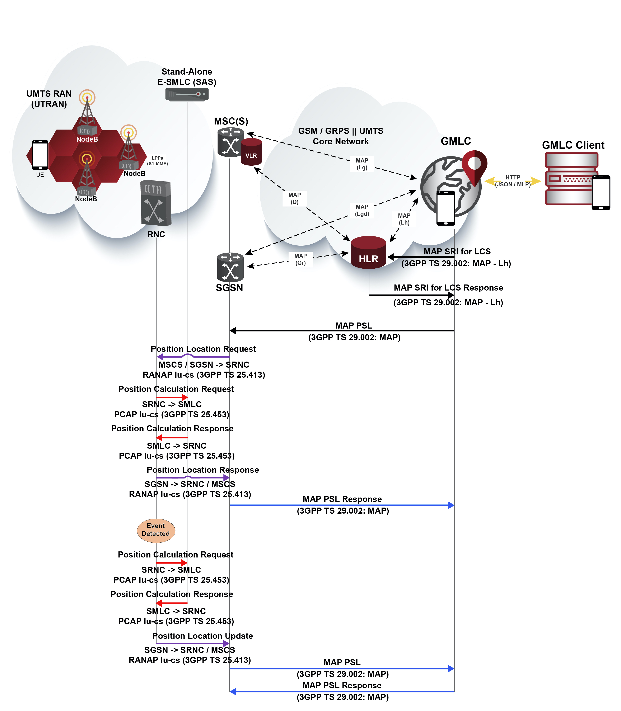
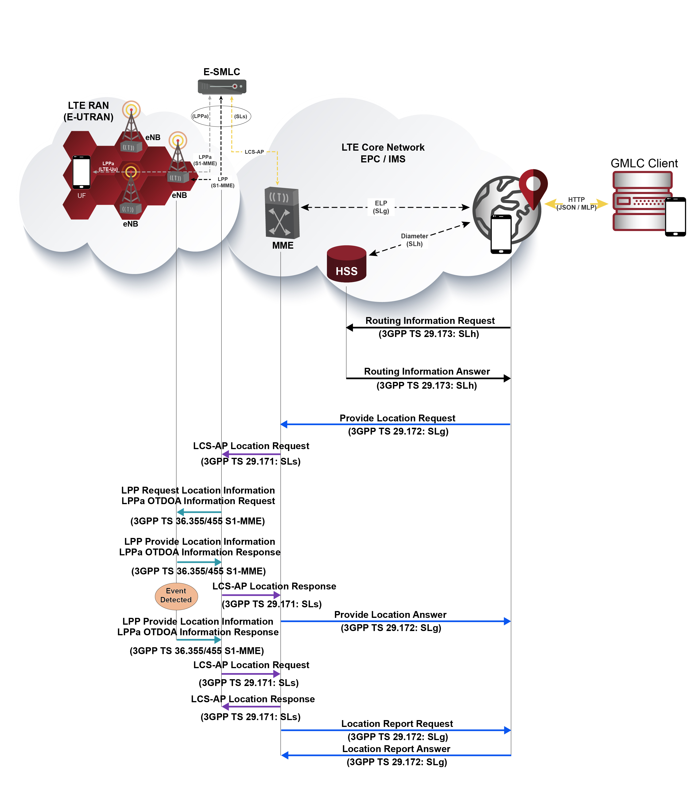

= SMLC and E-SMLC

Either the SMLC (Serving Mobile Location Center) or the E-SMLC (Evolved SMLC) manage the overall coordination and scheduling of resources required for the location of a UE (User Equipment) that is attached to RAN (GERAN/UTRAN or E-UTRAN). It also calculates the final location and velocity estimate and estimates the achieved accuracy.

Either the SMLC or E-SMLC interact with the UE in order to exchange location information applicable to UE assisted and UE based position methods and interacts with the RAN in order to exchange location information applicable to network assisted and network-based position methods. It receives and relays position location requests to (in the case of network-initiated location requests) and from the UE (in the case of mobile-initiated location requests). Likewise, it receives measurements made by the target UE and by LMUs, as well as Global Navigation Satellite Systems (GNSS) signals, which might assist the target UE positioning.

Either the SMLC or E-SMLC select the localization technique to be used, based on the availability of LMUs and cells and on the specific positioning service requirements, like accuracy and position fix delay, as defined by the LCS client request conveyed by the GMLC

[[_smlc]]
== SMLC

Either for GSM/GPRS or UMTS, an SMLC or Stand-Alone SMLC (SAS) resides in the GERAN or UTRAN and can be either a standalone network element or an integrated node within the BSC or RNC and interfaces with the core network MSC or SGSN. The communication with the BSC or RNC is done through PCAP for tunneling RRLP (Radio Resource LCS Protocol) messages. Results are sent back via RANAP between the RNC and MSC/SGSN or BSSAP between the BSC and the MSC/SGSN.

.GMLC - SMLC location request and report in UMTS

[[_esmlc]]
== E-SMLC

For LTE instead, it comprises a standalone network element interfacing the MME. The SLs interface is used to convey LCS-AP messages and parameters between the MME to the E-SMLC. It is also used for tunneling LTE Positioning Protocols (LPP between the E-SMLC and the target UE, LPPa between the E-SMLC and the eNB), which are transparent to the MME. Following are a couple of signaling call flows for either UMTS and LTE location services procedures (OTDOA technique is assumed for the latter), covering the messages exchanged between the GMLC, core network elements (MSC/SGSN), RAN network elements (RNC or eNB) and the SMLC or E-SMLC.

.GMLC - E-SMLC location request and report in UMTS LTE
