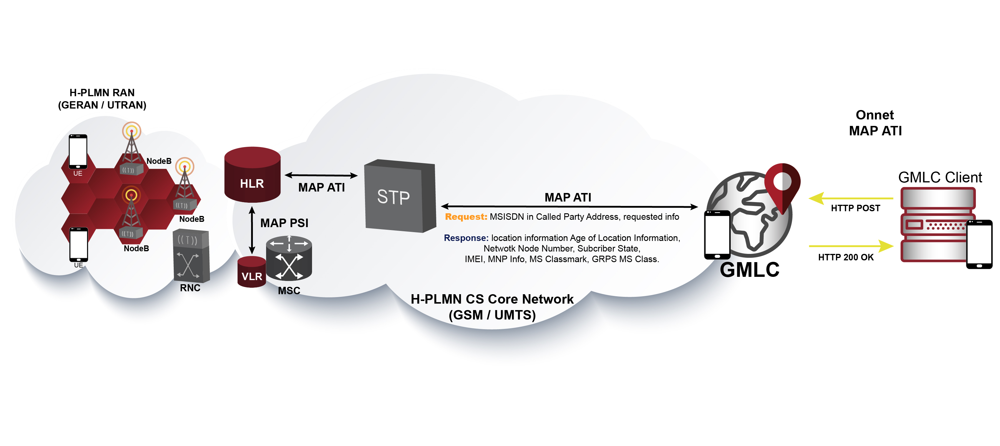

= Message Flows

== HTTP and MAP ATI messages flow for GSM/UMTS Location Services

GMLC service begins when the client sends an HTTP request (GET/POST) to the GMLC.

Next figure exposes the network topology and message call flow needed for gathering mobile subscriber's location information from a GSM/UMTS core network by conveying a MAP ATI operation from the GMLC to the HLR according to 3GPP TS 29.002 guidelines.

.SS7 MAP ATI call flow.

A deeper look inside the HTTP messages exchanged as for the previous diagram is shown next.

[WARNING]
The location information depicted in this document is mostly fictitious or mixed up from real live tests.

[underline]#HTTP POST request:#
....
curl -d "msisdn=59899077937&operation=ATI&token=RmVybmFuZG9NZW5kaW9yb3o" -X POST 127.0.0.1:8080/restcomm/gmlc/rest
....

[underline]#HTTP POST Response (JSON formatted):#
....
{
  "network": "GSM/UMTS",
  "protocol": "MAP",
  "operation": "ATI",
  "result": "SUCCESS",
  "CSLocationInformation": {
    "LocationNumber": {
      "oddFlag": false,
      "natureOfAddressIndicator": 4,
      "internalNetworkNumberIndicator": 1,
      "numberingPlanIndicator": 1,
      "addressPresentationRestrictedIndicator": 1,
      "screeningIndicator": 3,
      "address": 819203961904
    },
    "CGI": {
      "mcc": 748,
      "mnc": 21,
      "lac": 32005,
      "ci": 38221
    },
    "GeographicalInformation": {},
    "GeodeticInformation": {
      "latitude": -45.002102,
      "longitude": 110.100067,
      "typeOfShape": "EllipsoidPointWithUncertaintyCircle",
      "uncertainty": 4.6,
      "confidence": 1,
      "screeningAndPresentationIndicators": 3
    },
    "EPSLocationInformation": {
      "TAI": {},
      "ECGI": {},
      "GeographicalInformation": {},
      "GeodeticInformation": {}
    }
  },
  "PSLocationInformation": {
    "LSA": {},
    "RAI": {},
    "GeographicalInformation": {},
    "GeodeticInformation": {}
  },
  "GPRSMSClass": {},
  "MNPInfoResult": {
    "mnpStatus": "ownNumberNotPortedOut",
    "mnpMsisdn": 59899077937,
    "mnpImsi": 748026871012345,
    "mnpRouteingNumber": "2124"
  },
  "saiPresent": true,
  "ageOfLocationInformation": 0,
  "currentLocationRetrieved": true,
  "msisdn": 59899077937,
  "imei": "011714004661050",
  "vlrNumber": 59899000231,
  "mscNumber": 59899000231,
  "mmeName": "mmec03.mmeer3000.mme.epc.mnc021.mcc748.3gppnetwork.org",
  "subscriberState": "assumedIdle",
  "msClassmark": "003"
}
....

Following, see an example of an HTTP POST message but including an OMA MLP payload included in the HTTP POST request received by {this-platform} {this-application} for the same request as done in the previous example. The terms MLP SLIR/SLIA stand for Mobile Location Protocol Standard Location Immediate Request/Answer as for OMA (Open Mobile Alliance) Mobile Location Protocol 3.4 specification.

[underline]#HTTP POST request (XML formatted as for OMA MLP SLIR):#
----
curl -X POST -d @slir_ati.xml http://127.0.0.1:8080/restcomm/gmlc/mlp
----

_slir_ati.xml_ could be like this, where `<serviceid>0100</serviceid>` stands for MAP ATI:
....
<?xml version="1.0" encoding="UTF-8"?>
<!DOCTYPE svc_init PUBLIC "-//OMA//DTD MLP 3.2.0//EN" "http://openmobilealliance.org/tech/dtd/MLP_SLIR_320.DTD">
<svc_init ver="3.4.0">
  <hdr>
     <client>
       <id>1</id>
       <pwd>RmVybmFuZG9NZW5kaW9yb3o</pwd>
       <serviceid>0100</serviceid>
     </client>
   </hdr>
  <slir ver="3.4.0" res_type="SYNC">
    <msids>
      <msid type="MSISDN">59899077937</msid>
    </msids>
  </slir>
</svc_init>
....

The corresponding answer to the MLP SLIR (after reception of MAP ATI response from the HLR, with the exact same values as the precedent one shown for JSON), i.e. the MLP SLIA (Standard Location Immediate Answer), is shown next:

[underline]#HTTP POST response (XML formatted as for OMA MLP SLIA):#
....
<?xml version="1.0" encoding="UTF-8"?>
<svc_result ver="3.4.0">
	<slia ver="3.4.0">
		<pos result_type="FINAL">
			<msid>59899077937</msid>
			<pd>
				<time utc_off="-0300">20210426200220</time>
				<shape>
					<CircularArea>
						<coord>
							<X>-45.002102</X>
							<Y>110.100067</Y>
						</coord>
						<radius>4.6</radius>
					</CircularArea>
				</shape>
			</pd>
			<gsm_net_param>
				<cgi>
					<mcc>748</mcc>
					<mnc>21</mnc>
					<lac>32005</lac>
					<cellid>38221</cellid>
				</cgi>
			<neid>
				<vmscid>
					<vmscno>59899000231</vmscno>
				</vmscid>
				<vlrid>
					<vlrno>59899000231</vlrno>
				</vlrid>
			</neid>
			</gsm_net_param>
		</pos>
		<result resid="0">OK</result>
	</slia>
</svc_result>
....

An MLP SLIA including an unsuccessful location information retrieval due to "Unknown Subscriber" error received in MAP ATI response is shown next.

[underline]#HTTP POST response (XML formatted as for OMA MLP SLIA):#
....
<?xml version="1.0" encoding="UTF-8"?>
<svc_result ver="3.4.0">
  <slia ver="3.4.0">
    <pos>
      <msid>99990000</msid>
      <poserr>
        <result resid="4">UNKNOWN SUBSCRIBER</result>
        <add_info>MAP Component error: Unknown Subscriber, MAP error code value: 1</add_info>
        <time utc_off="-0300">20210309211258</time>
      </poserr>
    </pos>
  <result resid="4">UNKNOWN SUBSCRIBER</result>
  </slia>
</svc_result>
....

The latter HTTP POST message could contain the domain type (`cs` for CS domain), i.e.:

....
curl -d "msisdn=59899077937&operation=ATI&token=RmVybmFuZG9NZW5kaW9yb3o&domain=cs" -X POST 127.0.0.1:8080/restcomm/gmlc/rest
....

MAP ATI could be conveyed to the SGSN in the PS domain. This should be reflected in the `domain` parameter in the HTTP POST. An example of the HTTP POST request and the corresponding response is shown next:

....
curl -d "msisdn=59899077937&operation=ATI&token=RmVybmFuZG9NZW5kaW9yb3o&domain=ps" -X POST 127.0.0.1:8080/restcomm/gmlc/rest
....

[underline]#HTTP POST Response (JSON formatted):#
....
{
  "network": "GSM/UMTS",
  "protocol": "MAP",
  "operation": "ATI",
  "result": "SUCCESS",
  "CSLocationInformation": {
    "LocationNumber": {},
    "GeographicalInformation": {},
    "GeodeticInformation": {},
    "EPSLocationInformation": {
      "TAI": {},
      "ECGI": {},
      "GeographicalInformation": {},
      "GeodeticInformation": {}
    }
  },
  "PSLocationInformation": {
    "LSA": {
      "lsaIdType": "Universal",
      "lsaId": "131"
    },
    "RAI": {
      "mcc": 748,
      "mnc": 1,
      "lac": 14645,
      "rac": 50
    },
    "GeographicalInformation": {
      "latitude": -44.721018,
      "longitude": 105.993411,
      "typeOfShape": "EllipsoidPointWithUncertaintyCircle",
      "uncertainty": 9.5
    },
    "GeodeticInformation": {}
  },
  "GPRSMSClass": {
    "msNetworkCapability": "10002031",
    "msRadioAccessCapability": "1000203170814"
  },
  "MNPInfoResult": {},
  "saiPresent": false,
  "ageOfLocationInformation": 0,
  "currentLocationRetrieved": true,
  "msisdn": 59899077937,
  "imei": "011714004661051",
  "sgsnNumber": 5982133021,
  "subscriberState": "psAttachedReachableForPaging"
}
....

== HTTP and MAP PSI messages flow for GSM/UMTS Location Services

Next figure depicts the network topology and message call flow needed for gathering more complete mobile subscriber's location information within as GSM/UMTS core network by the execution of MAP SRISM and PSI operations between the GMLC and the MNO's HLR and the concerning MSC/VLR. Besides the location information provided by the CGI parameter, others might be obtained through this method (depending on the MNO's core and radio access networks entities' capabilities and configurations) such as the IMEI, IMSI, MNP information result, location number, VLR/MSC/SGSN SCCP addresses, MME name, geographic/geodetic information (provided either by the circuit-switched core network, GPRS, or EPS), E-UTRAN's CGI (LTE Cell ID), tracking area identity, subscriber's state (idle or busy), GPRS routeing area identity, LSA identity, etc.

.SS7 MAP SRISM-PSI call flow.

HTTP POST request and the corresponding response are shown next for a MAP PSI request on simulation mode.

[underline]#HTTP POST request for CS domain# (not including the domain would result in identical result as CS is considered the default domain by the GMLC for MAP ATI requests):
....
curl -d "msisdn=59899077937&operation=PSI&token=RmVybmFuZG9NZW5kaW9yb3o&domain=cs" -X POST 127.0.0.1:8080/restcomm/gmlc/rest
....

[underline]#HTTP POST response (JSON formatted):#
....
{
  "network": "GSM/UMTS",
  "protocol": "MAP",
  "operation": "PSI",
  "result": "SUCCESS",
  "CSLocationInformation": {
    "LocationNumber": {
      "oddFlag": false,
      "natureOfAddressIndicator": 4,
      "internalNetworkNumberIndicator": 1,
      "numberingPlanIndicator": 1,
      "addressPresentationRestrictedIndicator": 1,
      "screeningIndicator": 3,
      "address": 819203961904
    },
    "GeographicalInformation": {},
    "GeodeticInformation": {}
    "EPSLocationInformation": {
      "ECGI": {
        "mcc": 732,
        "mnc": 103,
        "eci": 23187296,
        "eNBId": 90575,
        "ci": 96
      },
      "TAI": {
        "mcc": 732,
        "mnc": 103,
        "tac": 14645
      },
      "GeographicalInformation": {
        "typeOfShape": "EllipsoidPointWithUncertaintyCircle",
        "latitude": -23.291026,
        "longitude": 109.977801,
        "uncertainty": 18.5
      },
      "GeodeticInformation": {},
      "ageOfLocationInformation": 0,
      "currentLocationRetrieved": true,
      "mmeName": "mmec03.mmeer3000.mme.epc.mnc002.mcc748.3gppnetwork.org"
    }
  },
  "PSLocationInformation": {},
  "msisdn": 59899077937,
  "imsi": 124356871012345,
  "imei": "011714004661050",
  "lmsi": "7202e98c",
  "subscriberState": "notProvidedFromVLR",
  "MNPInfoResult": {
    "mnpStatus": "ownNumberNotPortedOut",
    "mnpMsisdn": 59899077937,
    "mnpImsi": 748026871012345,
    "mnpRouteingNumber": "598123"
  },
  "msClassmark": "393A52"
}
....

For performing the same action but via MLP, you must proceed similarly as for MAP ATI. Following, see an example of an HTTP POST message but including an OMA MLP payload included in the HTTP POST request received by {this-platform} {this-application} for a MLP SLIR triggering the exact same MAP SRISM-PSI as for the previous example using the JSON API.

[underline]#HTTP POST request (XML formatted as for OMA MLP SLIR):#
----
curl -X POST -H "Content-Type: application/xml" -d @slir_psi.xml http://127.0.0.1:8080/restcomm/gmlc/mlp
----

_slir_psi.xml_ could be like this, where `<serviceid>0101</serviceid>` stands for MAP SRISM-PSI:
....
<?xml version="1.0" encoding="UTF-8"?>
<!DOCTYPE svc_init PUBLIC "-//OMA//DTD MLP 3.2.0//EN" "http://openmobilealliance.org/tech/dtd/MLP_SLIR_320.DTD">
<svc_init ver="3.4.0">
  <hdr>
     <client>
       <id>1</id>
       <pwd>RmVybmFuZG9NZW5kaW9yb3o</pwd>
       <serviceid>0101</serviceid>
     </client>
   </hdr>
  <slir ver="3.4.0" res_type="SYNC">
    <msids>
      <msid type="MSISDN">59899077937</msid>
    </msids>
  </slir>
</svc_init>
....

An example of the corresponding answer to the MLP SLIR (after reception of MAP SRISM-PSI response from the HLR/VLR, with the exact same values as the precedent one shown for JSON), i.e., the MLP SLIA (Standard Location Immediate Answer) is shown next:

[underline]#HTTP POST response (XML formatted as for OMA MLP SLIA):#
....
<?xml version="1.0" encoding="UTF-8"?>
<svc_result ver="3.4.0">
  <slia ver="3.4.0">
    <pos result_type="FINAL">
      <msid>59899077937</msid>
      <pd>
        <time utc_off="-0300">20210426221945</time>
        <shape>
          <CircularArea>
            <coord>
              <X>-23.291026</X>
              <Y>109.977801</Y>
            </coord>
            <radius>18.5</radius>
          </CircularArea>
        </shape>
      </pd>
      <gsm_net_param>
        <imsi>124356871012345</imsi>
        <lmsi>7202e98c</lmsi>
      </gsm_net_param>
      <serving_cell>
        <mcc>732</mcc>
        <mnc>103</mnc>
        <lte_ci>23187296</lte_ci>
      </serving_cell>
      <tac>14645</tac>
    </pos>
    <result resid="0">OK</result>
  </slia>
</svc_result>
....

As with MAP ATI, MAP PSI could be conveyed to the SGSN in the PS domain. This should be reflected in the `domain` parameter in the HTTP POST. An example of the HTTP POST request and the corresponding response is shown next:

[underline]#HTTP POST request for PS domain (JSON formatted):#
....
curl -d "msisdn=59899077937&operation=PSI&token=RmVybmFuZG9NZW5kaW9yb3o&domain=ps" -X POST 127.0.0.1:8080/restcomm/gmlc/rest
....

[underline]#HTTP POST response (JSON formatted):#
....
{
  "network": "GSM/UMTS",
  "protocol": "MAP",
  "operation": "PSI",
  "result": "SUCCESS",
  "CSLocationInformation": {
    "EPSLocationInformation": {}
  },
  "PSLocationInformation": {
    "SAI": {
      "mcc": 748,
      "mnc": 23,
      "lac": 32006,
      "sac": 38222
    },
    "saiPresent": true,
    "RAI": {
      "mcc": 748,
      "mnc": 1,
      "lac": 14645,
      "rac": 50
    },
    "LSA": {
      "lsaIdType": "Universal",
      "lsaId": "131"
    },
    "GeographicalInformation": {},
    "GeodeticInformation": {},
    "ageOfLocationInformation": 14571,
    "currentLocationRetrieved": false,
    "sgsnNumber": 5982133021
  },
  "msisdn": 59899077937,
  "imsi": 124356871012345,
  "imei": "011714004661051",
  "lmsi": "71ffacce",
  "subscriberState": "psAttachedReachableForPaging",
  "MNPInfoResult": {},
  "GPRSMSClass": {
    "msNetworkCapability": "10002031",
    "msRadioAccessCapability": "1000203170814"
  }
}
....

Either for MAP ATI and MAP PSI, the retrieved subscriber state can take several values, namely: `assumedIdle`, `camelBusy`, `notProvidedFromVLR` (CS domain only), `psAttachedReachableForPaging`, `psAttachedNotReachableForPaging`, `psPDPActiveReachableForPaging`, `psPDPActiveNotReachableForPaging`, `notProvidedFromSGSNorMME`, `psDetached` (PS domain only) and `netDetNotReachable` (applicable for both CS and PS domain). For the latter, a parameter called `notReachableReason` appears in the HTTP/JSON response, for example:

....
{
  "network": "GSM/UMTS",
  "protocol": "MAP",
  "operation": "PSI",
  "result": "SUCCESS",
  "CSLocationInformation": {
    "EPSLocationInformation": {}
  },
  "PSLocationInformation": {
    "saiPresent": true,
    "RAI": {
      "mcc": 748,
      "mnc": 1,
      "lac": 14645,
      "rac": 50
    },
    "LSA": {
      "lsaIdType": "Universal",
      "lsaId": "131"
    },
    "GeographicalInformation": {},
    "GeodeticInformation": {},
    "ageOfLocationInformation": 14571,
    "currentLocationRetrieved": false,
    "sgsnNumber": 5982133021
  },
  "GPRSMSClass": {},
  "MNPInfoResult": {},
  "saiPresent": false,
  "ageOfLocationInformation": 1575,
  "currentLocationRetrieved": false,
  "msisdn": 59899077937,
  "imsi": 124356871012345,
  "sgsnNumber": 5982133021,
  "subscriberState": "netDetNotReachable",
  "notReachableReason": "imsiDetached"
}
....

The parameter `notReachableReason` might take several values, i.e. `msPurged`, `imsiDetached`, `restrictedArea` and `notRegistered`.

Likewise, whenever a PSI arrives at the serving MSC within the CS domain or SGSN within the PS domain, it will instruct to page the mobile station.
This action shall not always be possible, therefore some location information will not be available. An example of such response for MAP ATI in the PS domain is shown next, when the `subscriberState` parameter equals `psAttachedNotReachableForPaging`:

....
{
  "network": "GSM/UMTS",
  "protocol": "MAP",
  "operation": "PSI",
  "result": "SUCCESS",
  "CSLocationInformation": {
  "EPSLocationInformation": {}
  },
  "PSLocationInformation": {
    "RAI": {
      "mcc": 748,
      "mnc": 1,
      "lac": 14645,
      "rac": 50
    },
    "LSA": {
      "lsaIdType": "Universal",
      "lsaId": "131"
    },
    "GeographicalInformation": {},
    "GeodeticInformation": {}
  },
  "GPRSMSClass": {},
  "MNPInfoResult": {},
  "saiPresent": false,
  "ageOfLocationInformation": 221,
  "currentLocationRetrieved": false,
  "msisdn": 59899077937,
  "imsi": 124356871012345,
  "sgsnNumber": 5982133021,
  "subscriberState": "psAttachedNotReachableForPaging"
}
....

Instead of SRISM, call handling SRI could be used instead, previous to sending PSI to the serving MSC/VLR or SGSN. The HTTP request should change by adding the *psiServiceType* to the request with value `useSri`, for example:

....
curl -d "msisdn=59899077937&operation=PSI&token=RmVybmFuZG9NZW5kaW9yb3o&psiServiceType=useSri" -X POST 127.0.0.1:8080/restcomm/gmlc/rest
....

Next figure depicts the network topology and message call flow needed for gathering more complete mobile subscriber's location information within a GSM/UMTS core network by the execution of call handling MAP SRI and PSI operations between the GMLC and the MNO's HLR and the concerning MSC/VLR or SGSN.

.SS7 MAP SRI-PSI call flow.

{this-platform} {this-application} also supports sending PSI without a previous SRI or SRISM. For this operation mode, you'd need to set *psiServiceType* value to *psiFirst* and add the following parameters: *psiImsi* and *psiNnn*. *psiImsi* should take the value of the targeted subscriber's IMSI, while the *psiNnn* should take the value of the serving MSC/VLR or SGSN Global Title digits. For example:

....
curl -d "msisdn=59899077937&operation=PSI&token=RmVybmFuZG9NZW5kaW9yb3o&psiServiceType=psiFirst&psiImsi=543210987654321&psiNnn=97891000321" -X POST 127.0.0.1:8080/restcomm/gmlc/rest
....

If any of *psiServiceType*, *psiImsi* or *psiNnn* is missing, by default SRISM will be used prior to sending the PSI.

== HTTP and Diameter-based messages flow for IMS/LTE Location Information retrieval

As already stated, CS, PS and EPS location information can be obtained via Diameter User-Data-Request command from the GMLC to the HSS, like portrayed in the next call flow diagram

.Sh interface Diameter UDR/UDA call flow.

An HTTP POST request and a couple of responses are shown next for a Sh UDR/UDA request on simulation mode (information shown is obviously fake).

Sh UDR/UDA request could actually indicate either which domain is requested (CS or PS), if a current location retrieval needs to be carried out on the network side, if EPS Location Information is supported/requested or not, if 5GS Location Information is requested or not, and if the Radio Access type is requested or not.
This can be done by adding `domain`, `activeLocation`, `locationInfoEps`, `locationInfo5gs` and `ratTypeRequested` parameters respectively to the HTTP request (if not added, they will default to `PS`, `true`, `true`, `false` and `false respectively). Following an example of such request in which the PS domain is requested, while an active location retrieval, EPS Location Information and RAT (Radio Access Technology) type are requested:

[underline]#HTTP POST request (JSON formatted):#
....
curl -d "msisdn=59899077937&operation=UDR&token=RmVybmFuZG9NZW5kaW9yb3o&ratTypeRequested=true" -X POST 127.0.0.1:8080/restcomm/gmlc/rest
....

[underline]#HTTP POST response# (JSON formatted), fist example (only EPS location information is retrieved from the core network):
....
{
  "network": "IMS",
  "protocol": "Diameter Sh",
  "operation": "UDR-UDA",
  "result": "SUCCESS",
  "PublicIdentifiers": {
    "msisdn": 59899077937
  },
  "CSLocationInformation": {},
  "PSLocationInformation": {},
  "EPSLocationInformation": {
    "TAI": {
      "mcc": 502,
      "mnc": 19,
      "tac": 771
    },
    "ECGI": {
      "mcc": 502,
      "mnc": 19,
      "eci": 38791702,
      "eNBId": 151530,
      "ci": 22
    },
    "GeographicalInformation": {},
    "GeodeticInformation": {
      "typeOfShape": "EllipsoidPointWithUncertaintyCircle",
      "latitude": -24.010009,
      "longitude": 110.009859,
      "uncertainty": 98.3,
      "confidence": 0,
      "screeningAndPresentationIndicators": 3
    },
    "mmeName": "MMEC18.MMEGI8001.MME.EPC.MNC019.MCC502.3GPPNETWORK.ORG",
    "currentLocationRetrieved": true,
    "ageOfLocationInformation": 0,
    "csgId": "8191",
    "VisitedPLMNId": {
      "mcc": 598,
      "mnc": 31
    },
    "LocalTimeZone": {
      "timeZone": "-9",
      "daylightSavingTime": 0
    },
    "ratType": "EUTRAN"
  },
  "5GSLocationInformation": {}
}
....

Following, see an example of an HTTP POST message but including an OMA MLP payload included in the HTTP POST request received by {this-platform} {this-application} for a MLP SLIR triggering the exact same Diameter Sh UDR as for the previous example using the JSON API.

[underline]#HTTP POST request (XML formatted as for OMA MLP SLIR):#
----
curl -X POST -H "Content-Type: application/xml" -d @slir_udr.xml http://127.0.0.1:8080/restcomm/gmlc/mlp
----

_slir_udr.xml_ could be like this, where `<serviceid>0106</serviceid>` stands for Diameter Sh UDR:
....
<?xml version="1.0" encoding="UTF-8"?>
<!DOCTYPE svc_init PUBLIC "-//OMA//DTD MLP 3.2.0//EN" "http://openmobilealliance.org/tech/dtd/MLP_SLIR_320.DTD">
<svc_init ver="3.4.0">
  <hdr>
    <client>
      <id>1</id>
      <pwd>RmVybmFuZG9NZW5kaW9yb3o</pwd>
      <serviceid>0106</serviceid>
    </client>
  </hdr>
  <slir ver="3.4.0" res_type="SYNC">
    <msids>
      <msid type="MSISDN">59899077937</msid>
    </msids>
  </slir>
</svc_init>
....

An example of the corresponding answer to the MLP SLIR (after reception of Diameter Sh UDA from the HSS, with the exact same values as the precedent one shown for JSON), i.e., the MLP SLIA (Standard Location Immediate Answer) is shown next:

[underline]#HTTP POST response (XML formatted as for OMA MLP SLIA):#
....
<?xml version="1.0" encoding="UTF-8"?><svc_result ver="3.4.0">
	<slia ver="3.4.0">
		<pos result_type="FINAL">
			<msid>59899077937</msid>
			<pd>
				<time utc_off="-0300">20210430190454</time>
				<shape>
					<CircularArea>
						<coord>
							<X>-24.010009</X>
							<Y>110.009859</Y>
						</coord>
						<radius>98.3</radius>
					</CircularArea>
				</shape>
			</pd>
            <serving_cell>
                <mcc>502</mcc>
                <mnc>19</mnc>
                <lte_ci>38791702</lte_ci>
            </serving_cell>
			<tac>771</tac>
		</pos>
	<result resid="0">OK</result>
	</slia>
</svc_result>
....

Following, an example of a request in which the PS domain is explicitly requested, while neither an active location retrieval nor EPS Location Information are requested:

....
curl -d "msisdn=59898077939&operation=UDR&token=RmVybmFuZG9NZW5kaW9yb3o&domain=ps&activeLocation=false&ratTypeRequested=true" -X POST 127.0.0.1:8080/restcomm/gmlc/rest
....

[underline]#HTTP POST response# (JSON formatted), second example (only PS location information is retrieved from the core network):
....
{
  "network": "IMS",
  "protocol": "Diameter Sh",
  "operation": "UDR-UDA",
  "result": "SUCCESS",
  "PublicIdentifiers": {
    "msisdn": 59898077939
  },
  "CSLocationInformation": {},
  "PSLocationInformation": {
    "CGI": {
      "mcc": 732,
      "mnc": 103,
      "lac": 1,
      "ci": 20042
    },
    "RAI": {
      "mcc": 748,
      "mnc": 1,
      "lac": 14645,
      "rac": 50
    },
    "GeographicalInformation": {
      "typeOfShape": "EllipsoidPointWithUncertaintyCircle",
      "latitude": -23.291026,
      "longitude": 109.977801,
      "uncertainty": 45.6
    },
    "GeodeticInformation": {},
    "sgsnNumber": 598978936,
    "currentLocationRetrieved": false,
    "ageOfLocationInformation": 5,
    "csgId": "8191",
    "VisitedPLMNId": {
      "mcc": 598,
      "mnc": 21
    },
    "LocalTimeZone": {
      "timeZone": "+8",
      "daylightSavingTime": 1
    },
    "ratType": "GERAN"
  },
  "EPSLocationInformation": {},
  "5GSLocationInformation": {}
}
....

Following, an HTTP POST example destined to the CS domain, while both an active location retrieval and EPS Location Information are requested, along with the RAT type:
....
curl -d "msisdn=59899077937&operation=UDR&token=RmVybmFuZG9NZW5kaW9yb3o&domain=cs&ratTypeRequested=true" -X POST 127.0.0.1:8080/restcomm/gmlc/rest
....

[underline]#HTTP POST response# (JSON formatted), third example (only CS and EPS location information extension within the latter are retrieved):
....
{
  "network": "IMS",
  "protocol": "Diameter Sh",
  "operation": "UDR-UDA",
  "result": "SUCCESS",
  "PublicIdentifiers": {
    "msisdn": 59899077937,
    "imsPublicIdentity": "sip:john.doe@hp.com"
  },
  "CSLocationInformation": {
    "LocationNumber": {
      "oddFlag": true,
      "natureOfAddressIndicator": 4,
      "internalNetworkNumberIndicator": 1,
      "numberingPlanIndicator": 1,
      "addressPresentationRestrictedIndicator": 1,
      "screeningIndicator": 3,
      "address": 56034254999
    },
    "CGI": {},
    "GeographicalInformation": {},
    "GeodeticInformation": {},
    "mscNumber": 59897901234,
    "vlrNumber": 59897901234,
    "currentLocationRetrieved": true,
    "ageOfLocationInformation": 0
    "EPSLocationInformation": {
      "ECGI": {
        "mcc": 502,
        "mnc": 19,
        "eci": 38676245,
        "eNBId": 151079,
        "ci": 21
      },
      "TAI": {
        "mcc": 502,
        "mnc": 19,
        "tac": 774
      },
      "LocalTimeZone": {
        "timeZone": "-5",
        "daylightSavingTime": 0
      }
    }
  },
  "PSLocationInformation": {},
  "EPSLocationInformation": {},
  "5GSLocationInformation": {}
}
....

Following, an HTTP POST example destined tpo the PS domain, while both an active location retrieval and 5GS Location Information are requested, along with the RAT type:
....
curl -d "msisdn=59897077938&operation=UDR&token=RmVybmFuZG9NZW5kaW9yb3o&locationInfo5gs=true&ratTypeRequested=true" -X POST 127.0.0.1:8080/restcomm/gmlc/rest
....

[underline]#HTTP POST response# (JSON formatted) last example (only 5GS location information with its extensions is retrieved):
....
{
  "network": "IMS",
  "protocol": "Diameter Sh",
  "operation": "UDR-UDA",
  "result": "SUCCESS",
  "PublicIdentifiers": {
    "msisdn": 59897077938
  },
  "CSLocationInformation": {},
  "PSLocationInformation": {},
  "EPSLocationInformation": {},
  "5GSLocationInformation": {
    "NCGI": {
      "mcc": 598,
      "mnc": 1,
      "nci": 512063008768
    },
    "ECGI": {
      "mcc": 502,
      "mnc": 19,
      "eci": 38676245,
      "eNBId": 151079,
      "ci": 21
    },
    "TAI": {
      "mcc": 502,
      "mnc": 19,
      "tac": 774
    },
    "amfAddress": "amf1.cluster1.net2.amf.5gc.mnc012.mcc345.3gppnetwork.org",
    "smsfAddress": "smset12.smsf01.5gc.mnc012.mcc345.3gppnetwork.org",
    "currentLocationRetrieved": true,
    "ageOfLocationInformation": 0,
    "VisitedPLMNId": {
      "mcc": 598,
      "mnc": 1
    },
    "LocalTimeZone": {
      "timeZone": "-3",
      "daylightSavingTime": 0
    },
    "ratType": "NR"
  }
}
....

== HTTP and MAP messages flow for UMTS Location Services Management (LSM) services

Next figure shows an example signal flow exclusively between {this-platform} {this-application} within an UMTS Core Network for location retrieval by means of MAP operations destined to a Circuit-Switched Core Network where a Stand-Alone SMLC (Serving Mobile Location Center) is operational and positioning methods are available at the Radio Access Network (e.g. OTDOA). Then, UMTS Terrestrial Radio Access Network (UTRAN) comprises positioning procedures involving the Stand-Alone SMLC (SAS), NB (Node Base station), and the UE. The example considers a location report sent back to {this-platform} {this-application}, triggered by an event previously armed at the UTRAN (e.g. a UE exiting a predefined area).

.MAP Location Services Management (LSM) services call flow.

HTTP POST request and the corresponding response are shown next for a MAP SRILCS and PSL request on simulation mode.

[underline]#HTTP POST Request for MAP SRILCS-PSL:#
....
curl -d "msisdn=59899077937&operation=PSL&lcsClientType=0&lcsClientExternalID=6543210987&lcsLocationType=currentLocation&clientReferenceNumber=30000&token=RmVybmFuZG9NZW5kaW9yb3o" -X POST 127.0.0.1:8080/restcomm/gmlc/rest
....

[underline]#HTTP Response (JSON formatted)#
....
{
  "network": "GSM/UMTS",
  "protocol": "MAP",
  "operation": "SRILCS-PSL",
  "result": "SUCCESS",
  "clientReferenceNumber": 30000,
  "lcsReferenceNumber": 10,
  "SRILCS": {
    "msisdn": 59899077937,
    "imsi": 748026871012345,
    "lmsi": "71ffacce",
    "networkNodeNumber": 5982123007,
    "gprsNodeIndicator": false,
    "mmeName": "mmec03.mmeer3000.mme.epc.mnc002.mcc748.3gppnetwork.org",
    "3GPPAAAServerName": "aaa04.aaa3000.aaa.epc.mnc002.mcc748.3gppnetwork.org",
    "hGmlcAddress": "181.104.201.3",
    "vGmlcAddress": "180.53.105.48",
    "pprAddress": "181.104.97.21"
  },
  "PSL": {
    "LocationEstimate": {
      "typeOfShape": "Polygon"
    },
    "AdditionalLocationEstimate": {
      "typeOfShape": "Polygon",
      "numberOfPoints": 3,
      "polygonPoint1": {
        "latitude": 29.47231,
        "longitude": 77.71216
      },
      "polygonPoint2": {
        "latitude": 29.47228,
        "longitude": 77.71186
      },
      "polygonPoint3": {
        "latitude": 29.47083,
        "longitude": 77.71231
      }
      "polygonCentroid": {
        "latitude": 29.47181,
        "longitude": 77.71212
      }
    },
    "ageOfLocationEstimate": 0,
    "accuracyFulfilmentIndicator": "REQUESTED_ACCURACY_FULFILLED",
    "deferredMTLRresponseIndicator": true,
    "moLrShortCircuitIndicator": true,
    "CGI": {
      "mcc": 437,
      "mnc": 109,
      "lac": 8304,
      "ci": 17185
    },
    "GERANPositioningInfo": {},
    "UTRANPositioningInfo": {
      "utranPositioningData": "393333363031",
      "utranGanssPositioningData": "393333363030"
    },
    "VelocityEstimate": {
      "horizontalSpeed": 101,
      "bearing": 3,
      "verticalSpeed": 2,
      "uncertaintyHorizontalSpeed": 5,
      "uncertaintyVerticalSpeed": 1,
      "velocityType": "HorizontalWithVerticalVelocityAndUncertainty"
    }
  }
}
....

Note that the `msisdn` parameter could be changed by the `imsi` parameter for this operation. Either ways, both parameter values will be retrieved back in the response.

Following, see an example of an HTTP POST message but including an OMA MLP payload included in the HTTP POST request received by {this-platform} {this-application} for a MLP SLIR triggering the exact same MAP SRILCS-PSL as for the previous example using the JSON API.

[underline]#HTTP POST request (XML formatted as for OMA MLP SLIR):#
----
curl -X POST -H "Content-Type: application/xml" -d @slir_psl.xml http://127.0.0.1:8080/restcomm/gmlc/mlp
----

_slir_psl.xml_ could be like this, where `<serviceid>0104</serviceid>` stands for MAP SRILCS-PSL:
....
<?xml version="1.0" encoding="UTF-8"?>
<!DOCTYPE svc_init PUBLIC "-//OMA//DTD MLP 3.2.0//EN" "http://openmobilealliance.org/tech/dtd/MLP_SLIR_320.DTD">
<svc_init ver="3.4.0">
  <hdr>
    <client>
      <id>1</id>
      <pwd>RmVybmFuZG9NZW5kaW9yb3o</pwd>
      <serviceid>0105</serviceid>
      <requestmode type="ACTIVE"/>
      <lcs_client_type>EMERGENCY_SERVICES</lcs_client_type>
      <lcs_client_external_id>6543210987</lcs_client_external_id>
    </client>
  </hdr>
  <slir ver="3.4.0" res_type="SYNC">
    <msids>
      <msid type="MSISDN">59899077937</msid>
      <trans_id>30000</trans_id>
    </msids>
    <loc_type type="LAST" />
  </slir>
</svc_init>
....

An example of the corresponding answer to the MLP SLIR (after reception of Diameter Sh UDA from the HSS, with the exact same values as the precedent one shown for JSON), i.e., the MLP SLIA (Standard Location Immediate Answer) is shown next:

[underline]#HTTP POST response (XML formatted as for OMA MLP SLIA):#
....
<?xml version="1.0" encoding="UTF-8"?>
<svc_result ver="3.4.0">
  <slia ver="3.4.0">
    <pos result_type="FINAL">
      <msid>59899077937</msid>
      <pd>
        <time utc_off="-0300">20210316014504</time>
        <shape>
          <Polygon>
            <innerBoundaryIs>
              <LinearRing>
                <coord>
                  <X>29.47231</X>
                  <Y>77.71216</Y>
                </coord>
                <coord>
                  <X>29.47228</X>
                  <Y>77.71186</Y>
                </coord>
                <coord>
                  <X>29.47083</X>
                  <Y>77.71231</Y>
                </coord>
              </LinearRing>
            </innerBoundaryIs>
          </Polygon>
        </shape>
      </pd>
      <gsm_net_param>
        <cgi>
          <mcc>437</mcc>
          <mnc>109</mnc>
          <lac>8304</lac>
          <cellid>17185</cellid>
        </cgi>
        <lmsi>71ffacce</lmsi>
        <imsi>748026871012345</imsi>
      </gsm_net_param>
    </pos>
    <req_id>30000</req_id>
    <result resid="0">OK</result>
  </slia>
</svc_result>
....

=== Deferred Location Requests in UMTS Location Services Management (LSM) services

A PSL request may include parameters for triggering events from the RAN, for example, whenever the target subscriber gets in or out a specific area or stays within it. An example of such an inferred MAP PSL operation arming an area event report is shown next:

....
curl -d "msisdn=60192235906&operation=PSL&clientReferenceNumber=15817&lcsClientType=0&lcsClientExternalID=6543210987654321&lcsLocationType=activateDeferredLocation&lcsDeferredLocationType=entering&lcsAreaType=cellGlobalId&lcsAreaId=502-19-3081-33045&lcsAreaEventOccurrenceInfo=multipleTimeEvent&lcsAreaEventIntervalTime=60&lcsServiceTypeId=4" -X POST 127.0.0.1:8080/restcomm/gmlc/rest
....

Following, see an example of an HTTP POST message but including an OMA MLP payload for a *Triggered Location Reporting Service* (MLP TLRR) included in the HTTP POST request received by {this-platform} {this-application} for the exact same MAP SRILCS-PSL triggering area event reports as for the previous example using the JSON API.

[underline]#HTTP POST request (XML formatted as for OMA MLP TLRR):#
----
curl -X POST -H "Content-Type: application/xml" -d @tlrr_psl.xml http://127.0.0.1:8080/restcomm/gmlc/mlp
----

_tlrr_psl.xml_ could be like this, where `<serviceid>0105</serviceid>` stands for MAP SRILCS-PSL:
....
<?xml version="1.0" encoding="UTF-8"?>
<!DOCTYPE svc_init PUBLIC "-//OMA//DTD MLP 3.2.0//EN" "http://openmobilealliance.org/tech/dtd/MLP_SLIR_320.DTD">
<svc_init ver="3.4.0">
  <hdr>
    <client>
      <id>ExtendedGeo</id>
      <pwd>RmVybmFuZG9NZW5kaW9yb3o</pwd>
      <serviceid>0105</serviceid>
      <lcs_client_type>EMERGENCY_SERVICES</lcs_client_type>
      <lcs_external_id>6543210987654321</lcs_client_name>
      <lcs_service_type_id>4</lcs_service_type_id>
    </client>
  </hdr>
  <tlrr ver="3.4.0">
    <msids>
      <msid type="MSISDN">60192235906</msid>
      <trans_id>15817</trans_id>
    </msids>
    <loc_type type="CURRENT_AND_INTERMEDIATE" />
    <tlrr_event>
      <change_area type="MS_ENTERING" loc_estimates="TRUE">
        <target_area>
          <serving_cell>
            <cgi>
              <mcc>502</mcc>
              <mnc>19</mnc>
              <lac>3081</lac>
              <cellid>33045</cellid>
            </cgi>
          </serving_cell>
        </target_area>
        <no_of_reports>2</no_of_reports>
        <minimumIntervalTime>60</minimumIntervalTime>
      </change_area>
    </tlrr_event>
  </tlrr>
</svc_init>
....

The MAP PSL operation example builds area event reports. Hence, whenever the target subscriber enters the area belonging to the indicated Cell Global Id (`lcsDeferredLocationType=entering`, `lcsAreaType=cellGlobalId` and `lcsAreaId=502-19-3081-33045` in JSON or `<change_area type="MS_ENTERING" loc_estimates="TRUE">` and same MCC, MNC, LAC and CI parameters inside `cgi` XML tag in MLP TLRR) a location report is conveyed as a MAP SLR operation to the GMLC, with a minimum interval time between reports of 60 seconds (`lcsAreaEventIntervalTime=60` in JSON or `<minimumIntervalTime>60</minimumIntervalTime>` in MLP TLRR).

The HTTP request sent to the HTTP server indicated in the `lcsCallbackUrl` parameter in JSON or `pushaddr` in MLP TLRR (or defaulted to the one set in the configuration if missing) is shown next:

[underline]#HTTP Request (JSON formatted) for MAP SLR:#
....
{
  "network": "GSM/UMTS",
  "protocol": "MAP",
  "operation": "SLR",
  "result": "SUCCESS",
  "clientReferenceNumber": 15817,
  "lcsReferenceNumber": 351,
  "msisdn": 60192235906,
  "imsi": 502193907608104,
  "imei": "354449063537030",
  "lcsServiceTypeID": 4,
  "lcsClientID": {},
  "LocationEstimate": {
    "typeOfShape": "Polygon"
  },
  "ageOfLocationEstimate": 0,
  "accuracyFulfilmentIndicator": "REQUESTED_ACCURACY_FULFILLED",
  "AdditionalLocationEstimate": {
    "typeOfShape": "Polygon",
    "numberOfPoints": 4,
    "polygonPoint1": {
      "latitude": 26.64651,
      "longitude": 73.49208
    },
    "polygonPoint2": {
      "latitude": 26.64803,
      "longitude": 73.4957
    },
    "polygonPoint3": {
      "latitude": 26.64874,
      "longitude": 73.49564
    },
    "polygonPoint4": {
      "latitude": 26.64876,
      "longitude": 73.49572
    }
    "polygonCentroid": {
      "latitude": 26.647746,
      "longitude": 73.494472
    }
  },
  "CGI": {
    "mcc": 502,
    "mnc": 19,
    "lac": 3081,
    "ci": 33045
  },
  "GERANPositioningInfo": {},
  "UTRANPositioningInfo": {
    "utranPositioningData": "393334363031",
    "utranGanssPositioningData": "393333363130"
  },
  "VelocityEstimate": {
    "horizontalSpeed": 101,
    "bearing": 3,
    "verticalSpeed": 2,
    "uncertaintyHorizontalSpeed": 5,
    "uncertaintyVerticalSpeed": 1,
    "velocityType": "HorizontalWithVerticalVelocityAndUncertainty"
  },
  "pseudonymIndicator": "PSEUDONYM_NOT_REQUESTED",
  "lcsEvent": "DEFERRED_MT_LR_RESPONSE",
  "moLrShortCircuitIndicator": false,
  "PeriodicLDRInfo": {},
  "sequenceNumber": 0,
  "DeferredMTLRData": {
    "deferredLocationEventType": "ENTERING_INTO_AREA",
    "terminationCause": "CONGESTION",
    "gprsNodeIndicator": false,
    "networkNodeNumber": 5980480081,
    "lmsi": "71ffacce",
    "mmeName": "mmec01.mmegi8000.mme.epc.mnc001.mcc748.3gppnetwork.org",
    "aaaServerName": "aaa01.aaa8000.aaa.epc.mnc001.mcc748.3gppnetwork.org",
    "SupportedLCSCapabilitySets": {
      "RELEASE98_99": true,
      "RELEASE4": true,
      "RELEASE5": true,
      "RELEASE6": true,
      "RELEASE7": true
    },
    "AdditionalLCSCapabilitySets": {
      "RELEASE98_99": true,
      "RELEASE4": true,
      "RELEASE5": true,
      "RELEASE6": true,
      "RELEASE7": true
    }
  }
 }
....

The same area event report but received upon MLP TLRR (after reception of MAP SLR from the MSC, with the exact same values as the precedent one shown for JSON), i.e., the MLP TLREP (*Triggered Location Report*) is shown next:

[underline]#HTTP POST request (XML formatted as for OMA MLP TLREP):#
....
<?xml version="1.0" encoding="UTF-8"?>
<svc_result ver="3.4.0">
  <tlrep ver="3.4.0">
    <pos result_type="FINAL">
      <msid>60192235906</msid>
      <pd>
        <time utc_off="-0300">20210316014504</time>
        <shape>
          <Polygon>
            <innerBoundaryIs>
              <LinearRing>
                <coord>
                  <X>26.64651</X>
                  <Y>73.49208</Y>
                </coord>
                <coord>
                  <X>26.64803</X>
                  <Y>73.4957</Y>
                </coord>
                <coord>
                  <X>26.64874</X>
                  <Y>73.49564</Y>
                </coord>
                <coord>
                  <X>26.64876</X>
                  <Y>73.49572</Y>
                </coord>
              </LinearRing>
            </innerBoundaryIs>
          </Polygon>
        </shape>
      </pd>
      <gsm_net_param>
        <cgi>
          <mcc>502</mcc>
          <mnc>19</mnc>
          <lac>3081</lac>
          <cellid>33045</cellid>
        </cgi>
        <imsi>502193907608104</imsi>
      </gsm_net_param>
    </pos>
    <req_id>30000</req_id>
    <lcs_ref>351</lcs_ref>
    <result resid="0">OK</result>
  </tlrep>
</svc_result>
....

Whether these triggered location reports shall be delivered via JSON or MLP will depend on the value assigned previously and stored in MongoDB. For example, the following DB query shows that the latter SLR must be delivered via MLP to `http://paicbd.com:8081/api/report` (being the requestor `"paicbd"`) as for `"referenceNumber" : 351, "transactionNumber" : 15817`. Likewise, any SLR with `"clientReferenceNumber": 910, "lcsReferenceNumber": 350` shall be delivered via JSON to `http://fer.net:9001/lcs/report` (being the requestor `fer`)

....
> db.getCollection("http-report").find({})
{ "_id" : ObjectId("608cae7823075506a6e9ddf3"), "referenceNumber" : 350, "transactionNumber" : 910, "callbackUrl" : "http://paicbd.com:8081/api/report", "reportParameters" : null, "json" : false, "requestor" : "fer" }
{ "_id" : ObjectId("608caf2723075506a6e9de24"), "referenceNumber" : 351, "transactionNumber" : 15817, "callbackUrl" : "http://fer.net:9001/lcs/report", "reportParameters" : null, "mlp" : true, "requestor" : "paicbd" }
....

=== HTTP POST parameters for UMTS Location Services Management (LSM) services

The parameters applying for {this-platform} {this-application}  REST API (JSON formatted) that appear in the initial HTTP POST for SRILCS-PSL operations are described next, where (M) means that the parameter is *mandatory*, while (O) indicates *optional* or *conditional*:

 * *msisdn* (O): refers to the target subscriber E.164 number (MSISDN).
 * *imsi* (O): refers to the target subscriber E.212 digits (IMSI).
At least one of `msisdn` or `imsi` shall appear in the HTTP POST for MAP SRILCS-PSL.
 * *lcsClientType* (M): refers to the location service client type, which can be one of the following integer values:
    - 0 (emergency services)
    - 1 (value-added services)
    - 2 (PLMN operator services)
    - 3 (lawful interception).
 * *lcsClientExternalID* (O, mandatory when `lcsClientType` equals `0` (emergency services) or `1` (value-added services)): represents an ISDN address whose length must not exceed 16 digits.
 * *lcsClientInternalID* (O, mandatory when `lcsClientType` equals `2` (PLMN operator services). Must be one of `0` (broadcast service), `1` (Operation and Maintenance HPLMN), `2` (Operation and Maintenance VPLMN), `3` (anonymousLocation) or `4` (target MS subscribed service SIP).
 * *lcsClientName* (O, mandatory when `lcsClientType` equals `1` (value-added services)): name of the LCS Client in UTF8 string format (according to the format indicator).
 * *lcsClientFormatIndicator* (O, mandatory when `lcsClientType` equals `1` (value-added services)): format indicator of the LCS Client name, which can take one of the following values:
    - 0 (logical name)
    - 1 (email address)
    - 2 (MSISDN)
    - 3 (URL)
    - 4 (SIP URL)
 * *lcsRequestorId* (O when `lcsClientType` equals `1` (value-added services)): contains the identification of the LCS requestor in UTF8 format (according to its format indicator)
 * *lcsRequestorFormatIndicator* (O when `lcsClientType` equals `1` (value-added services)): format indicator of the LCS Requestor identity. The possible values are identical as the ones defined by the `lcsClientFormatIndicator` parameter.
 * *lcsLocationType* (M): indicates the type of location request, which can be one of the following string values:
    - currentOrLastKnownLocation
    - initialLocation
    - currentLocation
    - activateDeferredLocation
    - cancelDeferredLocation
    - notificationVerificationOnly
* *lcsDeferredLocationType* (O, mandatory when `lcsLocationType` equals `activateDeferredLocation` or `cancelDeferredLocation`): refers to the type of event requested. The allowed values for MAP PSL are:
    - __available__: (MS/UE Available) any event in which the MSC/SGSN/MME has established a contact with the MS/UE.
    - __inside__: a report will be generated whenever the mobile station is inside the pre-defined geographical area (geofence) indicated by the corresponding type and identification.
    - __entering__: a report will be generated whenever the mobile station enters the pre-defined geographical area (geofence) indicated by the corresponding type and identification.
    - __leaving__: a report will be generated whenever the mobile station leaves the pre-defined geographical area (geofence) indicated by the corresponding type and identification.
    - __periodicLDR__: periodic location deferred request reports, determined by an amount of reports between time intervals.
[WARNING]
Being *inside* an area (i.e. `lcsDeferredLocationType=inside`) is always treated as a one time event, regardless of the occurrence info possible value (refer to `lcsAreaEventOccurrenceInfo` parameter).
 * *lcsAreaType*: (O) indicates the type of pre-defined geographical area defined by the MAP PSL operation
    - countryCode (0)
    - plmnId (1)
    - locationAreaId (2)
    - routingAreaId (3)
    - cellGlobalId (4)
    - utranCellId (5)
 * *lcsAreaId*: (O) comprises a string representation of the identity of the indicated area type, containing the area identity parameters used for geofencing location reports, separated by a hyphen. Following some example depending on the area type:
    - areaId=748 (areaType=countryCode)
    - areaId=748-1 (areaType=plmnId)
    - areaId=736-2-13100 (areaType=locationAreaId)
    - areaId=748-2-32005-245 (areaType=routingAreaId)
    - areaId=502-16-33562-788 (areaType=cellGlobalId)
    - areaId=502-17-134283263 (areaType=utranCellId)
 * *lcsAreaEventOccurrenceInfo*: (O) indicates the eventuality occurrence amount of area-event deferred location reports. Possible values are `oneTimeEvent` or `multipleTimeEvent`.
 * *lcsAreaEventIntervalTime*: (O) indicates the minimum time interval between area-event deferred location reports, in seconds. The minimum value shall be 1 second and the maximum value 32767 seconds.
 * *lcsPriority*: (O) indicates if the location request need to be prioritized or not. Accepted values are "highestPriority" or "normalPriority" respectively.
 * *lcsServiceTypeId*: (O) refers to the service type identity of the location service. It is an integer value lower than 128, which refer to the following:
    - emergencyServices (0) emergencyAlertServices (1), personTracking (2), fleetManagement (3), assetManagement (4), trafficCongestionReporting (5), roadsideAssistance (6), routingToNearestCommercialEnterprise (7), navigation (8), citySightseeing (9), localizedAdvertising (10), mobileYellowPages (11), trafficAndPublicTransportationInfo (12), weather (13), assetAndServiceFinding (14), gaming (15), findYourFriend (16), dating (17), chatting (18), routeFinding (19), whereAmI (20).
 * *horizontalAccuracy*: (O) requested horizontal accuracy in meters for the involving location request as part of the LCS QoS (location services quality of service).
 * *verticalAccuracy*: (O) requested vertical accuracy in meters for the involving location request as part of the LCS QoS.
 * *verticalCoordinateRequest*: (O) boolean value (true or false) determining if vertical coordinate is requested, also as part of the LCS QoS.
 * *responseTime*: (O) as part of the LCS QoS, it implies if the request needs to be treated as urgent or not. Respectively, the accepted values to assign are `lowdelay` or `delaytolerant`.
 * *reportingAmount* and *reportingInterval* (O, mandatory for periodic location deferred requests): either of these values shall contain a positive integer which shall not exceed 8639999 seconds (99 days, 23 hours, 59 minutes and 59 seconds) for compatibility with OMA MLP and RLP.
 * *lcsVisitedPLMNId*: (O) indicates the ID of the visited PLMN. It must contain the corresponding `MCC` and `MNC` parameters separated by a hyphen, for example: `748-1`.
 * *lcsVisitedPLMNIdRAN*: indicates the type of Radio Access Network of the visited PLMN (indicated by Visited-PLMN-Id). Possible values are:
    - 0 (GSM)
    - 1 (UMTS)
 * *lcsPeriodicLocationSupportIndicator*: indicates if the given PLMN-ID (indicated by Visited-PLMN-Id) supports periodic location or not. Possible values are:
    - 0 (not supported)
    - 1 (supported)
 * *lcsPrioritizedListIndicator*: indicates if the PLMN-ID-List is provided in prioritized order or not. Possible values are:
    - 0 (not prioritized)
    - 1 (prioritized)
 * *imei*: (O) International Mobile Equipment Identity as specified by 3GPP TS 23.003. It can contain only 14 to 15 digits. Only to be included when there's a 100% certainty that the IMEI belongs to the target MSISDN/IMSI.
 * *lcsCodeword*: (O) indicates the potential codeword string to send in a notification message to the UE.
 * *lcsCallbackUrl*: (O) refers to the URL of the GMLC client to which the SLR report will be sent via HTTP in JSON format (if not included, the one defined in the `GmlcManagement_gmlcproperties.xml` file shall be used).
 * *token*: (M) cURL request token. This value must match the one configured as `curltoken` in the `GmlcManagement_gmlcproperties.xml` file or the `token` at the MongoDB database within the `curl-account` collection.
 * *clientReferenceNumber* (M): reference number of the GMLC Client for correlating requests and a immediate/deferred responses.

GMLC uses MongoDB for correlating MT-LR location reports LCS-ReferenceNumber (*lcsReferenceNumber* parameter) with previous GMLC Client's *clientReferenceNumber* and callback URL (*lcsCallbackUrl* parameter).
This can be checked through the MongoDB shell after issuing *mongo* in a console terminal and perform queries like the following for the previous location query example:

....
> db.getCollection("http-report").findOne({transactionNumber: 15817})
{
	"_id" : ObjectId("5ccfb3478385840ee4bc1cf9"),
	"referenceNumber" : 351,
	"transactionNumber" : 15817,
	"callbackUrl" : "http://paicbd:8081/api/report",
	"reportParameters" : null,
    "mlp" : false,
    "requestor" : "paicbd"
}
....

....
 db.getCollection("http-report").find({referenceNumber: 351})
{ "_id" : ObjectId("5ccfb3478385840ee4bc1cf9"),
  "referenceNumber" : 351,
  "transactionNumber" : 15817,
  "callbackUrl" : "http://paicbd:8081/api/report",
  "reportParameters" : null,
  "mlp" : false,
  "requestor" : "paicbd" }
>
....

Location requests triggering MAP SRILCS-PSL can also be achieved via OMA MLP, with some restrictions, as MLP is mostly specified for triggering OMA SUPL requests. Some extensions to OMA MLP specification have been implemented in order to mock most of the parameters that apply for executing a MAP PSL as described previously.

The following XML files are examples for executing MLP SLIRs for triggering location requests over MAP SRLCS-PSL, for which `<serviceid>0105</serviceid>` must be placed within the `client` tag.

The first example includes the parameters for a GMLC Client with a SIP URL formatted name for a VAS type of location request for the last known location, an external id of 6543210987654321, with a requestor Id of URL type, for the target MSISDN 59899077937 and reference number 57891, and service type "localizedAdvertising" (10).

----
<?xml version="1.0" encoding="UTF-8"?>
<!DOCTYPE svc_init PUBLIC "-//OMA//DTD MLP 3.2.0//EN" "http://openmobilealliance.org/tech/dtd/MLP_SLIR_320.DTD">
<svc_init ver="3.4.0">
  <hdr>
    <client>
      <id>1</id>
      <pwd>RmVybmFuZG9NZW5kaW9yb3o</pwd>
      <serviceid>0105</serviceid>
      <requestmode type="ACTIVE"/>
      <lcs_client_type>VALUE_ADDED_SERVICES</lcs_client_type>
      <lcs_client_name>sip:+1-212-555-1212:1234@gateway.com;user=phone</lcs_client_name>
      <lcs_client_name_fi>SIPURL</lcs_client_name_fi>
      <lcs_client_external_id>6543210987654321</lcs_client_external_id>
      <lcs_service_type_id>10</lcs_service_type_id>
    </client>
    <requestor type="URL">
      <id>http://www.example.com/index.html</id>
      <serviceid></serviceid>
    </requestor>
  </hdr>
  <slir ver="3.4.0" res_type="SYNC">
    <msids>
      <msid type="MSISDN">59899077937</msid>
      <trans_id>57891</trans_id>
    </msids>
    <loc_type type="LAST" />
  </slir>
</svc_init>
----

The next example includes the parameters for a GMLC Client with a URL formatted name for an emergency service type of location request for the current or last known location, with requestor Id of SIP URL type, for the target IMSI 748026871012345 and reference number 80.

----
<?xml version="1.0" encoding="UTF-8"?>
<!DOCTYPE svc_init PUBLIC "-//OMA//DTD MLP 3.2.0//EN" "http://openmobilealliance.org/tech/dtd/MLP_SLIR_320.DTD">
<svc_init ver="3.4.0">
  <hdr>
    <client>
      <id>0</id>
      <pwd>RmVybmFuZG9NZW5kaW9yb3o</pwd>
      <serviceid>0105</serviceid>
      <lcs_client_type>EMERGENCY_SERVICES</lcs_client_type>
      <lcs_client_name>http://www.example.com/index.html</lcs_client_name>
      <lcs_client_name_fi>URL</lcs_client_name_fi>
      <lcs_client_external_id>911</lcs_client_external_id>
    </client>
    <requestor type="SIPURL">
      <id>sip:+1-212-555-1212:1234@gateway.com</id>
      <serviceid></serviceid>
    </requestor>
  </hdr>
  <slir ver="3.4.0" res_type="SYNC">
    <msids>
      <msid type="IMSI">748026871012345</msid>
      <trans_id>80</trans_id>
    </msids>
    <loc_type type="CURRENT_OR_LAST" />
  </slir>
</svc_init>
----

The next example includes the parameters for a GMLC Client with an MSISDN formatted name for a PLMN operator services type of location request for Operation and Maintenance HPLMN of the current location, for the target MSISDN 573195897484 and reference number 57892.

----
<!DOCTYPE svc_init PUBLIC "-//OMA//DTD MLP 3.2.0//EN" "http://openmobilealliance.org/tech/dtd/MLP_SLIR_320.DTD">
<svc_init ver="3.4.0">
  <hdr>
    <client>
      <id>3</id>
      <pwd>RmVybmFuZG9NZW5kaW9yb3o</pwd>
      <serviceid>0105</serviceid>
      <lcs_client_type>PLMN_OPERATOR_SERVICES</lcs_client_type>
      <lcs_client_name>http://www.example.com/index.html</lcs_client_name>
      <lcs_client_name_fi>URL</lcs_client_name_fi>
      <lcs_client_internal_id>1</lcs_client_internal_id>
      <lcs_service_type_id>120</lcs_service_type_id>
    </client>
  </hdr>
  <slir ver="3.4.0" res_type="SYNC">
    <msids>
      <msid type="MSISDN">573195897484</msid>
      <trans_id>57892</trans_id>
    </msids>
    <loc_type type="CURRENT" />
  </slir>
</svc_init>
----

The next example includes the parameters for a GMLC Client with an MSISDN formatted name for a lawful intercept service type of person tracking initial location request, for the target MSISDN 59899077939 and reference number 79.

----
<?xml version="1.0" encoding="UTF-8"?>
<!DOCTYPE svc_init PUBLIC "-//OMA//DTD MLP 3.2.0//EN" "http://openmobilealliance.org/tech/dtd/MLP_SLIR_320.DTD">
<svc_init ver="3.4.0">
  <hdr>
    <client>
      <id>3</id>
      <pwd>RmVybmFuZG9NZW5kaW9yb3o</pwd>
      <serviceid>0105</serviceid>
      <lcs_client_type>LAWFUL_INTERCEPT_SERVICES</lcs_client_type>
      <lcs_client_name>5989912340945</lcs_client_name>
      <lcs_client_name_fi>MSISDN</lcs_client_name_fi>
      <lcs_service_type_id>2</lcs_service_type_id>
    </client>
  </hdr>
  <slir ver="3.4.0" res_type="SYNC">
    <msids>
      <msid type="MSISDN">59899077939</msid>
      <trans_id>79</trans_id>
    </msids>
    <loc_type type="INITIAL" />
  </slir>
</svc_init>
----

=== Location Reports in UMTS

Location reports might come from the UMTS radio access network without a previous PSL request from the GMLC. For example, in the event of an emergency call release, the network could determine to send the report to the GMLC. A couple of JSON formatted examples follow:

[underline]#HTTP POST request out of MAP SLR (JSON formatted ):#
....
{
  "network": "GSM/UMTS",
  "protocol": "MAP",
  "operation": "SLR",
  "result": "SUCCESS",
  "msisdn": 919418967382,
  "imsi": 404511170527751,
  "lcsClientID": {
    "lcsClientType": 0,
    "lcsClientIDName": {},
    "lcsClientRequestorID": {}
  },
  "LocationEstimate": {
    "typeOfShape": "EllipsoidPoint",
    "latitude": 34.789124,
    "longitude": -124.902027
  },
  "ageOfLocationEstimate": 0,
  "AdditionalLocationEstimate": {},
  "CGI": {
    "mcc": 404,
    "mnc": 51,
    "lac": 5000,
    "ci": 21831
  },
  "GERANPositioningInfo": {},
  "UTRANPositioningInfo": {},
  "VelocityEstimate": {},
  "pseudonymIndicator": "PSEUDONYM_NOT_REQUESTED",
  "lcsEvent": "EMERGENCY_CALL_ORIGINATION",
  "moLrShortCircuitIndicator": false,
  "PeriodicLDRInfo": {},
  "DeferredMTLRData": {
    "SupportedLCSCapabilitySets": {},
    "AdditionalLCSCapabilitySets": {}
  }
 }
....

[underline]#HTTP POST request out of MAP SLR (JSON formatted ):#
....
{
  "network": "GSM/UMTS",
  "protocol": "MAP",
  "operation": "SLR",
  "result": "SUCCESS",
  "msisdn": 919418967382,
  "imsi": 404511170527751,
  "lcsClientID": {
    "lcsClientType": 0,
    "lcsClientIDName": {},
    "lcsClientRequestorID": {}
  },
  "LocationEstimate": {
    "typeOfShape": "Polygon"
  },
  "ageOfLocationEstimate": 0,
  "AdditionalLocationEstimate": {
    "typeOfShape": "Polygon",
    "numberOfPoints": 3,
    "polygonPoint1": {
      "latitude": 25.654825,
      "longitude": 83.240318
    },
    "polygonPoint2": {
      "latitude": 25.658644,
      "longitude": 83.240876
    },
    "polygonPoint3": {
       "latitude": 25.663719,
       "longitude": 83.23946
    },
    "polygonCentroid": {
      "latitude": 25.659063,
      "longitude": 83.240219
    }
  },
  "CGI": {
    "mcc": 404,
    "mnc": 51,
    "lac": 5000,
    "ci": 21831
  },
  "GERANPositioningInfo": {},
  "UTRANPositioningInfo": {},
  "VelocityEstimate": {},
  "pseudonymIndicator": "PSEUDONYM_NOT_REQUESTED",
  "lcsEvent": "EMERGENCY_CALL_ORIGINATION",
  "moLrShortCircuitIndicator": false,
  "PeriodicLDRInfo": {},
  "DeferredMTLRData": {
    "SupportedLCSCapabilitySets": {},
    "AdditionalLCSCapabilitySets": {}
  }
 }
....

As per OMA MLP, MLP SLREP (*Standard Location Report*) apply for these type of location reports, as shown in the next couple of examples (with the exact same values as the precedent ones shown for JSON):

[underline]#HTTP POST request out of MAP SLR (XML formatted as for OMA MLP SLREP):#
----
<?xml version=1.0 encoding=UTF-8?>
<svc_result ver=3.4.0>
	<slrep ver=3.4.0>
		<pos result_type=FINAL>
			<msid>919418967382</msid>
			<pd>
				<time utc_off=-0300>20210422030642</time>
				<shape>
					<Point>
						<coord>
							<X>34.789124</X>
							<Y>-124.902027</Y>
						</coord>
					</Point>
				</shape>
			</pd>
			<gsm_net_param>
				<cgi>
					<mcc>404</mcc>
					<mnc>51</mnc>
					<lac>5000</lac>
					<cellid>21831</cellid>
				</cgi>
				<imsi>404511170527751</imsi>
			</gsm_net_param>
		</pos>
	</slrep>
</svc_result>
----

[underline]#HTTP POST request out of MAP SLR (XML formatted as for OMA MLP SLREP):#
----
<?xml version=1.0 encoding=UTF-8?>
<svc_result ver=3.4.0>
	<slrep ver=3.4.0>
		<pos result_type=FINAL>
			<msid>919418967382</msid>
			<pd>
				<time utc_off=-0300>20210422030642</time>
				<shape>
					<Polygon>
                        <innerBoundaryIs>
                            <LinearRing>
                                <coord>
                                  <X>25.654825</X>
                                  <Y>83.240318</Y>
                                </coord>
                                <coord>
                                  <X>25.658644</X>
                                  <Y>83.240876</Y>
                                </coord>
                                <coord>
                                  <X>25.663719</X>
                                  <Y>83.23946</Y>
                                </coord>
                          </LinearRing>
                        </innerBoundaryIs>
                      </Polygon>
				</shape>
			</pd>
			<gsm_net_param>
				<cgi>
					<mcc>404</mcc>
					<mnc>51</mnc>
					<lac>5000</lac>
					<cellid>21831</cellid>
				</cgi>
				<imsi>404511170527751</imsi>
			</gsm_net_param>
		</pos>
	</slrep>
</svc_result>
----

Whether these location reports shall be sent via MLP or JSON API, it is determined by the value assigned in the *_GmlcManagement_gmlcproperties.xml_* configuration file at the `lcsnontriggeredreportoption`. For example, the following configuration value: `<lcsnontriggeredreportoption value="MLP"/>` indicates that these reports shall be MLP formatted and delivered according to the requestor.

== HTTP and Diameter-based messages flow for LTE Location Services

Next figure shows a call flow example exclusively between {this-platform} {this-application} within an Evolved Packet Core Network for location retrieval by means of Diameter based procedures as for 3GPP TS 29.172 and 29.173 (i.e. SLg and SLh interfaces).

.LTE Location Services Diameter call flow.

These Diameter-based requests are destined to a Packet-Switched Core Network like LTE's EPC, where an Evolved-SMLC is operational and positioning methods are available at the Radio Access Network (e.g. OTDOA). Then, LTE's Radio Access Network (E-UTRAN) involves positioning procedures comprising the E-SMLC (Evolved SMLC), eNB (Evolved NB), and the UE. The example considers a location report sent back to {this-platform} {this-application}, triggered by an event previously armed at the Radio Access Network (e.g. a UE entering a geofence).

HTTP POST and its corresponding response are shown next for a Diameter SLh RIR/RIA and SLg ELP PLR-/PLA request on simulation mode, for an immediate location request for the MSISDN 573195897484.

[underline]#HTTP POST request:#
....
curl -d "msisdn=573195897484&operation=PLR&token=RmVybmFuZG9NZW5kaW9yb3o&clientReferenceNumber=103&lcsLocationType=5&lcsClientName=sip:+1-212-555-1212:1234@gateway.coml&lcsClientFormatIndicator=4&lcsClientType=3" -X POST 127.0.0.1:8080/restcomm/gmlc/rest
....

[underline]#HTTP POST response (JSON formatted):#
....
{
  "network": "LTE",
  "protocol": "Diameter SLh-SLg(ELP)",
  "operation": "RIR-RIA-PLR-PLA",
  "result": "SUCCESS",
  "clientReferenceNumber": 103,
  "Routing-Info-Answer": {
    "msisdn": 573195897484,
    "imsi": 732101509580853,
    "lmsi": "2731191775",
    "mmeName": "dra.simulator",
    "mmeRealm": "epc.mnc000.mcc000.3gppnetwork.org",
    "sgsnNumber": 5730100003,
    "sgsnName": "dra.simulator",
    "sgsnRealm": "epc.mnc000.mcc000.3gppnetwork.org",
    "3GPPAAAServerName": "aaa001",
    "gmlcAddress": "191.42.21.204"
  },
  "Provide-Location-Answer": {
    "LocationEstimate": {
      "typeOfShape": "EllipsoidPointWithAltitudeAndUncertaintyEllipsoid",
      "latitude": 6.195592,
      "longitude": -75.558107,
      "altitude": 200,
      "uncertaintySemiMajorAxis": 3.9,
      "uncertaintySemiMinorAxis": 2.1,
      "angleOfMajorAxis": 21.0,
      "uncertaintyAltitude": 11.4,
      "confidence": 80
    },
    "ageOfLocationEstimate": 0,
    "ECGI": {
      "mcc": 732,
      "mnc": 123,
      "eci": 2829314,
      "eNBId": 11052,
      "ci": 2,
      "cellPortionId": 197
    },
    "GERANPositioningInfo": {},
    "UTRANPositioningInfo": {},
    "E-UTRANPositioningInfo": {
      "eUtranPositioningData": "235C6A1911"
    },
    "VelocityEstimate": {
      "horizontalSpeed": 20,
      "bearing": 0,
      "verticalSpeed": 0,
      "uncertaintyHorizontalSpeed": 0,
      "uncertaintyVerticalSpeed": 0,
      "velocityType": "HorizontalVelocity"
    },
    "civicAddress": "Calle 2 Sur 20-185, Medellin, Colombia",
    "barometricPressure": 1012
  }
}
....

Following, see an example of an HTTP POST message but including an OMA MLP payload included in the HTTP POST request received by {this-platform} {this-application} for a MLP SLIR triggering the exact same Diameter SLh RIR/RIA and SLg ELP PLR-/PLA as for the previous example using the JSON API.

[underline]#HTTP POST request (XML formatted as for OMA MLP SLIR):#
----
curl -X POST -H "Content-Type: application/xml" -d @slir_plr.xml http://127.0.0.1:8080/restcomm/gmlc/mlp
----

_slir_plr.xml_ could be like this, where `<serviceid>0104</serviceid>` stands for MAP SRILCS-PSL:
....
<?xml version="1.0" encoding="UTF-8"?>
<!DOCTYPE svc_init PUBLIC "-//OMA//DTD MLP 3.2.0//EN" "http://openmobilealliance.org/tech/dtd/MLP_SLIR_320.DTD">
<svc_init ver="3.4.0">
  <hdr>
    <client>
      <id>Restcomm</id>
      <pwd>RmVybmFuZG9NZW5kaW9yb3o</pwd>
      <serviceid>0104</serviceid>
      <lcs_client_type>LAWFUL_INTERCEPT_SERVICES</lcs_client_type>
      <lcs_client_name>sip:+1-212-555-1212:1234@gateway.com</lcs_client_name>
      <lcs_client_name_fi>SIPURL</lcs_client_name_fi>
    </client>
  </hdr>
  <slir ver="3.4.0" res_type="SYNC">
    <msids>
      <msid type="MSISDN">573195897484</msid>
      <trans_id>103</trans_id>
    </msids>
    <loc_type type="CURRENT_OR_LAST" />
  </slir>
</svc_init>
....

....
<?xml version="1.0" encoding="UTF-8"?>
<svc_result ver="3.4.0">
  <slia ver="3.4.0">
    <pos result_type="FINAL">
      <msid>573195897484</msid>
      <pd>
        <time utc_off="-0300">20210325234234</time>
        <shape>
          <EllipticalArea>
            <coord>
              <X>6.195592</X>
              <Y>-75.558107</Y>
            </coord>
            <angle>21.0</angle>
            <semiMajor>3.9</semiMajor>
            <semiMinor>2.1</semiMinor>
          </EllipticalArea>
        </shape>
      </pd>
      <gsm_net_param>
        <neid>
          <vmscid>
            <vmscno>5730100003</vmscno>
          </vmscid>
        </neid>
        <lmsi>2731191775</lmsi>
        <imsi>732101509580853</imsi>
      </gsm_net_param>
      <serving_cell>
        <mcc>732</mcc>
        <mnc>123</mnc>
        <lte_ci>2829314</lte_ci>
       </serving_cell>
    </pos>
    <req_id>103</req_id>
    <result resid="0">OK</result>
  </slia>
</svc_result>
....

== Deferred Location Reports in LTE Location Services

=== Geofencing with Area Event Information in LTE

Analogous to MAP PSL, a Diameter SLg PLR command may include parameters for triggering events from the RAN, for example, whenever the target subscriber becomes available, gets in or out a specific area, or a motion even is detected. An example of a PLR command arming a geofence (including Area-Event-Info attribute values) is shown next:

....
curl -d "msisdn=573195897484&operation=PLR&token=n4ndO&clientReferenceNumber=1041&lcsLocationType=4&lcsClientName=fernando.mendioroz@gmail.com&lcsClientFormatIndicator=1&lcsClientType=0&lcsDeferredLocationType=4&lcsAreaType=7&lcsAreaId=502-18-811059-3&lcsAreaEventOccurrenceInfo=1&lcsAreaEventIntervalTime=600&lcsAreaEventMaxInterval=86400&lcsAreaEventSamplingInterval=3600&lcsAreaEventReportingDuration=8640000&lcsAreaEventReportLocationReqs=0&lcsServiceTypeId=4" -X POST 127.0.0.1:8080/restcomm/gmlc/rest
....

Following, see an example of an HTTP POST message but including an OMA MLP payload for a *Triggered Location Reporting Service* (MLP TLRR) included in the HTTP POST request received by {this-platform} {this-application} for the exact same Diameter SLg PLR triggering area event reports as for the previous example using the JSON API.

[underline]#HTTP POST request (XML formatted as for OMA MLP TLRR):#
----
curl -X POST -H "Content-Type: application/xml" -d @tlrr_plr.xml http://127.0.0.1:8080/restcomm/gmlc/mlp
----

_tlrr_psl.xml_ could be like this, where `<serviceid>0104</serviceid>` stands for Diameter SLh RIR - SLg PLR:
....
<?xml version="1.0" encoding="UTF-8"?>
<!DOCTYPE svc_init PUBLIC "-//OMA//DTD MLP 3.2.0//EN" "http://openmobilealliance.org/tech/dtd/MLP_SLIR_320.DTD">
<svc_init ver="3.4.0">
  <hdr>
    <client>
      <id>0</id>
      <pwd>RmVybmFuZG9NZW5kaW9yb3o</pwd>
      <serviceid>0104</serviceid>
      <requestmode type="ACTIVE"/>
      <lcs_client_type>EMERGENCY_SERVICES</lcs_client_type>
      <lcs_client_name>fernando.mendioroz@gmail.com</lcs_client_name>
      <lcs_client_name_fi>E-MAIL</lcs_client_name_fi>
      <lcs_service_type_id>4</lcs_service_type_id>
    </client>
  </hdr>
  <tlrr ver="3.4.0">
    <msids>
      <msid type="MSISDN">573195897484</msid>
      <trans_id>1041</trans_id>
    </msids>
    <interval>600</interval>
    <duration>3600</duration>
    <loc_type type="CURRENT_AND_INTERMEDIATE" />
    <tlrr_event>
      <change_area type="MS_ENTERING" loc_estimates="TRUE">
        <target_area>
          <serving_cell>
            <mcc>502</mcc>
            <mnc>18</mnc>
            <lte_ci>811059</lte_ci>
        </target_area>
        <no_of_reports>2</no_of_reports>
        <minimumIntervalTime>600</minimumIntervalTime>
      </change_area>
    </tlrr_event>
  </tlrr>
</svc_init>
....

This PLR operation example armed an area event. Notice that `lcsDeferredLocationType` argument value equals `4`, thus implying a `Entering-Into-Area` event (or `<change_area type="MS_ENTERING" loc_estimates="TRUE">` in MLP TLRR).
Hence, whenever the target subscriber gets into the area belonging to the indicated E-UTRAN Cell Global Id (`lcsAreaType=7` and `lcsAreaId=502-18-811059-3` (or `<target_area> <serving_cell> <mcc>502</mcc> <mnc>18</mnc> <lte_ci>811059</lte_ci> </target_area>` in MLP TLRR), a location report is conveyed as an ELP LRR operation to the GMLC, with a minimum interval time between reports of 600 seconds (`lcsAreaEventIntervalTime=600` or `<minimumIntervalTime>600</minimumIntervalTime>`), a maximum interval time between reports of 86400 seconds (`lcsAreaEventMaxInterval=86400`), and a reporting duration of 8640000 (`lcsAreaEventReportingDuration=8640000`).

When the settled event occurs, it triggers a location report back to the GMLC, the ELP LRR/LRA messages are subsequently conveyed back and forth between the MME and GMLC, as displayed next:

[underline]#HTTP POST request out of Diameter SLg LRR (JSON formatted ):#
....
{
  "network" : "LTE",
      "protocol" : "Diameter SLg (ELP)",
      "operation" : "LRR",
      "result" : "SUCCESS",
      "msisdn" : 573195897484,
      "imsi" : 732101509580853,
      "clientReferenceNumber" : 1041,
      "lcsReferenceNumber" : 3,
      "imei" : "352154090165449",
      "lcsServiceTypeID" : 0,
      "locationEvent" : "EMERGENCY_CALL_RELEASE",
      "lcsEPSClientName" : {
        "lcsEPSClientNameString" : "fernando.mendioroz@gmail.com",
        "lcsEPSClientDataFormatIndicator" : 1
      },
      "LocationEstimate" : {
        "typeOfShape" : "EllipsoidPointWithAltitudeAndUncertaintyEllipsoid",
      "latitude": 6.195592,
      "longitude": -75.558107,
      "altitude": 200,
      "uncertaintySemiMajorAxis": 3.9,
      "uncertaintySemiMinorAxis": 2.1,
      "angleOfMajorAxis": 21.0,
      "uncertaintyAltitude": 11.4,
      "confidence": 80
    },
      "ageOfLocationEstimate" : 0,
      "lcsQoSClass" : "BEST_EFFORT",
      "ServingNode" : {
        "mmeName" : "dra.simulator",
        "mmeRealm" : "epc.mnc000.mcc000.3gppnetwork.org",
        "sgsnName" : "dra.simulator",
        "sgsnRealm" : "epc.mnc000.mcc000.3gppnetwork.org",
        "sgsnNumber" : 5730100028,
        "3GPPAAAServerName" : "aaa001",
        "mscNumber" : 5730100003,
        "lcsCapabilitySets" : "RELEASE4"
      },
      "ECGI" : {
        "mcc" : 502,
        "mnc" : 18,
        "eci" : 811059,
        "eNBId" : 3168,
        "ci" : 51,
        "cellPortionId" : 197
      },
      "GERANPositioningInfo" : {
        "geranPositioningData" : "30",
        "geranGanssPositioningData" : "30"
      },
      "UTRANPositioningInfo" : {
        "utranPositioningData" : "3831",
        "utranGanssPositioningData" : "343033",
        "utranAdditionalPositioningData" : "30"
      },
      "E-UTRANPositioningInfo" : {
        "eUtranPositioningData" : "235C10192B"
      },
      "VelocityEstimate" : {
        "horizontalSpeed" : 20,
        "bearing" : 0,
        "verticalSpeed" : 0,
        "uncertaintyHorizontalSpeed" : 0,
        "uncertaintyVerticalSpeed" : 0,
        "velocityType" : "HorizontalVelocity"
      },
      "pseudonymIndicator" : "PSEUDONYM_NOT_REQUESTED",
      "PeriodicLDRInfo" : {
        "reportingAmount" : 5,
        "reportingInterval" : 30
      },
      "DeferredMTLRData" : {
        "deferredLocationType" : "UE-AVAILABLE",
        "terminationCause" : "CONGESTION",
        "ServingNode" : { }
      },
      "DelayedLocationReportingData" : {
        "terminationCause" : "PRIVACY_VIOLATION",
        "ServingNode" : { }
      },
      "civicAddress" : "Calle 2 Sur 20-185, 050022, Medellin, Colombia",
      "barometricPressure" : 1012
}
....

The same area event report but received upon MLP TLRR (after reception of MAP SLR from the MSC, with the exact same values as the precedent one shown for JSON), i.e., the MLP TLREP (*Triggered Location Report*) is shown next:

[underline]#HTTP POST request (XML formatted as for OMA MLP TLREP):#
....
<?xml version=1.0 encoding=UTF-8?>
<svc_result ver=3.4.0>
	<tlrep ver=3.4.0>
		<req_id>1041</req_id>
		<lcs_ref>3</lcs_ref>
		<trl_pos>
			<msid>573195897484</msid>
			<pd>
				<time utc_off=-0300>20210430223121</time>
				<shape>
					<EllipticalArea>
						<coord>
							<X>6.195592</X>
							<Y>-75.558107</Y>
						</coord>
						<angle>21.0</angle>
						<semiMajor>3.9</semiMajor>
						<semiMinor>2.1</semiMinor>
					</EllipticalArea>
				</shape>
			</pd>
			<gsm_net_param>
				<neid>
					<vmscid>
						<vmscno>5730100003</vmscno>
					</vmscid>
				</neid>
				<imsi>732101509580853</imsi>
			</gsm_net_param>
			<serving_cell>
				<mcc>732</mcc>
				<mnc>123</mnc>
				<lte_ci>2829314</lte_ci>
			</serving_cell>
		</trl_pos>
	</tlrep>
</svc_result>
....

The previous HTTP responses contains obviously fake figures, and some attributes are null, like CGI, SAI, GERANPositioningInfo, UTRANPositioningInfo (whose parameters are equal as described in previous operations), as they can not appear when ECGI and eUtranPositioningData are provided. Likewise, as this report is triggered by an area event not for EPC-MT-LR, other parameters such as PeriodicLDRInfo, DeferredMTLRData and DelayedLocationReportingData are also null. Their arguments will be detailed later.

As with SS7 MAP LSM operations, GMLC uses MongoDB for correlating EPC-MT-LR location report's LCS-Reference-Number (*lcsReferenceNumber* parameter) with previous GMLC Client's *clientReferenceNumber* and callback URL (*lcsCallbackUrl* parameters).
This can be checked through the MongoDB shell after issuing *mongo* in a console terminal and perform queries like the following for the previous LTE location query example:

....
> use gmlc

db.getCollection("http-report").findOne({transactionNumber: 892})
{
	"_id" : ObjectId("5ccfb3478385840ee4bc1cf9"),
	"referenceNumber" : 3,
	"transactionNumber" : 1041,
	"callbackUrl" : "http://paicbd:8081/api/report",
	"reportParameters" : null,
    "mlp" : false,
	"requestor" : "paicbd"
}
....

....
 db.getCollection("http-report").find({referenceNumber: 6})
{ "_id" : ObjectId("5ccfb3478385840ee4bc1cf9"),
  "referenceNumber" : 3,
  "transactionNumber" : 1041,
  "callbackUrl" : "http://paicbd:8081/api/report",
  "reportParameters" : null,
  "mlp" : false,
  "requestor" : "paicbd" }
>
....

Likewise, all queries made with certain *lcsCallbackUrl* parameter can be checked by issuing the following:

....
db.getCollection("http-report").find({callbackUrl: "http://paicbd:8081/api/report"})

{ "_id" : ObjectId("5ccfb0068385840ee4bc1c25"), "referenceNumber" : 0, "transactionNumber" : 1971, "callbackUrl" : "http://paicbd:8081/api/report", "reportParameters" : null, "mlp" : false,  "requestor" : "paicbd" }

{ "_id" : ObjectId("5ccfb03a8385840ee4bc1c38"), "referenceNumber" : 1, "transactionNumber" : 1972, "callbackUrl" : "http://paicbd:8081/api/report", "reportParameters" : null, "mlp" : true,  "requestor" : "paicbd" }

{ "_id" : ObjectId("5ccfb2928385840ee4bc1c9c"), "referenceNumber" : 2, "transactionNumber" : 1973, "callbackUrl" : "http://paicbd:8081/api/report", "reportParameters" : null, "mlp" : false,  "requestor" : "paicbd" }

{ "_id" : ObjectId("5ccfb2bb8385840ee4bc1cb3"), "referenceNumber" : 3, "transactionNumber" : 1041, "callbackUrl" : "http://paicbd:8081/api/report", "reportParameters" : null, "mlp" : false,  "requestor" : "fer" }

{ "_id" : ObjectId("5ccfb2e68385840ee4bc1cca"), "referenceNumber" : 4, "transactionNumber" : 1089, "callbackUrl" : "http://paicbd:8081/api/report", "reportParameters" : null, "mlp" : true,  "requestor" : "paicbd" }

{ "_id" : ObjectId("5ccfb32a8385840ee4bc1cea"), "referenceNumber" : 5, "transactionNumber" : 891, "callbackUrl" : "http://paicbd:8081/api/report", "reportParameters" : null, "mlp" : false,  "requestor" : "paicbd" }

{ "_id" : ObjectId("5ccfb3478385840ee4bc1cf9"), "referenceNumber" : 6, "transactionNumber" : 910, "callbackUrl" : "http://fer.net:9001/api/report", "reportParameters" : null, "json" : true,  "requestor" : "fer" }

{ "_id" : ObjectId("5ccfb35c8385840ee4bc1d0b"), "referenceNumber" : 7, "transactionNumber" : 893, "callbackUrl" : "http://paicbd:8081/api/report", "reportParameters" : null, "mlp" : false,  "requestor" : "paicbd" }

{ "_id" : ObjectId("5ccfb3788385840ee4bc1d1b"), "referenceNumber" : 8, "transactionNumber" : 910, "callbackUrl" : "http://paicbd:8081/api/report", "reportParameters" : null, "mlp" : false,  "requestor" : "paicbd" }

{ "_id" : ObjectId("5ccfb4558385840ee4bc1d9d"), "referenceNumber" : 9, "transactionNumber" : 1098, "callbackUrl" : "http://paicbd:8081/api/report", "reportParameters" : null, "mlp" : false,  "requestor" : "paicbd" }
....

As it can be seen, there can be more than one record with same *referenceNumber* and different *transactionNumber*. This might be checked by issuing the following in the MongoDB shell:

....
db.getCollection("http-report").find({transactionNumber: 910})

{ "_id" : ObjectId("5ccfb3478385840ee4bc1cf9"), "referenceNumber" : 6, "transactionNumber" : 910, "callbackUrl" : "http://fer.net:9001/api/report", "reportParameters" : null, "json" : true,  "requestor" : "fer" }

{ "_id" : ObjectId("5ccfb3788385840ee4bc1d1b"), "referenceNumber" : 8, "transactionNumber" : 910, "callbackUrl" : "http://paicbd:8081/api/report", "reportParameters" : null, "mlp" : false,  "requestor" : "paicbd" }
....

=== Location Deferred Requests for Motion Events in LTE

A motion event report can be gathered by arming the corresponding triggers through a PLR command. Following, an example of such command:

....
curl -d "msisdn=573195897484&operation=PLR&token=RmVybmFuZG9NZW5kaW9yb3o&clientReferenceNumber=1089&lcsLocationType=3&lcsClientName=Fmcgmlc&lcsClientFormatIndicator=0&lcsClientType=0&lcsCallbackUrl=http://paicbd:8081/api/report&lcsDeferredLocationType=32&lcsMotionEventLinearDistance=10000&lcsMotionEventOccurrenceInfo=1&lcsMotionEventIntervalTime=32767&lcsMotionEventMaxInterval=86400&lcsMotionEventSamplingInterval=3600&lcsMotionEventReportingDuration=8640000&lcsMotionEventReportLocationReqs=2&&lcsServiceTypeId=2" -X POST 127.0.0.1:8080/restcomm/gmlc/rest
....

Please notice that `lcsDeferredLocationType` argument value equals `32`, meaning that Deferred-Location-Type AVP indicates that the deferred location report is generated by a motion event, defined by a linear distance threshold of 10000 metres (`lcsMotionEventLinearDistance=10000`).

An example of an LRR response involving a motion event in JSON format is shown below:

....
{
  "network": "LTE",
  "protocol": "Diameter SLg (ELP)",
  "operation": "LRR",
  "result": "SUCCESS",
  "clientReferenceNumber": 1089,
  "lcsReferenceNumber": 6091,
  "msisdn": 573195897484,
  "imsi": 732101509580853,
  "imei": "352154090165449",
  "lcsServiceTypeID": 2,
  "locationEvent": "DEFERRED_MT_LR_RESPONSE",
  "lcsEPSClientName": {
    "lcsEPSClientNameString": "Fmcgmlc"
    "lcsClientDataCodingScheme": 15,
    "lcsClientDataFormatIndicator": 0
  },
  "LocationEstimate": {
    "typeOfShape": "EllipsoidPointWithUncertaintyCircle",
    "latitude": 6.203888,
    "longitude": -75.579722,
    "uncertainty": 4.6
  },
  "ageOfLocationEstimate": 0,
  "CGI": {},
  "SAI": {
    "mcc": 733,
    "mnc": 233,
    "lac": 12336,
    "sac": 12344
  },
  "ECGI": {},
  "GERANPositioningInfo": {},
  "UTRANPositioningInfo": {
    "utranPositioningData": "81",
    "utranGanssPositioningData": "403",
    "utranAdditionalPositioningData": "0"
  },
  "E-UTRANPositioningInfo": {},
  "VelocityEstimate": {
    "horizontalSpeed": 5,
    "bearing": 1,
    "verticalSpeed": 0,
    "uncertaintyHorizontalSpeed": 1,
    "uncertaintyVerticalSpeed": 0,
    "velocityType": "HorizontalVelocity"
  },
  "PeriodicLDRInfo": {},
  "DeferredMTLRData": {},
  "DelayedLocationReportingData": {},
  "civicAddress": "Calle 2 Sur 20-185, 050022, Medellin, Colombia",
  "barometricPressure": 1013
}
....

=== Location Deferred Request for Periodic Reports

If properly set, location reports will be generated whenever a defined periodic timer expires in the UE and activates a location report or a location request. For such periodic location be gathered, triggers must be armed in the PSL, such as in the next HTTP POST example, posted to the GMLC:

....
curl -d "msisdn=573195897484&operation=PLR&clientReferenceNumber=1094&lcsLocationType=3&lcsClientName=fernando.mendioroz@gmail.com&lcsClientFormatIndicator=1&lcsClientType=0&lcsDeferredLocationType=16&lcsPeriodicReportingAmount=600&lcsPeriodicReportingInterval=1200&token=n4ndO&lcsServiceTypeId=9" -X POST 127.0.0.1:8080/restcomm/gmlc/rest
....

Please notice that `lcsDeferredLocationType` argument value equals `16`, meaning that Deferred-Location-Type AVP indicates that the deferred location request is generated by a periodic LDR (Location Deferred Request). The other arguments are detailed next:

An example of an LRR response involving a periodic LDR in JSON format is shown below:

....
{
  "network": "LTE",
  "protocol": "Diameter SLg (ELP)",
  "operation": "LRR",
  "result": "SUCCESS",
  "clientReferenceNumber": 1094,
  "lcsReferenceNumber": 2,
  "msisdn": 573195897484,
  "imsi": 732101509580853,
  "imei": "352154090165449",
  "lcsServiceTypeID": 9,
  "locationEvent": "DEFERRED_MT_LR_RESPONSE",
  "lcsEPSClientName": {
    "lcsEPSClientNameString": "gmlcCl2"
    "lcsClientDataCodingScheme": 15,
    "lcsClientDataFormatIndicator": 3
  },
  "LocationEstimate": {
    "typeOfShape": "EllipsoidArc",
    "latitude": 6.203888,
    "longitude": -75.579722,
    "innerRadius": 5,
    "uncertaintyInnerRadius": 1.0000000000000009,
    "offsetAngle": 20.0,
    "includedAngle": 12.5
  },
  "ageOfLocationEstimate": 0,
  "CGI": {
    "mcc": 733,
    "mnc": 233,
    "lac": 12336,
    "ci": 52
  },
  "SAI": {},
  "ECGI": {},
  "GERANPositioningInfo": {
    "geranPositioningData": "0",
    "geranGanssPositioningData": "0"
  },
  "E-UTRANPositioningInfo": {},
  "UTRANPositioningInfo": {},
  "VelocityEstimate": {},
  "PeriodicLDRInfo": {
    "reportingAmount": 600,
    "reportingInterval": 1200
  },
  "DeferredMTLRData": {},
  "DelayedLocationReportingData": {},
  "civicAddress": "Calle 2 Sur 20-185, 050022, Medellin, Colombia",
  "barometricPressure": 1015
}
....

=== HTTP POST parameters for LTE Location Services via Diameter-based SLh Routing-Info-Request and SLg ELP Provide-Location-Request

The HTTP POST parameters for SLh-SLg RIR/PLR are detailed next in virtue of the Diameter attribute value pair (AVP) they relate to:

_MSISDN AVP_

* *msisdn* (O): refers to the target subscriber E.164 number (MSISDN).

_User-Name AVP_

* *imsi* (O): refers to the target subscriber E.212 digits (IMSI).

At least one of `msisdn` or `imsi` shall appear in the HTTP POST for  SLh-SLg RIR/PLR.

_SLg-Location-Type AVP_:

 * *lcsLocationType*: (M) indicates the type of location request, namely:
    - 0 (current location)
    - 1 (current or last known location)
    - 2 (initial location)
    - 3 (active deferred location)
    - 4 (cancel deferred location)
    - 5 (notification verification only).

_LCS-EPS-Client-Name AVP_:

 * *lcsClientName*: (M) as part of the LCS-EPS-Client-Name grouped AVP, consists of the name of the LCS client in UTF8 string format (according to the format indicator).
 * *lcsClientFormatIndicator*: (M) also as part of the LCS-EPS-Client-Name grouped AVP, indicates the format of the name of the LCS client name, namely:
    - 0 (logical name)
    - 1 (email address)
    - 2 (MSISDN)
    - 3 (URL)
    - 4 (SIP URL)

_LCS-Client-Type AVP_:

 ** *lcsClientType*: (M) indicates the type of location service being conducted by the PLR command, namely:
    - 0 (emergency services)
    - 1 (value-added services)
    - 2 (PLMN operator services)
    - 3 (lawful interception services)

_Deferred-Location-Type AVP_

* *lcsDeferredLocationType*: (O, mandatory when `lcsLocationType` equals `3` (active deferred location) or `4` (cancel deferred location)): indicates a type of deferred location event. The allowed values are:
 ** *_UE Available_*: Any event in which the MSC/SGSN/MME has established a contact with the UE. This event is considered to be applicable when the UE is temporarily unavailable due to inaction by the user, temporarily loss of radio connectivity or IMSI detach and so on. Note that IMSI detach is only applicable whenever the UE has previously been registered and information is still kept in the node. The UE Available event only requires one response, after which the UE Available event is concluded. Following is the acceptable value of UE available events that apply to lcsDeferredLocationType argument:
    - 1 (UE-Available):
 ** *_Change of Area Events_*: An event where the UE enters, leaves or is currently within a pre-defined geographical  area. Only one type of area event may be defined (i.e. entering, leaving or remaining within the area). The LCS client defines the target area as a geographical area, as an E.164 country code for a geographic area, as a PLMN identity or as a geopolitical name of the area. The LCS server may translate and define the target area as the identities of one or more radio cells, location areas, routing areas, tracking areas, country code or PLMN identity. The target UE must not give its user access to the area definitions and network identities. The change of area event may be reported several times or one time only. The area event report must not be repeated more often than allowed by the LCS client. The change of area event report shall contain an indication of the event occurrence. The location estimate may be included in the report. If an area event is detected by the UE but an event report cannot be sent (e.g. because the UE cannot access the network or due to a minimum reporting interval), a report shall be sent later when possible irrespective of whether the area event still applies for the current UE location. For E-UTRAN access, area event reporting is controlled by a minimum and a maximum reporting time. The minimum reporting time defines the minimum allowed time between successive area events. The maximum reporting time defines the maximum time between successive reports. When a UE sends a report due to expiration of the maximum reporting time, the UE indicates expiration of the maximum reporting time as the trigger event. The maximum reporting time enables the LCS client, Requesting-GMLC (R-GMLC) and Home-GMLC (H-GMLC) to remain aware of continuing support by the UE for the area event (e.g. to detect if area event reporting may have been aborted due to UE power off). Following are the acceptable values of change of area events that apply to lcsDeferredLocationType argument:
    - 2 (Entering-Into-Area): An event where the UE enters a pre-defined geographical area.
    - 4 (Leaving-From-Area): An event where the UE leaves a pre-defined geographical area.
    - 8 (Being-Inside-Area): An event where the UE is currently within the pre-defined geographical area.
  ** *_Motion Events_*: An event where the UE moves by more than some predefined linear distance from a previous location. The motion event may be reported one time only, or several times. The motion event report shall contain an indication of the event occurrence. A location estimate may be included in the report if requested by the LCS client. For successive motion event reports, motion is determined relative to the UE location corresponding to the immediately preceding event report (including an event report triggered by expiration of the maximum reporting time). If a motion event is detected by the UE but an event report is deferred (e.g. because the UE cannot access the network temporarily), a report shall be sent later when possible irrespective of whether the motion event still applies to the current UE location. Motion reporting is controlled by a minimum and a maximum reporting time. The minimum reporting time defines the minimum allowed time between successive event reports. The maximum reporting time defines the maximum time between successive reports. When a UE sends a report due to expiration of the maximum reporting time, the UE indicates expiration of the maximum reporting time as the trigger event. The maximum reporting time enables the LCS client, R-GMLC and H-GMLC to remain aware of continuing support by the UE for the motion event (e.g. to detect if motion event reporting may have been aborted due to UE power off). Following is the acceptable value of motion events that apply to lcsDeferredLocationType argument:
    - 32 (Motion-Event): A deferred EPC-MT-LR only event where the UE moves by more than a minimum linear distance.
  ** *_Periodic Location_*: An event where a defined periodic timer expires in the UE and activates a location report or a location request. If a periodic event is detected by the UE but an event report cannot be sent (e.g. because the UE cannot access the network temporarily), a report shall be sent later when possible and the periodic timer for the next event shall then be started. The reporting duration for periodic location shall equal the requested number of reports multiplied by the periodic interval even when reports are delayed. Following are the acceptable values of periodic location events that apply to lcsDeferredLocationType argument
    - 16 (Periodic-LDR): An event where a defined periodic timer expires in the UE and activates a location report or a location request.
    - 64 (LDR-Activated): A deferred EPC-MT-LR only event where deferred location reporting has been activated in the UE.
    - 128 (Maximum-Interval-Expiration): A deferred EPC-MT-LR only event where the maximum reporting interval has expired.

_Area-Event-Info grouped AVP_

 * *lcsAreaType*: (O) refers to the type of area of the geofence, which can take an integer value from 1 to 7, indicating one of the following:
    - 0 (Country Code)
    - 1 (PLMN ID)
    - 2 (Location Area ID)
    - 3 (Routing Area ID)
    - 4 (Cell Global ID)
    - 5 (UTRAN Cell ID)
    - 6 (Tracking Area ID)
    - 7 (E-UTRAN Cell Global ID)
 * *lcsAreaId*: (O) string representation of the identity of the indicated area type. It must contain the area identity parameters used for geofencing location reports, separated by a hyphen. For Area-Type 0 to 5 (lcsAreaType argument), octets are coded as described in 3GPP TS 29.002, thus 2 to 7 bytes length values are allowed. For Area-Type 6, octets are coded as defined for the Tracking Area Identity as for 3GPP TS 24.080, thus needing a fixed 6 bytes length value. For Area-Type 7, octets are coded as defined for the ECGI area identification in 3GPP TS 24.080, thus needing a fixed 7 bytes length value. For a deferred EPC-MT-LR (Evolved Packet Core Mobile-Terminating Location-Report) for the area event, only Area-Type 6 and 7 are applicable (thus lcsDeferredLocationType can only take values 5 to 7 as will be explained soon). Following are examples for each possible area type (`lcsAreaType` parameter):
    - lcsAreaId=748 (Country Code, i.e. lcsAreaType=0)
    - lcsAreaId=748-1 (PLMN ID, i.e. lcsAreaType=1)
    - lcsAreaId=736-2-13100 (Location Area ID, i.e. lcsAreaType=2)
    - lcsAreaId=748-2-32005-245 (Routing Area ID, i.e. lcsAreaType=3)
    - lcsAreaId=502-16-33562-788 (Cell Global ID, i.e. lcsAreaType=4)
    - lcsAreaId=502-17-134283263 (UTRAN Cell ID, i.e. lcsAreaType=5)
    - lcsAreaId=502-18-1029 (Tracking Area ID, i.e. lcsAreaType=6)
    - lcsAreaId=502-18-811059-3 (E-UTRAN Cell Global ID, i.e. lcsAreaType=7)
 * *lcsAreaEventOccurrenceInfo*: (O) it refers to the amount of area events desired to being reported. It can take only two values:
    - 0 (one time event)
    - 1 (multiple time events).
 * *lcsAreaEventIntervalTime*: (O) refers to the minimum time interval between area reports, in seconds. The minimum value shall be 1 second and the maximum value 32767 seconds.
 * *lcsAreaEventMaxInterval*: (O) refers to the maximum time interval between consecutive event reports, in seconds. The minimum value shall be 1 second and the maximum value 86400 seconds. The Maximum-Interval AVP is only applicable to a deferred EPC-MT-LR.
 * *lcsAreaEventSamplingInterval*: (O) refers to the maximum time interval between consecutive evaluations by a UE of an area event in seconds. The minimum value shall be 1 second and the maximum value 3600 seconds. The Sampling-Interval AVP is only applicable to a deferred EPC-MT-LR.
 * *lcsAreaEventReportingDuration*: (O) refers to the maximum duration of event reporting, in seconds. Its minimum value shall be 1 and maximum value shall be 8640000. The Reporting-Duration AVP is only applicable to a deferred EPC-MT-LR.
 * *lcsAreaEventReportLocationReqs*: (O) indicates the requirements on location provision for a deferred EPC-MT-LR. It takes integer values from 0 to 31. When set to 0, a location estimate is required for each area event or expiration of the maximum time interval between event reports.
 * *lcsAdditionalAreaType*: (O) same as lcsAreaType argument, but for an additional area.
 * *lcsAdditionalAreaId*: (O) same as lcsAreaId argument, but for an additional area.

_Motion-Event-Info grouped AVP_:

 * *lcsMotionEventLinearDistance*: (O) refers the minimum linear (straight line) distance for motion event reports, in meters. The minimum value shall be 1 and maximum value shall be 10,000. The Linear-Distance AVP is only applicable to a deferred EPC-MT-LR.
 * *lcsMotionEventOccurrenceInfo*: (O) refers to the amount of motion events desired to being reported. It can take only two values:
    - 0 (one time event)
    - 1 (multiple time events).
 * *lcsMotionEventIntervalTime*: (O) refers to the minimum time interval between motion event reports, in seconds. The minimum value shall be 1 second and the maximum value 32767 seconds.
 * *lcsMotionEventMaxInterval*: (O) refers to the maximum time interval between consecutive motion event reports, in seconds. The minimum value shall be 1 second and the maximum value 86400 seconds. The Maximum-Interval AVP is only applicable to a deferred EPC-MT-LR.
 * *lcsMotionEventSamplingInterval*: (O) refers to the maximum time interval between consecutive evaluations by a UE of a motion event in seconds. The minimum value shall be 1 second and the maximum value 3600 seconds. The Sampling-Interval AVP is only applicable to a deferred EPC-MT-LR.
 * *lcsMotionEventReportingDuration*: (O) refers to the maximum duration of motion event reporting, in seconds. Its minimum value shall be 1 and maximum value shall be 8640000. The Reporting-Duration AVP is only applicable to a deferred EPC-MT-LR.
 * *lcsMotionEventReportLocationReqs*: (O) indicates the requirements on location provision for a deferred EPC-MT-LR. It takes integer values from 0 to 31. When set to 0, a location estimate is required for each motion event or expiration of the maximum time interval between event reports.

_Periodic-LDR-Info grouped AVP_:

* *lcsPeriodicReportingAmount*: refers to the reporting frequency in seconds. Its minimum value shall be 1 and maximum value shall be 8639999.
* *lcsPeriodicReportingInterval*: refers to reporting interval in seconds. Its minimum value shall be 1 and maximum value shall be 8639999.

* _LCS-QoS grouped AVP_:

 * *lcsQoSClass*: (O) indicates the quality treatment requested. Allowed values are:
    - 0 (assured)
    - 1 (best effort)
 * *horizontalAccuracy*: (O) the horizontal location error should be less than the error indicated by the uncertainty code with 67% confidence.
 * *verticalAccuracy*: (O) the vertical location error should be less than the error indicated by the uncertainty code with 67% confidence.
 * *verticalCoordinateRequest*: (O) indicates if vertical coordinates are requested or not. Allowed values are:
    - 0 (vertical coordinate is not requested)
    - 1 (vertical coordinate is requested)
 * *responseTime*: (O) indicates the response time. Allowed values are:
    - 0 (velocity is not requested)
    - 1 (velocity is requested)

_LCS-Priority AVP_:

    ** *lcsPriority*: (O) indicates the priority treatment requested. Allowed values are:
        - 0 (highest priority)
        - 1 or any other integer value (normal priority).

_LCS-Requestor-Name AVP_:

 * *lcsRequestorId*: (O) refers to _LCS-Requestor-Id-String_ AVP which contains the identification of the LCS requestor (according to its format indicator).
 * *lcsRequestorFormatIndicator*: (O) refers to _LCS-Format-Indicator_ AVP which contains the format of the LCS Requestor. It can be one of the following values:
        - 0	logical name
        - 1	email address
        - 2	MSISDN
        - 3	URL
        - 4	SIP URL

_Velocity-Requested AVP_:

 * *velocityRequested*: (O) indicates if the velocity is requested or not. Possible values are:
        - 0 (velocity is not requested)
        - 1 (velocity is requested)

_Supported-GAD-Shapes AVP_:

 * *supportedGADShapes*: (O) indicates the Geographical Area Definitions supported as per 3GPP TS 23.032. Possible values are:
        - 0 (ellipsoidPoint)
        - 1 (ellipsoidPointWithUncertaintyCircle)
        - 2 (ellipsoidPointWithUncertaintyEllipse)
        - 3 (polygon)
        - 4 (ellipsoidPointWithAltitude)
        - 5 (ellipsoidPointWithAltitudeAndUncertaintyEllipsoid)
        - 6 (ellipsoidArc)

_LCS-Service-Type-ID AVP_:

 * *lcsServiceTypeId*: (O) identifier associated to one of the Service Types for which the LCS client is allowed to locate the particular UE, namely:
        - emergencyServices (0) emergencyAlertServices (1), personTracking (2), fleetManagement (3), assetManagement (4), trafficCongestionReporting (5), roadsideAssistance (6), routingToNearestCommercialEnterprise (7), navigation (8), citySightseeing (9), localizedAdvertising (10), mobileYellowPages (11), trafficAndPublicTransportationInfo (12), weather (13), assetAndServiceFinding (14), gaming (15), findYourFriend (16), dating (17), chatting (18), routeFinding (19), whereAmI (20).

_Reporting-PLMN-List AVP_:

 * *lcsVisitedPLMNId*: (O) indicates the ID of the visited PLMN. It must contain the corresponding `MCC` and `MNC` parameters separated by a hyphen, for example: `748-1`.
 * *lcsPeriodicLocationSupportIndicator*: indicates if the given PLMN-ID (indicated by Visited-PLMN-Id) supports periodic location or not. Possible values are:
        - 0 (not supported)
        - 1 (supported)
    ** *lcsPrioritizedListIndicator*: indicates if the PLMN-ID-List is provided in prioritized order or not. Possible values are:
        - 0 (not prioritized)
        - 1 (prioritized)

_LCS-Codeword AVP_:

    * *lcsCodeword*: (O) indicates the potential codeword string to send in a notification message to the UE.

_LCS-Privacy-Check-Non-Session_ and _LCS-Privacy-Check-Session_:

    * *lcsPrivacyCheckNonSession* and *lcsPrivacyCheckNonSession*: possible values are:
        0 (allowed without notification)
        1 (allowed with notification)
        2 (allowed of no response)
        3 (restricted if no response)

_Service-Selection AVP_:
    ** *lcsApn*: (O) contain the Access Point Name (APN) Network Identifier of the LCS client, as used by the target UE. It shall only be included in session-related location requests.

_IMEI AVP_:

 * *imei*: (O) International Mobile Equipment Identity as specified by 3GPP TS 23.003. It can contain only 14 to 15 digits. Only to be included when there's a 100% certainty that the IMEI belongs to the target MSISDN/IMSI.

_PLR-Flags AVP_:
 * *plrFlags*: (O) numeric value indicating a bit mask. The argument must be an integer value for a bit mask for bit 0 (MO-LR-ShortCircuit-Indicator), bit 1 (Optimized-LCS-Proc-Req) and bit 2 (Delayed-Location-Reporting-Support-Indicator).

* *clientReferenceNumber*: (M) reference number of the GMLC Client for correlating requests and a immediate/deferred responses. Especially important for deferred EPC-MT-LR procedures, when *SLR* or *LRR* can arrive hours or even days after the initial *PSL* or *PLR* response. Different, but coupled with *lcsReferenceNumber* parameter, which refers to the location reference number for correlating answers (LCS-Reference-Number AVP). It shall contain the reference number identifying the deferred location request or identifying the request for which Delayed Location Reporting is triggered. Only applies for EPC-MT-LR.
* *lcsCallbackUrl*: (O) refers to the URL of the GMLC client that will receive the location report in HTTP (JSON formatted).

=== Non EPC-MT-LR Location Report Requests

Location reports might come from the LTE radio access network without a previous PLR request from the GMLC. For example, in the event of an emergency call origination, the network could determine to send the report to the GMLC. For example:

....
{
  "network": "LTE",
  "protocol": "Diameter SLg (ELP)",
  "operation": "LRR",
  "result": "SUCCESS",
  "msisdn": 573195897484,
  "imsi": 732101509580853,
  "imei": "352154090165449",
  "locationEvent": "EMERGENCY_CALL_ORIGINATION",
  "lcsEPSClientName": {
    "lcsEPSClientNameString": "gmlcCl2"
    "lcsClientDataCodingScheme": 15,
    "lcsClientDataFormatIndicator": 3
  },
  "LocationEstimate": {
    "typeOfShape": "EllipsoidArc",
    "latitude": 75.90700,
    "longitude": -19.000226,
    "innerRadius": 4,
    "uncertaintyInnerRadius": 1.00,
    "offsetAngle": 20.0,
    "includedAngle": 3.0
  },
  "ageOfLocationEstimate": 0,
  "CGI": {},
  "SAI": {},
  "ECGI": {
    "mcc": 733,
    "mnc": 23,
    "eci": 40463924,
    "eNBId": 158062,
    "ci": 52
    "cellPortionId": 194
  },
  "GERANPositioningInfo": {},
  "UTRANPositioningInfo": {},
  "E-UTRANPositioningInfo": {
    "eUtranPositioningData": "235c6a1911"
  },
  "VelocityEstimate": {},
  "PeriodicLDRInfo": {},
  "DeferredMTLRData": {},
  "DelayedLocationReportingData": {},
}
....

As per OMA MLP, MLP SLREP (*Standard Location Report*) apply for these type of location reports, as shown in the next couple of examples (with the exact same values as the precedent ones shown for JSON):

[underline]#HTTP POST request out of Diameter SLg LRR (XML formatted as for OMA MLP SLREP):#
----
<?xml version=1.0 encoding=UTF-8?>
<svc_result ver=3.4.0>
	<slrep ver=3.4.0>
		<pos result_type=FINAL>
			<msid>919418967382</msid>
			<pd>
				<time utc_off=-0300>20210422030642</time>
				<shape>
					<CircularArcArea>
                        <coord>
                          <X>75.90700</X>
                          <Y>-19.000226</Y>
                        </coord>
                        <inRadius>4.0</inRadius>
                        <startAngle>20.0</startAngle>
                        <stopAngle>3.0</stopAngle>
                      </CircularArcArea>
				</shape>
			</pd>
			<gsm_net_param>
				<imsi>732101509580853</imsi>
			</gsm_net_param>
            <serving_cell>
                <mcc>733</mcc>
                <mnc>23</mnc>
                <lte_ci>40463924</lte_ci>
              </serving_cell>
		</pos>
	</slrep>
</svc_result>
----

Whether these location reports shall be sent via MLP or JSON API, it is determined by the value assigned in the *_GmlcManagement_gmlcproperties.xml_* configuration file at the `lcsnontriggeredreportoption`. For example, the following configuration value: `<lcsnontriggeredreportoption value="JSON"/>` indicates that these reports shall be JSON formatted and delivered according to the requestor.

== SUPL messages flows

=== SUPL Collaboration Network Initiated

Network Initiated Services are services, which originate from within the SUPL network. For these services the SUPL Agent (GMLC Client) resides in the Network.

Before sending any User Location Protocol (ULP) messages the SET SHALL take needed actions such that a TLS connection exists with the SLP module of
{this-platform} {this-application}. This can be achieved by establishing a new connection, resume a connection or reuse an existing TLS connection. This includes establishment or utilization of various data connectivity resources that depends on the terminal in which the SET resides and the type of access network.

==== Network Initiated Non-Roaming Standard Location

Next figure shows network initiated call flow example between a GMLC Client, the SLP module of this {this-platform} {this-application} and a SET, initiated by a standard location procedure via MLP.

The GMLC Client (SUPL Agent) issues an MLP SLIR message to the SLP module of this {this-platform} {this-application}, for example, by issuing the following
cURL command:

----
curl -X POST -d @slir_supl.xml http://192.168.1.6:8080/restcomm/gmlc/mlp
----

_slir_supl.xml_ could be like this, where `<serviceid>0201</serviceid>` stands for SUPL.

....
<?xml version="1.0" encoding="UTF-8"?>
<!DOCTYPE svc_init PUBLIC "-//OMA//DTD MLP 3.2.0//EN" "http://openmobilealliance.org/tech/dtd/MLP_SLIR_320.DTD">
<svc_init ver="3.4.0">
  <hdr>
    <client>
      <id>0</id>
      <pwd>RmVybmFuZG9NZW5kaW9yb3o</pwd>
      <serviceid>0201</serviceid>
      <requestmode type="ACTIVE"/>
    </client>
  </hdr>
  <slir ver="3.4.0" res_type="SYNC">
    <msids>
      <msid type="MSISDN">59899077937</msid>
      <trans_id>1751</trans_id>
    </msids>
    <eqop>
      <hor_acc>1000</hor_acc>
      <alt_acc>10000</alt_acc>
      <resp_req type="LOW_DELAY" />
      <ll_acc qos_class="ASSURED"></ll_acc>
    </eqop>
    <loc_type type="CURRENT_OR_LAST" />
    <prio type="HIGH" />
    <pushaddr>
      <url>http://localhost:8081/api/report</url>
    </pushaddr>
  </slir>
</svc_init>
....

SLP module of this {this-platform} {this-application} shall then authenticate the SUPL Agent and check if it is authorized for the service it is requesting, based on the client-id received. Then, based on the received ms-id, the SLP module of this {this-platform} {this-application} shall apply subscriber privacy against the clientid. If a previously computed position which meets the requested QoP
is available at the SLP module of this {this-platform} {this-application} and no notification and verification is required, the SLP module of this
{this-platform} {this-application} shall directly proceed with the MLP answer (SLIA).

The SLP module of this {this-platform} {this-application} initiates the location session with the SET using the SUPL INIT message. The SUPL INIT message
contains at least session-id, proxy/non-proxy mode indicator and the intended positioning method. If the result of the privacy check indicates that
notification or verification to the target subscriber is needed, the SLP module of this {this-platform} {this-application} shall also include Notification element in the SUPL INIT message.

The SET then analyses the received SUPL INIT. If it founds to be non-authentic, then the SET takes not further actions. Otherwise, the SET prepares the
establishment or resumption of a secure connection. The SET shall establish a secure connection to the SLP module of this {this-platform} {this-application}
using the SLP address that has been provisioned by
the Home Network to it.

The SET then sends a SUPL POS INIT message to start a positioning session with SLP module of this {this-platform} {this-application}. The SET shall send the
SUPL POS INIT message even if the SET supported positioning technologies do not include the intended positioning method indicated in the SUPL INIT message.
The SUPL POS INIT message contains at least session-id, SET capabilities, a hash of the received SUPL INIT message (ver) and Location ID (lid). The SET
capabilities include the supported positioning methods (e.g., SET-Assisted A-GPS, SET-Based A-GPS) and associated positioning protocols (e.g., RRLP, RRC,
TIA-801 or LPP/LPPe). The SET MAY provide NMR specific for the radio technology being used (e.g., for GSM: TA, RXLEV). The SET may provide its position, if
this is supported. The SET may set the Requested Assistance Data element in the SUPL POS INIT.

If a position retrieved from or calculated based on information received in the SUPL POS INIT message is available that meets the required QoP, the SLP
module of this {this-platform} {this-application} may directly proceed to inform the GMLC Client with MLP SLIA and not engage in a SUPL POS session.

The SLP module of this {this-platform} {this-application} shall check that the hash of SUPL INIT matches the one it has computed for this particular session.
Based on the SUPL POS INIT message including posmethod(s) supported by the SET, the SLP module of this {this-platform} {this-application} shall then determine
the posmethod. If required for the posmethod
the SLP module of this {this-platform} {this-application} shall use the supported positioning protocol (e.g., RRLP, RRC, TIA-801 or LPP/LPPe) from the SUPL POS
INIT message.

The SET and the SLP module of this {this-platform} {this-application} exchange several successive positioning procedure messages. The SLP module of this
{this-platform} {this-application} calculates the position estimate based on the received positioning measurements (SET-Assisted) or the SET calculates the position estimate based on assistance obtained from the H-SLP (SET-Based).

Once the position calculation is complete, the SLP module of this {this-platform} {this-application} sends the SUPL END message to the SET informing that
no further positioning procedure will be started
and that the location session is finished. The SET shall then release the secure connection and release all resources related to this session.

The SLP module of this {this-platform} {this-application} sends the position estimate back to the SUPL Agent (GMLMC Client) in an MLP SLIA message and
release all resources related to this session. An example of the MLP SLIA is shown below:

----
<?xml version="1.0" encoding="UTF-8"?>
<svc_result ver="3.4.0">
	<slia ver="3.4.0">
		<pos result_type="FINAL">
			<msid>59899077937</msid>
			<pd>
				<time utc_off="-0300">20210617105127</time>
				<shape>
					<EllipticalArea>
					<coord>
						<X>37.422002</X>
						<Y>-122.084183</Y>
					</coord>
					<angle>0.0</angle>
					<semiMajor>1806.627477</semiMajor>
					<semiMinor>1806.627477</semiMinor>
					</EllipticalArea>
				</shape>
			</pd>
			<serving_cell>
				<mcc>748</mcc>
				<mnc>1</mnc>
				<lte_ci>207631107</lte_ci>
			</serving_cell>
			<tac>14646</tac>
		</pos>
		<result resid="0">OK</result>
	</slia>
</svc_result>
----

The following MLP SLIA shows a case when a positioning method failure occurred:

----
<?xml version="1.0" encoding="UTF-8"?>
<svc_result ver="3.4.0">
	<slia ver="3.4.0">
		<pos>
			<msid>59899077937</msid>
			<poserr>
				<result resid="6">POSITION METHOD FAILURE</result>
				<add_info>Network Initiated SUPL positioning failure</add_info>
				<time utc_off="-0300">20210607225821</time>
			</poserr>
		</pos>
		<result resid="6">POSITION METHOD FAILURE</result>
	</slia>
</svc_result>
----

==== Network Initiated Non-Roaming Triggered Services: Area Event Trigger

Next figure shows network initiated call flow example between a GMLC Client, the SLP module of this {this-platform} {this-application} and a SET, initiated
by a triggered location procedure via MLP.

The GMLC Client (SUPL Agent) issues an MLP SLIR message to the SLP module of this {this-platform} {this-application}, for example, by issuing the following
cURL command:

----
curl -X POST -d @supl_tlrr_entering_circular.xml http://192.168.1.6:8080/restcomm/gmlc/mlp
----

_supl_tlrr_entering_circular.xml_ could be like this, where `<serviceid>0201</serviceid>` stands for SUPL.

....
<?xml version="1.0" encoding="UTF-8"?>
<!DOCTYPE svc_init PUBLIC "-//OMA//DTD MLP 3.2.0//EN" "http://openmobilealliance.org/tech/dtd/MLP_SLIR_320.DTD">
<svc_init ver="3.4.0">
  <hdr>
    <client>
      <id>0</id>
      <pwd>RmVybmFuZG9NZW5kaW9yb3o</pwd>
      <serviceid>0201</serviceid>
      <requestmode type="ACTIVE"/>
    </client>
  </hdr>
  <tlrr ver="3.4.0">
    <msids>
      <msid type="MSISDN">573195897484</msid>
      <trans_id>2012</trans_id>
    </msids>
    <start_time utc_off="-0300">0</start_time>
    <stop_time utc_off="-0300">2678400</stop_time>
    <qop>
      <hor_acc>1000</hor_acc>
      <alt_acc>500</alt_acc>
      <resp_req type="LOW_DELAY" />
      <ll_acc qos_class="ASSURED"></ll_acc>
    </qop>
    <loc_type type="CURRENT_AND_INTERMEDIATE" />
    <tlrr_event>
      <change_area type="MS_ENTERING" loc_estimates="TRUE">
        <target_area>
          <shape>
            <CircularArea srsName="ECGI_748_1_614146">
              <coord>
                <X>-34.910349</X>
                <Y>-56.149832</Y>
              </coord>
              <radius>15</radius>
            </CircularArea>
          </shape>
        </target_area>
        <no_of_reports>2</no_of_reports>
        <minimumIntervalTime>100</minimumIntervalTime>
      </change_area>
    </tlrr_event>
  </tlrr>
</svc_init>
....

This MLP TLRR indicates to start a SUPL triggered request for an area type of event determined by the entering of the mobile station with MSISDN
573195897484 within the circular type of shape
with foci latitude of -34 .910349 and longitude -56.149832, with a radius of 15 metres. The amount of reports required is 2 with a minimun interval time of
100 seconds. The quality of positioning desired requests an assured/low delay horizontal accuracy of 1000 metres, and altitude accuracy of 500 metres. A
location estimate is required in terms of geographic coordinates for the location report.

The SLP module of this {this-platform} {this-application} shall authenticate the SUPL Agent and check if the SUPL Agent is authorized for the service it is
requesting, based on the client-id received. Then, based on the received ms-id, the SLP module of this {this-platform} {this-application} shall apply
subscriber privacy against the clientid.

The SLP module of this {this-platform} {this-application} initiates the area event trigger session with the SET using the SUPL INIT message. The SUPL INIT
message contains at least session-id, trigger type indicator (in this case area event), proxy/non-proxy mode indicator and the intended positioning method.
If the result of the privacy check indicates that notification or verification to the target subscriber is needed, the SLP module of this {this-platform}
{this-application} shall also include the Notification element in the SUPL INIT message. Before the SUPL INIT message is sent, the SLP module of this {this-platform}
{this-application} also computes and
stores a hash of the message.

The SET analyses the received SUPL INIT. If found to be non-authentic, then the SET takes not further actions. Otherwise, the SET takes needed action preparing
for establishment or resumption of a secure connection.

The SET will evaluate the Notification rules and follow the appropriate actions. If proxy mode is used, the SET SHALL establish a secure connection to the
SLP module of this {this-platform} {this-application} using SLP address that has been provisioned by the Home Network to the SET.

The SET then sends a SUPL TRIGGERED START message to start an area event triggered session with the SLP module of this {this-platform} {this-application}.
The SET shall send the SUPL TRIGGERED START
message even if the SET supported positioning technologies do not include the intended positioning method indicated in the SUPL INIT message. The SUPL
TRIGGERED START message contains at least session-id, SET capabilities, a hash of the received SUPL INIT message (ver) and Location ID (lid). The SET capabilities include the supported positioning methods (e.g., SETAssisted A-GPS, SET-Based A-GPS) and associated positioning protocols (e.g., RRLP, RRC, TIA-801 or LPP/LPPe).

Consistent with the SET capabilities received in the SUPL TRIGGERED START message, the SLP module of this {this-platform} {this-application} selects the intended positioning method to be used for the area
event triggered session and responds with a SUPL TRIGGERED RESPONSE message including session-id, posmethod and area event trigger parameters. The SUPL TRIGGERED RESPONSE message may contain the area ids of the specified area for the area event triggered session.

The SLP module of this {this-platform} {this-application} then informs the SUPL Agent (GMLC Client) in an MLP TLRA message that the triggered location response
request has been accepted and also includes a req_id parameter to be used as a transaction id for the entire duration of the area event triggered session.
The SET and the SLP module of this {this-platform} {this-application} may release the secure connection at this point. Following an example of the MLP TLRA
including the previous plus the reported location id (in this case, the serving cell parameters)

----
<?xml version="1.0" encoding="UTF-8"?><svc_result ver="3.4.0">
	<tlra ver="3.4.0">
		<pos result_type="FINAL">
			<msid/>
			<pd>
				<time utc_off="-0300">20210630195632</time>
			</pd>
			<gsm_net_param>
				<imsi>732026871012345</imsi>
			</gsm_net_param>
			<serving_cell>
				<mcc>748</mcc>
				<mnc>1</mnc>
				<lte_ci>207631107</lte_ci>
			</serving_cell>
			<tac>14646</tac>
		</pos>
		<req_id>2012</req_id>
		<result resid="0">OK</result>
	</tlra>
</svc_result>
----

When SUPL TRIGGERED RESPONSE is received, the SET SHALL compare the current area id to the downloaded area ids.

When the area event trigger mechanism in the SET or the comparison of the current area id to the downloaded area ids indicates that a position fix is to be
executed, the SET attaches itself to the Packet Data Network (if it is not already attached) or establishes a circuit switched data connection. The SET then
sends a SUPL POS INIT message to start a positioning session with the SLP module of this {this-platform} {this-application}. The SUPL POS INIT message
contains at least the session-id and the Location ID (lid), and the SET capabilities parameter. The SET may provide NMR specific for the radio technology being
used (e.g., for GSM: TA, RXLEV). The SET may also provide its position, if this is supported. The SET may also set the Requested Assistance Data element in the SUPL POS INIT.

If a position calculated based on information received in the SUPL POS INIT message is available (e.g. a cell-id based position fix) that meets the required
QoP, the SLP module of this {this-platform} {this-application} may directly proceed to report back the location report via MLP TLREP and not engage in a SUPL
POS session (which is not the case presented here).

The SET and the H-SLP exchange several successive positioning procedure messages.

The SLP module of this {this-platform} {this-application} calculates the position estimate based on the received positioning measurements (SET-Assisted) or the SET calculates the position estimate based on assistance obtained from the SLP module of this {this-platform} {this-application} (SET-Based).

Once the position calculation is complete, the SLP module of this {this-platform} {this-application} sends a SUPL REPORT message to the SET. The SET may then
release the secure connection with the SLP module of this {this-platform} {this-application}.

The SUPL REPORT message includes the position result if the position estimate is calculated in the SLP module of this {this-platform} {this-application} and therefore needs to be sent to the SET.

The SET compares the calculated position estimate with the event area to check if the event trigger condition has been met. If no area event is triggered,
the SET shall return to the step in which the SUPL POS INIT is sent to the SLP module of this {this-platform} {this-application}. If area event is triggered,
the SET shall proceed to step send a SUPL REPORT message including the session id and the position estimate to the SLP module of this {this-platform}
{this-application} (unless the Location estimate parameter is set to false in which case no position estimate is included, which is not the case in this
example).

The SLP module of this {this-platform} {this-application} sends a MLP TLREP message to the SUPL Agent (GMLC Client) which may include the position result, as
is the case in this example and shown
below:

----
<?xml version=\"1.0\" encoding=\"UTF-8\"?>
<svc_result ver=\"3.4.0\">
	<tlrep ver=\"3.4.0\">
		<req_id>2012</req_id>
		<lcs_ref>0</lcs_ref>
		<trl_pos>
			<msid>573195897484</msid>
			<pd>
				<time utc_off=\"-0300\">202107202031</time>
				<shape>
					<EllipticalArea>
						<coord>
							<X>37.422002</X>
							<Y>-122.084183</Y>
						</coord>
						<angle>0.0</angle>
						<semiMajor>1806.627477</semiMajor>
						<semiMinor>1806.627477</semiMinor>
					</EllipticalArea>
				</shape>
			</pd>
			<serving_cell>
				<mcc>748</mcc>
				<mnc>1</mnc>
				<lte_ci>207631107</lte_ci>
			</serving_cell>
		</trl_pos>
	</tlrep>
</svc_result>
----

If the SUPL Agent (GMLC Client) has requested several reports and more reports are to be sent, the SET repeats the steps depending if the area event condition is fulfilled or not.

When the last report has been sent, the SLP module of this {this-platform} {this-application}  ends the area event triggered session by sending a SUPL END message to the SET.
