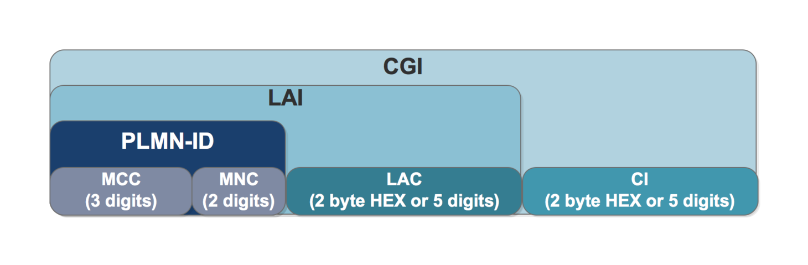
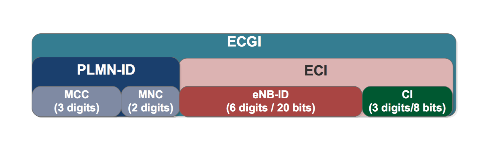
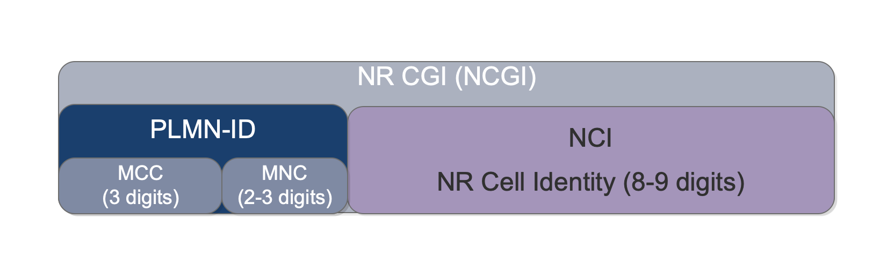
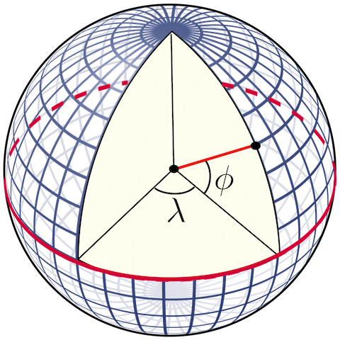
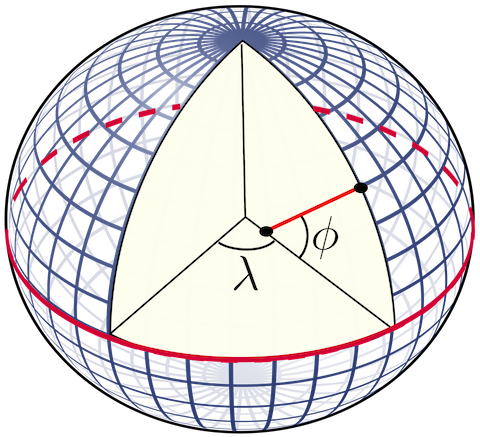
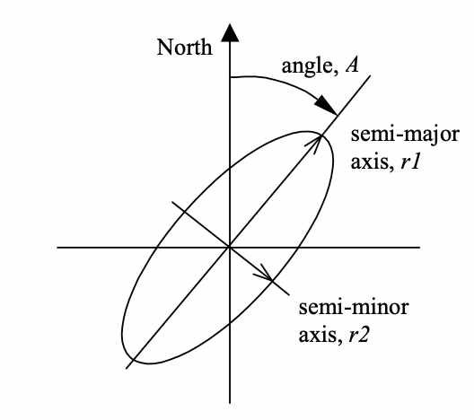
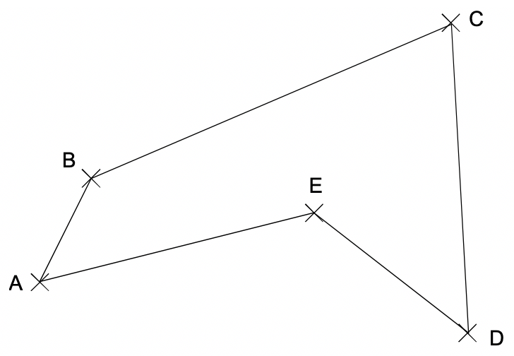
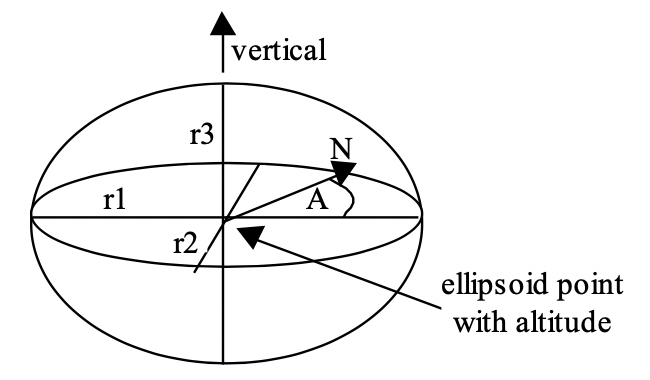
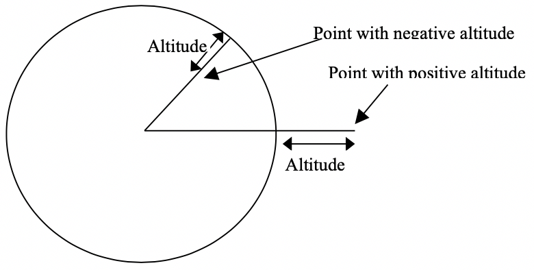
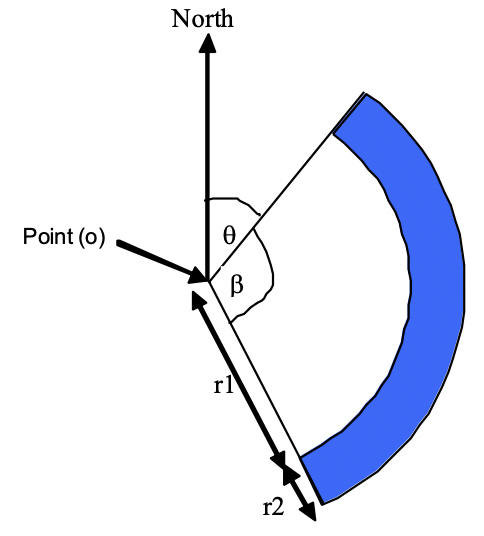

[[_gmlc_overview]]
= Overview

== Control Plane Location
GMLC stands for Gateway Mobile Location Centre and enables offering Location Based Services (LBS) to mobile subscribers roaming across several Mobile Network
Operator's Radio Access Networks, regardless of the type of access (GERAN, UTRAN, E-UTRAN or 5GNR).

Existing Public Land Mobile Network (PLMN) elements are proprietary and run on own operating environments located in trusted operator zones which make it
difficult to build and deploy new applications. Likewise, these network elements neither provide the tools nor the interfaces needed to access and retrieve
data from content providers over the Internet. {this-platform} {this-application} connects to these network elements and enables the flow of Location
Services (LCS) messages to be extended to an open, standards-based Application Server (AS) located in the IP network. The AS also provides the tools and interfaces to enable access to content providers through the Internet. A GMLC is the first node an external LCS client accesses within a PLMN. There may be more than one GMLC in a PLMN.

== User Plane Location
{this-platform} {this-application} implementation also comprises a SUPL Location Platform. The Secure User Plane Location (SUPL) protocol runs over the
TCP/IP network, enabling gathering location information from SUPL Enabled Terminals (SET) without the need to integrate to mobile core network’s backbones
such as SS7 or Diameter. Hence, its application may be used not only by mobile phones with GPS capabilities but by general-purpose computers, IoT devices, etc.

No integration with the MNO’s core network is required as SUPL runs in the user plane. Rather, the MNO acts as a bit pipe between the devices and the SUPL Location Platform (GMLC). Hence, the value chain for LBSs turns from a network-centric to a device-centric one, where positioning is controlled by the mobile devices and assisted by independent location providers that are interconnected with the devices via IP.

As SUPL Enabled Terminals (SETs) make use of the Global Navigation Satellite System to assist them in gathering its geolocation, the accuracy of the location
information retrieved is almost always greater than other positioning techniques if available in Radio Access Networks such as OTDOA, UTDOA, E-OTD, ECID, etc.

The SLP address is made available to the SET (SUPL Enabled Terminal) by the provisioning of it in the UICC (SIM), resident applications on the SET or a default SLP address is derived. This address must be in the form of a FQDN and should be securely provisioned by the Home Network of the SET or the UICC manufacturer.

TLS 1.1 or higher shall be used to provide confidentiality and data integrity between a SET and the SLP. All SUPL messages except SUPL INIT must be delivered within a TLS session between the SET and the SLP. If these conditions are met, a TLS socket can be established between the SLP and the SET in the user-plane.

Applications for location services (LCS) clients may or may not be provided by operators themselves, or through partnerships with third parties. As well as authorizing such requests from LCS Clients, the SLP is responsible for directly communicating with the SET in order to determine its current position and subsequently returning the results of such calculations to the LCS Client.

SUPL also allows for a resident application on the SET to query the SLP at any time for assistance in calculating, or to provide calculation of the SETs own
current location. {this-platform} {this-application} may use its control plane capabilities too for assistance in positioning calculation. Whenever A-GPS or
A-GNSS is not available, if the current Cell Global Identification is gathered, coordinates can be obtained via a query to a database.

[[_restcomm_gmlc_overview_features]]
== Major Features

{this-platform} {this-application} implementation of GMLC is the first and only open source GMLC with a host of rich features and advantages.

Java-based:::
  {this-platform} {this-application} is the only Java based GMLC Gateway.
  It is robust and reliable and can be installed on any Operating System that supports Java (JDK 11 and SCTP).

Open Source:::
 {this-platform} {this-application} is based on open-source software, mostly from the RestComm/Mobicents projects.

Carrier Grade Performance:::
  {this-platform} {this-application} has been developed to be deployed at Mobile Network Operators around the world to process billions of LCS transactions every day.
  A single {this-platform} {this-application} node can process up to 400's LCS/sec and can be adapted to the needs of Communication Service Providers of different sizes in any country reducing CAPEX and OPEX costs.

Cloud Ready:::
  {this-platform} {this-application} is cloud-ready.
  It can be deployed on dedicated hardware, private cloud infrastructure or public IaaS such as AWS.

SIGTRAN (M3UA):::
 {this-platform} {this-application} has in-built support for SIGTRAN (M3UA using SCTP).

Diameter-based Sh, SLh and SLg (ELP):::
  {this-platform} {this-application} also has in-built support for LCS in LTE networks (Diameter over SCTP or TCP).

HTTP/JSON interface:::
  {this-platform} {this-application} HTTP interface is a common interface that can be used for connection with service applications. {this-platform} {this-application} supports network/application/service initiated LCS requests.

MLP:::
  Location requests can be sent to the {this-platform} {this-application} using plain XML over HTTP(S), with the requests encoded in OMA MLP (Mobile Location
Protocol) version 3.4. See the full OMA MLP technical specification here: http://www.openmobilealliance.org/release/MLS/V1_3-20150512-A/OMA-TS-MLP-V3_4-20150512-A.pdf

SUPL:::
SUPL (Secure User Plane Location) employs user plane data bearers for transferring location information (e.g GPS assistance) and for carrying positioning
technology-related protocols between a SUPL Enabled Terminal (SET) and the network. SUPL needs only an IP capable network and requires minimum modification
to the network, and this is an efficient solution that can be deployed rapidly. See the OMA ULP (User Location Protocol) used to carry SUPL messages here:
http://member.openmobilealliance.org/ftp/Public_documents/loc/Permanent_documents/OMA-TS-ULP-V2_0_6-20200720-D.zip

JAIN SLEE:::
 JAIN SLEE (Java API for Integrated Networks Service Logic Execution Environment) specification constitutes the JAVA community framework for the high standards in terms of performance, availability, portability, scalability, robustness, event oriented execution logic, etc., suitable for services/applications inter-working within telecommunication networks.
  JAIN SLEE architecture, through its Resource Adaptors (RA), adjusts information from peripheral agents of the SLEE, namely: Mobile Switching Centre Servers (MSC/MSCS), Media Gateways (MGW, MGC/MGCF), Signaling Gateways (SGW), Mobility Management Entities (MME), SIP servers/proxies like Serving/Interrogating/Proxy-Call Session Control Functions (S-CSCF, I-CSCF, P-CSCF), Media Resource Function Control, mobile subscribers data base query to HSS/HLR through Diameter/MAP respectively, Signaling Control Points (SCP) through CAP/INAP, and other service protocols like SOAP (Simple Object Access Protocol), OSA/Parlay, LDAP (Lightweight Directory Access Protocol), JDBC (Java Data Base Connectivity), JPA (Java Persistence API), etc.
  The components that carry out logic implementation of services/applications according to JAIN SLEE are named Service Building Blocks or SBB. The SBB are executed within a «components container», which controls their life cycle and eases their composition. An SBB may comprise multiple child SBBs, which are also reusable for other services, encompassing Java code usually generated in a dynamic Service Creation Environment (SCE) or middleware platforms containing JAIN SLEE SBBs.
  JAIN SLEE service developer undergoes SBB construction by gathering logic items which represent events during the process of a service. As JAIN SLEE has been specially designed for event oriented logic execution, services are initiated by events like Diameter Requests/Answers. The generated SBBs then act together with the RAs under the JAIN SLEE framework so as to provide service to diverse external entities.  Every arriving event at the SLEE through the RAs is distributed among the SBBs in order to process them. This functionality is carried out by the «event router» as it is named within the functional structure of the JAIN SLEE framework.

MongoDB:::
  MongoDB is a cross-platform document-oriented NoSQL database program. {this-platform} {this-application} uses it for correlating MT-LR and EPC-MT-LR location reports LCS Reference Numbers with previous GMLC Clients reference numbers and their corresponding callback URL. Please check the Installation and Configuration Guide for setting MongoDB for the {this-platform} {this-application}.

Easy Configuration and Management:::
 {this-platform} {this-application} comes with an efficient Command Line Interface (CLI) tool allowing you to completely configure the  Gateway at run-time and manage it using simple commands rather than do everything manually.
  {this-platform} {this-application} also comes with a Graphical User Interface that will allow you to configure, monitor and manage the Gateway through a convenient user-friendly interface.

Location Data Records (CDR):::
  Each location attempt made by {this-platform} {this-application} generates a text file formatted record, usually known as CDRs in the Telco jargon.

[[_restcomm_gmlc_overview_tech_spec]]
=== Technical Specifications

{this-platform} {this-application} is not restricted by Transaction Per Second model. The only restricting factor is memory + CPU capacity of the host
servers, third-party applications or the underlying database service.

* {this-platform} {this-application} supports as many as 1073741823 incoming and 1073741823 outgoing concurrent sessions/dialogs.
* {this-platform} {this-application} SCTP supports as many associations as supported by the underlying Operating System. Can be setup for multi-homing.
* {this-platform} {this-application} M3UA can be configured to have as many ASPs/IPSPs as needed by the system.
* {this-platform} {this-application} SCCP can be configured to have virtually unlimited Global Title Translation rules and also supports wild characters for partial matching of Global Title digits.

[[_restcomm_gmlc_overview_http]]
=== HTTP Transfer Mechanism

{this-platform} {this-application} makes use of HTTP protocol between the gateway and the third-party applications (or Value Added Service Modules).
{this-platform} {this-application} receives location service requests from third-party applications and then translates these requests to SS7 MAP,
Diameter-based or SUPL commands when applies. The HTTP callback mechanism allows the third-party application to be agnostic to Operating System, Programming
Language and Framework.
The third-party application can be either of the following technologies on any Operating System:

* Apache Tomcat, JBoss AS, Oracle Application Server, IBM Websphere, etc. for JSP/Servlet on Java
* PHP
* Microsoft IIS for ASP

[[_restcomm_gmlc_overview_architecture_and_network_interfaces]]
== Architecture and Network Interfaces

Following figure illustrates {this-platform} {this-application} software architecture and network topology diagram interfaces for interconnection with GSM/UMTS/LTE core networks and GMLC clients and external APIs in the Internet.

.{this-platform} {this-application} Architecture and Interfaces.
image::images/GMLC_Arch_Interfaces.png[]

{this-platform} {this-application} supports the following MAP and Diameter-based operations for Location Services (LCS) within Mobile Network Operators
control plane:

* *MAP ATI*: Any-Time-Interrogation, to gather subscriber information from the HLR including Cell Global Identification, age of location information and potentially other location and subscriber information parameters such as the IMEI, IMSI, MNP information, location number, VLR/MSC/SGSN SCCP addresses, MME name, base station geographic/geodetic coordinates, E-UTRAN's CGI (LTE Cell ID), LTE tracking area identity, subscriber's state, GPRS routeing area identity, LSA identity, etc.
* *MAP PSI*: Provide-Subscriber-Information, to gather subscriber information as with MAP ATI but from the MSC/VLR or SGSN is currently attached to. This MAP operation is preceded by *MAP SRISM* or *SRI* for routing it to the appropriate MSC/VLR or SGSN, thus the subscriber information gathered from PSI also contains the IMSI.
* *MAP SRILCS*: Send Routing Information for Location Services, to gather IMSI and core network entity address (MSC or SGSN) to which send further location request.
* *MAP PSL*: Provide Subscriber Location, to gather location information from the UTRAN (UMTS Terrestrial Radio Access Network), which should include, besides Cell Global Identity, location estimates in geographic coordinates of the target User Equipment, depending on available positioning methods (e.g. E-OTD, OTDOA, UTDOA, A-GPS, etc.).
* *MAP SLR*: Subscriber Location Report, to gather location of a target User Equipment from the MSC or SGSN when a request for location is either implicitly administered or made at some earlier time in MAP PSL for event based deferred type of location.
* Diameter Routing Information Request/Answer (*RIR/RIA*): analogous to MAP SRILCS but over Diameter based SLh interface between GMLC and HSS.
* ELP Provide Location Request/Answer (*PLR/PLA*): analogous to MAP PSL but over Diameter-based Evolved Packet Core Location Protocol (ELP) SLg interface between GMLC and MME.
* ELP Location Report Request/Answer (*LRR/LRA*): analogous to MAP SLR, but over Diameter-based Evolved Packet Core Location Protocol (ELP) SLg interface between GMLC and MME.
* Sh User-Data-Request/Answer (*UDR/UDA*): similar to MAP ATI, but over Diameter-based IMS Sh interface between the GMLC (acting as a SIP-AS) and the HSS.

{this-platform} {this-application} supports the following SUPL messages for LCS within the user plane:

* *SUPL INIT*: used by the SLP module of {this-platform} {this-application} to initiate a SUPL session with the SET. This message is used in Network
Initiated SUPL Services.
* *SUPL POS INIT*: used by the SET to initiate the positioning protocol session (RRLP/RRC/TIA-801/LPP/LPPe) with the SLP module of
{this-platform} {this-application}.
* *SUPL POS*: used between the SLP module of
{this-platform} {this-application} and the SET to exchange positioning procedure messages (RRLP/RRC/TIA-801/LPP/LPPe) used to calculate the position of the SET.
* *SUPL END*: used by the SLP module of
{this-platform} {this-application} or the SET to end an existing SUPL session.
* *SUPL TRIGGERED START*: used by the SET to start a triggered SUPL session with the SLP module of
{this-platform} {this-application}.
* *SUPL TRIGGERED RESPONSE*: used by the SLP module of
{this-platform} {this-application} as a response to a SUPL TRIGGERED START message.
* *SUPL TRIGGERED STOP*: used by the SLP module of
{this-platform} {this-application} or SET to end an existing SUPL TRIGGERED session.
* *SUPL RESPONSE*: used by the SLP module of
{this-platform} {this-application} as a response to a SUPL START message in a SET initiated location request.
* *SUPL REPORT*: used by the SLP module of
{this-platform} {this-application} or SET to report position estimate and/or network measurement results.

[[_restcomm_location_information]]
== Location Information

The simplest location information a GMLC can retrieve is by issuing a MAP ATI (Any Time Interrogation) request to the HLR (Home Location register). MAP ATI is part of CAMEL phase 1. If the GMLC is allowed to proceed with the operation at the HLR, the latter will respond with subscriber information including the Cell Global Identification (CGI) as for the latest MAP Update Location operation carried out between the HLR and VLR at which the target mobile equipment is attached too for basic ATI. If active location retrieval (ALR) is requested within the ATI (an enhancement available in later CAMEL versions), then the location information as currently stored in the VLR can be gathered by a PSI command between sent to the MSC from the HLR, and consequent mobile station paging. CGI represents the location information with greatest error margin retrievable by a GMLC in GSM based core networks.

As shown in the figure below taken from 3GPP TS 23.003, CGI is made up of multiple components, namely, MCC (Mobile Country Code), MNC (Mobile Network Code), LAC (Location Area Code) and CI (Cell Identity). The combination of MCC and MNC equals the PLMN-ID, which represents the PLMN at which the cell is located, i.e. the country and Home-PLMN it belongs to.  LAC represents a geographic location area in which a cluster of Base Transceiver Stations (BTS) are located for radio access. the combination of PLMN-ID and LAC becomes the Location Area Identification or LAI. The CI (Cell ID) uniquely identifies the BTS providing service to the target subscriber in that area (more commonly known as cell). Finally, the combination of LAI and CI composes the CGI.
The following figure shows the composition of the CGI. Notice that LAC and CI can be represented by 2 hexadecimal bytes each (eventually BCD converted) or by 5 decimal digits.

.CGI composition.

In LTE networks, the CGI becomes the ECGI (E-UTRAN Cell Global Identification).
The ECGI shall be composed of the concatenation of the PLMN Identifier (PLMN-Id) and the E-UTRAN Cell Identity (ECI) as shown in next figure and shall be globally unique.
The eNB-ID (identity of the LTE base station, known as eNodeB or eNB), and the CI.
The ECI shall be of fixed length of 28 bits and shall be coded using full hexadecimal representation. The exact coding of the ECI is the responsibility of each PLMN operator.
eNB-ID is represented by 6 digits (20 bits) while the LTE CI is represented by 3 digits (8 bits). The combination of eNB-ID and CI is the ECI.

.ECGI composition.

In 5G networks or 5GS (5G System), the Cell Global Identification is denominated New Radio (NR) Cell Global Identity (NCGI) composed of the concatenation of the PLMN Identifier (PLMN-ID) and the NR Cell Identity (NCI). The NCI shall be of fixed length of 36 bits and shall be coded using full hexadecimal representation. The exact coding of the NCI is the responsibility of each PLMN operator.

.NCGI composition.

Another way to gather location information using SS7 MAP operations is through MAP PSI (Provide Subscriber Information). Actually, PSI is used by the HLR after each MAP ATI to gather the subscriber information requested from the latter.

Besides *CGI* or *ECGI*, other location information parameters/identifications are available through MAP ATI or PSI, namely:

* *SAI* (Service Area Identification): used to identify an area consisting of one or more cells belonging to the same Location Area. Such an area is called a Service Area and can be used for indicating the location of a UE to the core network. It is composed by the LAI and the Service Area Code (SAC), defined by the operator, and set in the RNC (Radio Network Controller). A cell may belong to one or two Service Areas. If it belongs to two Service Areas, one is applicable in the Broadcast (BC) domain and the other is applicable in both the CS (Circuit-Switched) and PS (Packet-Switched) domains. The Broadcast (BC) domain requires that its Service Areas consist of only one cell each. This does not limit the use of Service Areas for other domains.
* *Location Number*: is a number which defines a specific location within a PLMN. The location number is formatted according to ITU-T Recommendation E.164. Country Code (CC) and National Destination Code (NDC) fields of the location number are those which define the PLMN of which the location is part. The structure of the locally significant part (LSP) of the location number is a matter for agreement between the PLMN operator and the national numbering plan administrator in the PLMN's country.
    In the end, it is composed by:
     - odd flag
     - nature of address indicator
     - internal network number indicator
     - numbering plan indicator
     - address presentation restricted indicator
     - screening indicator
     - address digits
* *RAI* (Routing Area Identification): composed by the LAI (MCC, MNC, LAC) and RAC (Routing Area Code), which is a fixed 1 octet length code identifying a routing area within a location area (available from PS core networks like GPRS).
* *LSA ID* (Localised Service Area ID): also available from PS core networks, it can either be a PLMN significant number or a universal identity. This shall be known both in the networks and in the SIM. The LSA ID consists of 24 bits. Bit 0 indicates whether the LSA is a PLMN significant number or a universal LSA. If the bit is set to 0 the LSA is a PLMN significant number; if bit 0 is set to 1, then it is a universal LSA.
* *TAI* (Tracking Area Identification): composed by the PLMN-ID (MCC and MNC) and the Tracking Area Code (TAC), which is a fixed length code of 2 octets identifying a Tracking Area within a PLMN. The TAI is gathered from the Evolved Packet System (EPS). The RAN in 4G networks is called LTE or E-UTRAN, while the core network is called EPC (Evolved Packet Core). Together they compose the EPS.
* *Geographical Information*: Shall be present if the VLR can derive it from the stored service area identity, cell global identity or location area identity; otherwise shall be absent. If present, it shall provide the following parameters:
    - Type of shape: described in 3GPP TS 23.032 (Geographical Area Description), it can only be `EllipsoidPointWithUncertaintyCircle` for MAP ATI or MAP PSI Geographical or Geodetic Information.
    - Latitude: the angle between the equatorial plane and the perpendicular straight line from the Earth's center and the point expressed in the range -90°, +90°. As for WGS84 -World Geodetic System 1984-, Negative decimal values refer to South degrees of latitude, while positive to North degrees of latitude.
    - Longitude: the angle between the half-plane determined by the Greenwich meridian and the half-plane defined by the point and the polar axis, measured Eastward, expressed in the range -180°, +180°. As for WGS84, negative decimal values refer to West degrees of longitude, while positive to East degrees of longitude.
    - Uncertainty: method of describing the uncertainty for latitude and longitude indicating a radius, thus the subscriber is located within the circle defined by an ellipsoid and the radius. The uncertainty r, expressed in metres, is mapped to a number K, with the following formula: r = C((1+x)^k -1), with C = 10 and x = 0,1. With 0 * K * 127, a suitably useful range between 0 and 1800 kilometres is achieved for the uncertainty, while still being able to code down to values as small as 1 metre. The uncertainty can then be coded on 7 bits, as the binary encoding of K.

.Geographical coordinates.

* *Geodetic Information*: corresponds to the Calling Geodetic Location defined in ITU-T Recommendation Q.763. Shall be present if the VLR can derive it from the stored service area identity, cell global identity or location area identity; otherwise shall be absent.
It adds the parameters `confidence` and `screening and presentation indicators, considering always that geodetic latitude is determined by the angle between the equatorial plane and the normal to the ellipsoid, whereas geocentric latitude is determined by the angle between the equatorial plane and line crossing the point to the centre of the ellipsoid.
The confidence by which the position of a target entity is known to be within the shape description, (expressed as a percentage) is directly mapped from the 7 bit binary number K, except for K=0 which is used to indicate _no information_, and 100 < K < 128 which should not be used but may be interpreted as _no information_ if received.
    - Type of shape: as described previously for _Geographical Information_.
    - Latitude: the angle between the equatorial plane and the perpendicular to the plane tangent to the ellipsoid surface at the point expressed in the range -90°, +90°. As for WGS84 -World Geodetic System 1984-, Negative decimal values refer to South degrees of latitude, while positive to North degrees of latitude.
    - Longitude: as described previously for _Geographical Information_.
    - Uncertainty: as described previously for _Geographical Information_.
    - Confidence:

.Geodetic coordinates.

* *VLR Number*: E.164 number which identifies the VLR (VLR Global Title address digits).
* *MSC Number*: E.164 number which identifies the MSC (MSC Global Title address digits).
* *SGSN Number*: E.164 number which identifies the SGSN (SGSN Global Title address digits).
* *MME Name*: string which contains the MME Diameter identity User-Name in a format consistent with the NAI specification.
* *Age of Location Information*: indication in minutes of how old is the gathered location information.
* *Subscriber State*: indication of whether the subscriber is idle or busy, attached or detached, not provide by VLR (CS domain), not provided by SGSN or MME, PDP active reachable or not for paging (PS domain), or determined not reachable by the network.
* *Not Reachable Reason*: whenever the Subscriber State is determined not reachable by the network, the reason may vary from IMSI detached, restricted area, MS purged or not registered.
* *MS Classmark*: descriptor of radio network-related capabilities of the MS or UE in use by the served subscriber (e.g MT-SMS, voice broadcast or group call services, etc.).
* *GRPS MS Class*: includes two elements: MS network capabilities (e.g. SMS) and MS radio access capabilities (e.g. radio access technologies support).
* *IMEI*: International Mobile Equipment Identity as for 3GPP TS 22.016/23.003.

More advanced location procedures like MAP PSL/SLR or analogous Diameter based PLR/PLA and LRR/LRA, as well as those involving SUPL sessions in the user plane,
provide other location information parameters,
namely:

* *Location Estimate* and *Additional Location Estimate*: contain an estimate of the location of the UE in universal coordinates and other parameters depending on the type of shape, namely:
    - *Type of shape*: described in 3GPP TS 23.032 (Geographical Area Description), it can take one of the following values:
        ... `EllipsoidPoint`
        ... `EllipsoidPointWithUncertaintyCircle`
        ... `EllipsoidPointWithUncertaintyEllipse`
        ... `Polygon` (encoding be filled in in the *Additional Location Estimate* parameter).
        ... `EllipsoidPointWithAltitude` (encoding shall be filled in the *Additional Location Estimate* parameter.
        ... `EllipsoidPointWithAltitudeAndUncertaintyEllipsoid`
        ... `EllipsoidArc`.
    - *Latitude*: same as described for _Geographical Information_.
    - *Longitude*: same as described for _Geographical Information_.
    - *Uncertainty*: same as described for _Geographical Information_.
    - *Uncertainty Semi-Major-Axis*: applicable only to `EllipsoidPointWithUncertaintyEllipse` and `EllipsoidPointWithAltitudeAndUncertaintyEllipsoid` type of shape (see their description for better understanding of this parameter).
    - *Uncertainty Semi-Minor-Axis*: applicable only to `EllipsoidPointWithUncertaintyEllipse` and `EllipsoidPointWithAltitudeAndUncertaintyEllipsoid` type of shape (see their description for better understanding of this parameter).
    - *Altitude*: Applicable only to `EllipsoidPointWithAltitudeAndUncertaintyEllipsoid` and `EllipsoidPointWithAltitude` type of shape (in metres).
    - *Uncertainty Altitude*: uncertainty of the altitude included in `EllipsoidPointWithAltitudeAndUncertaintyEllipsoid` and `EllipsoidPointWithAltitude` type of shape (range between 0 and 990 meters).
    - *Inner Radius*: Inner radius (in meters) only applicable to type of shape `EllipsoidArc` (see its description for better understanding of this parameter).
    - *Uncertainty Inner Radius*: Inner radius uncertainty (in meters) only applicable to type of shape `EllipsoidArc` (see its description for better understanding of this parameter).
    - *Offset Angle*: applicable only applies to type of shape `EllipsoidArc` (see its description for better understanding of this parameter).
    - *Included Angle*: applicable only applies to type of shape `EllipsoidArc` (see its description for better understanding of this parameter).
    - *Confidence*: the confidence (in percentaje) by which the position of a target entity is known to be within the shape description (expressed as a percentage). Only applies to types of shapes `EllipsoidPointWithUncertaintyEllipse`, `EllipsoidPointWithAltitudeAndUncertaintyEllipsoid` and `EllipsoidArc` (see their description for better understanding of this parameter).
* *Age of Location Estimate*: indication in minutes of how old is the gathered location estimate.
* *Velocity Estimate*:
    - *Horizontal Speed*: the horizontal speed gives the magnitude of the horizontal component of the velocity of the target entity.
    - *Bearing*: provides the direction of the horizontal component of velocity taken clockwise from North.
    - *Vertical Speed*: vertical component of the velocity of the target entity.
    - *Uncertainty Horizontal Speed*: uncertainty of the horizontal speed.
    - *Uncertainty Vertical Speed*: uncertainty of the vertical speed.
    - *Velocity Type*: type of velocity which could be:
        ... `HorizontalVelocity`: characterized by the horizontal speed and bearing. The horizontal speed gives the magnitude of the horizontal component of the velocity of a target entity. The bearing provides the direction of the horizontal component of velocity taken clockwise from North.
        ... `HorizontalWithVerticalVelocity`: characterized by horizontal speed, bearing, vertical speed and direction. The horizontal speed and bearing characterise the horizontal component of velocity. The vertical speed and direction provides the component of velocity of a target entity in a vertical direction.
        ... `HorizontalVelocityWithUncertainty`: Horizontal velocity with uncertainty is characterized by a horizontal speed and bearing, giving a horizontal velocity vector V, and an uncertainty speed s.
        ... `HorizontalWithVerticalVelocityAndUncertainty`: Horizontal and vertical velocity with uncertainty is characterized by a horizontal speed and bearing, giving a horizontal velocity vector Vx,y, a vertical speed and direction giving a vertical velocity component Vz,and uncertainty speeds s1 and s2.
* *Periodic LDR Info*: Reporting-Interval x Reporting-Amount shall not exceed 8639999 (99 days, 23 hours, 59 minutes and 59 seconds) for compatibility with OMA MLP and RLP
    - *Reporting Amount*: reporting frequency (vales between 1 and 8639999)
    - *Reporting Interval*: reporting interval in seconds (1 and 8639999).
* *Deferred MT-LR Data*:
    - *Deferred Location Event Type*: type of event that triggered the location report: area event information (UE/MS available, entering, leaving or being inside an area), a motion event, periodic location reports or maximum interval expiration.
    - *Termination Cause*: `Normal`, `Error Undefined`, `Internal timeout`, `Congestion`, `MT_LR_Restart`, `Privacy Violation`, `Shape of Location Estimate Not Supported`, `Subscriber Termination`, `UE Termination`, `Network Termination`.
    - *Serving Node*: in case the Termination Cause equals _MT_LR_Restart_, the serving node values, i.e. `MME Name`, `MME Realm`, `SGSN Name`, `SGSN Realm`, `SGSN Number`, `MSC Number`, `AAA Server Name`, `LCS Capabilities set`.
* *Delayed Location Reporting Data*:
    - *Termination Cause*: as explained for _Deferred MT-LR Data_.
    - *Serving Node*: as explained for _Deferred MT-LR Data_.
* *Civic Address*: indicates the civic address at which the UE is located.
* *Barometric Pressure*: indicates the barometric pressure of the geographical area at which the UE is located

Either SS7 MAP LSM operations (MAP SRIforLCS, PSL and SLR) or Diameter-based operations over SLh/SLg interfaces are procedures which rely on the existence of an SMLC/E-SMLC for the `Location-Estimate` gathering. Also, positioning technologies must rely on the RAN as will be described in the chapter describing SMLC and E-SMLC further in this document.

=== Geographical Type Of Shapes

==== EllipsoidPoint

An _ellipsoid point_ can be considered as a point on the surface of the ellipsoid, consisting of a latitude and a longitude. In practice, such a description can be used to refer to a point on or close to Earth's surface with the same latitude and longitude.

==== EllipsoidPointWithUncertaintyCircle

The _ellipsoid point with uncertainty circle_ is characterized by the coordinates of an ellipsoid point (the origin) and a distance r. It describes formally the set of points on the ellipsoid which are at a distance from the origin less than or equal to r, the distance being the geodesic distance over the ellipsoid, i.e., the minimum length of a path staying on the ellipsoid and joining the two points.

As for the ellipsoid point, this can be used to indicate points on the Earth surface, or near the Earth surface, of same latitude and longitude.

The typical use of this shape is to indicate a point when its position is known only with a limited accuracy.

==== EllipsoidPointWithUncertaintyEllipse

The _ellipsoid point with uncertainty ellipse_ is characterized by the coordinates of an ellipsoid point (the origin), distances r1 and r2 and an angle of orientation A.

It describes formally the set of points on the ellipsoid which fall within or on the boundary of an ellipse with semi-major axis of length r1 oriented at angle A (0 to 180º) measure clockwise from north and semi-minor axis of length r2, the distances being the geodesic distance over the ellipsoid, i.e., the minimum length of a path staying on the ellipsoid and joining the two points, as show in next figure.

.Description of an uncertainty Ellipse.

As for the _ellipsoid point_, this can be used to indicate points on or near the Earth's surface, of same latitude and longitude. The confidence level with which the position of a target entity is included within this set of points is also included with this shape.

The typical use of this shape is to indicate a point when its position is known only with a limited accuracy, but the geometrical contributions to uncertainty can be quantified.

==== Polygon

A polygon is an arbitrary shape described by an ordered series of points (in the example pictured in the drawing, A to E).

The minimum number of points allowed is 3, and the maximum number of points allowed is 15. The points shall be connected in the order that they are given. A connecting line is defined as the line over the ellipsoid joining the two points and of minimum distance (geodesic). The last point is connected to the first.

The list of points shall respect a number of conditions:

    - a connecting line shall not cross another connecting line;
    - two successive points must not be diametrically opposed on the ellipsoid.

The described area is situated to the right of the lines with the downward direction being toward the Earth's centre and the forward direction being from a point to the next.

.Description of a Polygon.

==== EllipsoidPointWithAltitudeAndUncertaintyEllipsoid

The _ellipsoid point with altitude and uncertainty ellipsoid_ is characterized by the coordinates of an ellipsoid point with altitude, distances r1 (the `semi-minor uncertainty`), r2 (the `semi-minor uncertainty`) and r3 (the `vertical uncertainty`) and an angle of orientation A (the `vertical uncertainty`).

It describes formally the set of points which fall within or on the surface of a general (three dimensional) ellipsoid centered on an ellipsoid point with altitude whose real semi-major, semi-mean and semi-minor axis are some permutation of r1, r2, r3 with r1 ≥ r2. The r3 axis is aligned vertically, while the r1 axis, which is the semi-major axis of the ellipse in a horizontal plane that bisects the ellipsoid, is oriented at an angle A (0 to 180 degrees) measured clockwise from North, as illustrated in next figure.

.Description of an Ellipsoid Point with Altitude and Uncertainty Ellipsoid.

==== EllipsoidPointWithAltitude

The description of an ellipsoid point with altitude is that of a point at a specified distance above or below a point on the earth's surface. This is defined by an ellipsoid point with the given longitude and latitude and the altitude above or below the ellipsoid point. Next figure depicts the altitude aspect of this description.

.Description of an Ellipsoid Point with Altitude.

==== EllipsoidArc

An ellipsoid arc is a shape characterized by the co-ordinates of an ellipsoid point o (the origin), inner radius r1, uncertainty radius r2, both radii being geodesic distances over the surface of the ellipsoid, the offset angle (&#952;) between the first defining radius of the ellipsoid arc and North, and the included angle (&#946;) being the angle between the first and second defining radii. The offset angle is within the range of 0 to 359,999 degrees while the included angle is within the range from 0,000…1 to 360 degrees. This is to be able to describe a full circle, 0 to 360 degrees.

This shape-definition can also be used to describe a sector (inner radius equal to zero), a circle (included angle equal to 360 degrees) and other circular shaped areas. The confidence level with which the position of a target entity is included within the shape is also included.

.Description of an Ellipsoid Arc.

[[_ss7_operations]]
== SS7 MAP Operations

Both MAP ATI and MAP PSI could be conveyed to Visited-PLMN (offnet) rather than H-PLMN (on-net), but either would demand roaming agreements and allowed SS7 credentials.
SS7 *MAP ATI* (`Any-Time-Interrogation`), is used to gather subscriber information from the HLR including Cell Global Identification, age of location information and potentially other location and subscriber information parameters such as the IMEI, IMSI, MNP information, location number, VLR/MSC/SGSN SCCP addresses, MME name, base station geographic/geodetic coordinates, E-UTRAN’s CGI (LTE Cell ID), LTE tracking area identity, subscriber’s state (idle or busy), GPRS routeing area identity, LSA identity, etc.

SS7 *MAP PSI* (`Provide Subscriber Information`), is used to gather subscriber information as with MAP ATI but from the MSC/VLR or SGSN is currently attached to. This MAP operation is preceded by MAP SRIforSM or SRI for routing it to the appropriate MSC/VLR or SGSN, thus the subscriber information gathered from PSI also contains the IMSI.

UMTS Location Services under SS7 MAP Location Services Management (LSM) set of operations are currently under final stages of implementation and deployment.
Always as for 3GPP specs, a Stand-Alone SMLC can be placed within the BSC for triggering more precise location procedures. For 3G cellular networks (UMTS/HDSPA, HSPA+) the SMLC interfaces the MSC and/or the SGSN instead of being placed within the BSC (which in the UTRAN is now denominated as Radio Network Controller -RNC-). Naturally, accuracy comes with a price. When these dearer location capabilities are available, the GMLC may request routing information from the HLR via the Lh interface or HSS (Home Subscriber Server) via the SLh/Lh interface.

SS7 *MAP SRIforLCS* (`Send Routing Information for Location Services`), to gather IMSI and core network entity address (MSC or SGSN) to which send further location request.

SS7 *MAP PSL* (`Provide Subscriber Location`), to gather location information from the UTRAN (UMTS Terrestrial Radio Access Network), which should include, besides Cell Global Identity, location estimates in geographic coordinates of the target User Equipment, depending on available positioning methods (e.g. E-OTD, OTDOA, UTDOA, A-GPS, etc.).

SS7 *MAP SLR* (`Subscriber Location Report`), to gather location of a target User Equipment from the MSC or SGSN when a request for location is either implicitly administered or made at some earlier time in MAP PSL for event based deferred type of location.

[[_diameter_operations]]
== Diameter LTE/IMS Location Services Operatioons

While Lh interface resides in a Circuit-Switched Core Network and therefore demands SS7 MAP operations, SLh is placed in the Evolved Packet Core (EPC) and is a Diameter-based interface for LTE location services, as specified by 3GPP TS 29.173.
After performing registration authorization, it may send positioning requests to either VMSC (Visited Mobile Switching Centre), SGSN (Serving GPRS Support Node), MSCS (Mobile Switching Centre Server) or MME (Mobility Management Entity) and receives final location estimates from the corresponding entity via the Lg, Lgd or SLg interface. Again, Lg/Lgd interfaces demand SS7 MAP operations while SLg is a Diameter-based interface for LTE location occupying ELP procedures, where ELP stands for EPC Location Protocol as specified by 3GPP TS 29.172.

Diameter `Routing-Information-Request/Answer` (*RIR/RIA*): analogous to MAP SRIforLCS but over Diameter based SLh interface between GMLC and HSS.

ELP `Provide-Location-Request/Answer` (*PLR/PLA*): analogous to MAP PSL but over Diameter-based Evolved Packet Core Location Protocol (ELP) SLg interface between GMLC and MME.

ELP `Location-Report-Request/Answer` (*LRR/LRA*): analogous to MAP SLR, but over Diameter-based Evolved Packet Core Location Protocol (ELP) SLg interface between GMLC and MME.

A similar way to obtain location information, such as via SS7 MAP ATI or PSI, but from the IP Multimedia Subsystem (IMS) is through Diameter-based Sh interface (as defined by 3GPP TS 29.328/29.329), between a SIP-AS (SIP Application Server) and the HSS. Hence, by providing Sh Diameter resource adaptor, the GMLC can act as a SIP-AS and execute a User-Data-Request command to the HSS, from which the following can be retrieved:

Diameter `User-Data-Request/Answer` (*UDR/UDA*): similar to MAP ATI and/or MAP PSI, but over Diameter-based Sh interface between the GMLC and the HSS:

* CS Location Information: containing location parameters such as:
    - Location Number
    - Cell Global Id
    - Geographical Information
    - Geodetic Information
    - MSC Number
    - VLR Number
    - Age of location information
    - Current location information retrieved boolean value
    - User Closed Subscriber Group Id (CSG-Id)
    - E-UTRAN Cell Global Id
    - Tracking Area Id
    - Local Time Zone
* PS Location Information:
    - Cell Global Id
    - Routing Area Id
    - Geographical Information
    - Geodetic Information
    - SGSN Number
    - Age of location information
    - Current location information retrieved boolean value
    - User Closed Subscriber Group Id (CSG-Id)
    - Visited PLMN ID
    - Local Time Zone
    - Radio Access Technology (RAT) Type
* EPS Location Information:
    - E-UTRAN Cell Global Id
    - Tracking Area Id
    - Geographical Information
    - Geodetic Information
    - MME Name
    - Age of location information
    - Current location information retrieved boolean value
    - User Closed Subscriber Group Id (CSG-Id)
    - Visited PLMN ID
    - Local Time Zone
    - Radio Access Technology (RAT) Type
* 5GS Location Information:
    - NR Cell Global Id
    - E-UTRAN Cell Global Id
    - Tracking Area Id
    - Geographical Information
    - AMF address
    - SMSF Address
    - Age of location information
    - Current location information retrieved boolean value
    - Visited PLMN ID
    - Local Time Zone
    - Radio Access Technology (RAT) Type

In summary, location information retrieval within the control plane of a Mobile Core Network is done through the GMLC and its core network counterparts, which might include just the HLR/HSS and MSC/VLR, SGSN or MME, as well as the Stand-Alone Serving Mobile Location Centre (SAS) for location within the UTRAN (UMTS Terrestrial Radio Access Network) or Enhanced-SMLC (E-SMLC) for location within the E-UTRAN (Enhanced-UTRAN or LTE), along with the positioning methods available in the RAN (OTDOA, UTDOA, E-OTD, etc.). If available and up to this version of Extended-GMLC, 5GS location information can be retrieved indirectly from the Sh interface.

Location information retrieval in the user plane is performed through a positioning system using OMA's Secure User Plane Location (SUPL) protocol, also known as SLP (SUPL Location Platform). Although it's not part of {this-platform} {this-application} yet, user plane positioning via SUPL is currently being developed. As mentioned in numerous white papers, a combination of procedures in either planes is considered the ideal solution by the industry for location services in Next Generation Networks.

Up to this point, what is known as _Immediate Location Request_ has been covered. {this-platform} {this-application} can also handle _Deferred Location Requests_, which represents retrieving of location contingent on some current or future events where the response from the LCS Server to the LCS Client may occur after the request was sent, as described in 3GPP TS 23.271. When a deferred location request is triggered by the GMLC, event-based _Subscriber Location Reports_, either conveyed through MAP or ELP are sent back to the GMLC by the entity at which the target mobile equipment is attached to (VMSC, MSCS, SGSN or MME).
