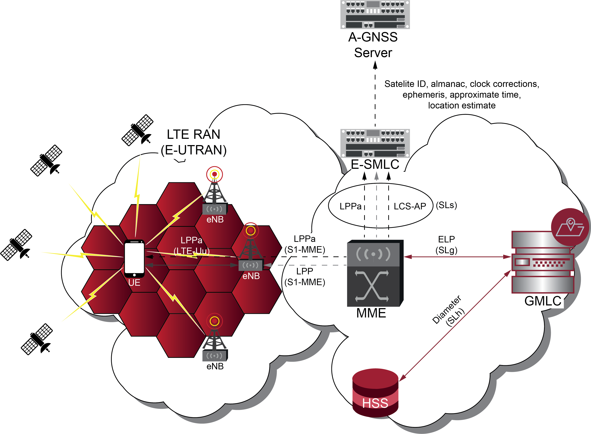

[[_ue_positioning]]
= User Equipment Positioning

[[_ran_positioning_methods]]
== Radio Access Network Positioning Methods

Several methodologies are used upon Radio Access Networks (RAN) for LCS. Following, are briefly described the most used location methods among all generations of mobile RAN, including GSM Base Station Subsystem (BSS), UMTS Terrestrial RAN (UTRAN) and EPS Enhanced UTRAN (E-UTRAN or LTE):

 * *A-GNSS* (`Assisted Global Navigation Satellite System`): it comprises a method based on or assisted by the mobile equipment which performs satellite measurements through GPS, Galileo or GLONASS. It achieves the greatest precision, but not available in legacy mobile equipment and positioning is compromised in urban/indoors environments.

 * *TDOA* (`Time Difference Of Arrival`): the time difference of arrival of two signals traveling between the given node and two reference nodes is estimated. This determines the location of the given node on a hyperbola with focal point at the two reference nodes. A third reference node is needed to triangulate the position of the mobile equipment. It is called hyperbolic trilateration because it uses hyperbolas and no spheres or circles. In hyperbolic trilateration, at least three BTSs are necessary to get a clear position of a mobile equipment. The error margin is between 100 and 300 meters.

 * *OTDOA* (`Observed Time Difference Of Arrival`): it consists of a mobile equipment assisted method, based on RSTD (Reference Signal Time Difference) received from several locations across the `Downlink`, where location is calculated via trilateration. It achieves good precision (around 100 meters of error margin) and useful in every environment, even those inaccessible to satellites.

 * *UTDOA* (`Uplink Time Difference Of Arrival`): the main differences with OTDOA relies on the fact that it calculates positioning from time difference of arrival of signals in the `Uplink`, and that it encompasses a network assisted method.

 * *E-OTD* (`Enhanced Observed Time Difference`): only operational in GSM and GPRS networks. The mobile equipment sends a signal to the surrounding cells BTS, then the nearest one sends back the signal. The time taken between sending and receiving the wave is analysed by an SMLC, which calculates the cell phone position in the network. More accurate in best conditions than xTDOA, but vulnerable to accuracy degradation due to multipath reflections and needs a software update at the mobile equipment.

 * *AECID* (`Adaptive Enhanced Cell Identity`). It encompasses a method assisted by the mobile equipment or the network which uses a record of cell identities (CID), several measurements from the base stations, `Timing Advance (TA) and `Angle of Arrival` (AoA). Less precise than the latter but available in every environment and useful for handsets not compliant with the GNSS.`

 * *ECID* (`Enhanced Cell Identity`). Similar to AECID, but AoA is not used. Less precise than the latter but much less expensive to set up.

The aforementioned RAN positioning procedures bring up different concerns upon the following subjects, namely:

 * Accuracy (where error margin determines accuracy levels)
    - High: error margin lower than 50 meters.
    - Medium: error margin between 50 and 150 meters.
    - Low: error margin greater than 150 meters.
 * Power consumption
 * Latency (time needed for location retrieval)
 * Cost
 * Range of subscribers to be covered
 * Availability
 * Reliability

Following table depicts a comparison between these positioning methods in terms of most of the aforementioned parameters.

.RAN Positioning Methods comparison
[%autowidth]
|================================================================================================
| METHOD    | ACCURACY  | LATENCY   | AVAILABILITY  | RELIABILITY   | COST          | POWER
| *A-GNSS*  | High      | &#60;10s (outdoors)

                          &#126;35s (indoors)| Medium| Medium       | High          | Medium
| *TDOA*    |Medium-Low | &#60;10s  | Low           | Medium        | High          | Medium
| *OTDOA*   |High-Medium| &#60;10s  | Low           | High          | High          | Medium
| *UTDOA*   |High-Medium| &#60;10s  | Low           | High          | High          | High
| *E-OTD*   |High-Medium| &#60;10s  | Medium        | Medium        | Medium        | Medium
| *AECID*   |Medium-Low | &#60;10s  | Medium        | High          | Medium        | Medium
| *ECID*    | Low       | &#60;5s   | Medium        | High          | Low           | Low
|================================================================================================

From Release 9 onwards, 3GPP standardized positioning techniques for LTE defining A-GNSS as the primary method, while OTDOA and ECID as the fall-back methods when satellite assisted positioning is compromised like it often happens in urban/indoors environments.

=== A-GNSS

Assisted Global Navigation Satellite System (A-GNSS) is considered the most accurate and prioritized technique for determining the position of a UE under LTE access. It is traditionally based on satellite-based position estimation using Global Navigation Satellite Systems (GNSS), like GPS (US `Global Positioning System`), GLONASS (Russian `Globalnaya Navigazionnaya Sputnikovaya Sistema`), Galileo (European GNSS), etc.

When an unobstructed line of sight (LOS) to at least four satellites between them and the mobile handset, GNSS satellites send signals to these devices (which should have integrated GNSS receivers) containing information the mobile device uses to calculate the time needed for the signal to reach it.

.A-GNSS topology for positioning in LTE.

LOS reception of the low-power radio signals transmitted from the medium-earth-orbit satellites cannot be guaranteed within indoor areas, resulting in inaccurate location. This is one of the drawbacks of using A-GNSS only. Another problem is that in urban areas the Time To First Fix (TTFF) sometimes takes a very long time because buildings hinder GPS signals from being received, which results in a battery drain for UEs (as detailed in the previous table). Hence, other methods like OTDOA are more reliable than A-GNSS in indoors.

=== OTDOA

Observed Time Difference Of Arrival (OTDOA) is a downlink positioning method used in UMTS and LTE beyond 3GPP release 9. It is a multilateration method in which the UE measures the time of arrival (TOA) of signals received from multiple base stations (NB or eNB).

The TOAs from several neighbour NB/eNB are subtracted from a TOA of a reference base station to form OTDOAs.

Geometrically, each time or range difference determines a hyperbola. The point at which these hyperbolas intersect is the UE's location estimate according to this technique.

At least three timing measurements from geographically dispersed NBs/eNBs with good geometry are needed to solve for two UE coordinates (latitude/longitude).

The OTDOA positioning method in LTE is illustrated in next figure, where the UE measures three TOAs relative to the UE internal time base, &#964;~1~, &#964;~2~ and &#964;~3~. The measurement from eNB1 is selected as reference base station, and two OTDOAs are composed: t~2~~,~~1~=&#964;~2~ - &#964;~1~ and t~3~~,~~1~=&#964;~3~ - &#964;~1~.

Since each TOA measurement &#964;~i~ has a certain accuracy/uncertainty, the hyperbolas are shown with a certain width, illustrating the measurement uncertainty. The UE location estimate is the intersection area of the two hyperbolas (gray shaded area).

.OTDOA topology for positioning in UMTS/LTE.
image::images/OTDOA.png[A-GPSS, align="center"]