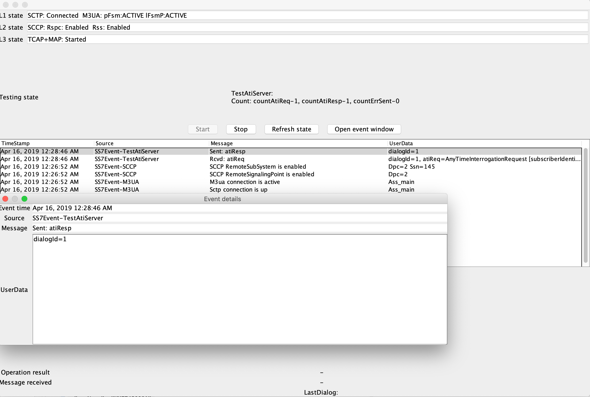

= Running (WildFly 10)
:doctype: book
:sectnums:
:toc: left
:icons: font
:experimental:
:sourcedir: .

== Running the Gateway

.Procedure: Run {this-platform} {this-application}
. Pre-requisite:

* You must have {this-platform} {this-application} installed as explained in the Configuration Guide.
* MongoDB must be running as a service with the *gmlc* database set as explained in the Configuration Guide.
* If you are using the SS7 board on server, you must ensure that the `java.library.path` variable is set to point to the directory containing the native component.
  Alternatively you can copy it to the JBoss native library path manually.

. All you have to do to start the Gateway is start the Wildfly Application Server.
  To start the Wildfly Server you must execute the [path]_standalone.sh_ (Unix) or [path]_standalone.bat_ (Microsoft Windows) startup script in the installation directory [path]_Extended-GMLC-<version>/wildfly-10.1.0.Final/bin_.
  Note that this will start the server in the default profile.
  The "default" profile is a clean profile where you start from scratch and configure the entire SS7 Stack and GMLC Gateway to suit your requirements.
. Result: If the service started properly you should see the following last few output lines in the Unix terminal or Command Prompt depending on your environment:

----
19:24:06,091 INFO  [org.mobicents.slee.container.management.ResourceManagement] (Timer-2) Created Resource Adaptor Entity HttpServletRA for ResourceAdaptorID[name=HttpServletResourceAdaptor,vendor=org.restcomm,version=1.0] Config Properties: [(name:java.lang.String=restcomm),(HTTP_REQUEST_TIMEOUT:java.lang.Integer=65000)]
19:24:06,346 INFO  [org.mobicents.slee.container.management.ResourceManagement] (Timer-2) Activated RA Entity HttpServletRA
19:24:06,601 INFO  [org.mobicents.slee.container.management.ResourceManagement] (Timer-2) Bound link between RA Entity HttpServletRA and Name HttpServletRA
19:24:06,854 INFO  [org.mobicents.slee.container.management.jmx.DeploymentMBeanImpl] (Timer-2) Installing DeployableUnitID[url=file:/opt/paic/gmlc/Extended-GMLC-4.0.0-154/wildfly-10.1.0.Final/simulator/tmp/vfs/temp/tempaf92c91c178e81ac/content-c74bba2c3aa82219/content/]
19:24:07,066 INFO  [org.mobicents.slee.container.component.deployment.PreferredPackagesBuilder] (Timer-2) No preferred package entry found. Applying defaults.
19:24:07,067 INFO  [org.mobicents.slee.container.component.deployment.PreferredPackagesBuilder] (Timer-2) No preferred package entry found. Applying defaults.
19:24:07,339 INFO  [org.mobicents.slee.container.management.jmx.DeploymentMBeanImpl] (Timer-2) Installed LibraryID[name=gmlc-library,vendor=org.mobicents,version=2.0]
19:24:07,385 INFO  [org.mobicents.slee.container.management.jmx.DeploymentMBeanImpl] (Timer-2) Installed SbbID[name=MobileCoreNetworkInterfaceSbb,vendor=org.mobicents,version=1.0]
19:24:07,427 INFO  [org.mobicents.slee.container.management.jmx.DeploymentMBeanImpl] (Timer-2) Installed SbbID[name=CDRSbbPlain,vendor=org.mobicents,version=1.0]
19:24:07,448 INFO  [org.mobicents.slee.container.management.jmx.DeploymentMBeanImpl] (Timer-2) Installed ServiceID[name=mobicents-gmlc,vendor=org.mobicents,version=1.0]. Root sbb is SbbID[name=MobileCoreNetworkInterfaceSbb,vendor=org.mobicents,version=1.0]
19:24:07,448 INFO  [org.mobicents.slee.container.management.jmx.DeploymentMBeanImpl] (Timer-2) Installed ServiceID[name=mobicents-gmlc-cdr-plain,vendor=org.mobicents,version=1.0]. Root sbb is SbbID[name=CDRSbbPlain,vendor=org.mobicents,version=1.0]
19:24:07,449 INFO  [org.mobicents.slee.container.management.jmx.DeploymentMBeanImpl] (Timer-2) Installed DeployableUnitID[url=file:/opt/paic/gmlc/Extended-GMLC-4.0.0-154/wildfly-10.1.0.Final/simulator/tmp/vfs/temp/tempaf92c91c178e81ac/content-c74bba2c3aa82219/content/]
19:24:07,737 INFO  [org.mobicents.slee.container.management.ServiceManagementImpl] (Timer-2) Activated ServiceID[name=mobicents-gmlc,vendor=org.mobicents,version=1.0]
19:24:07,990 INFO  [org.mobicents.slee.container.management.ServiceManagementImpl] (Timer-2) Activated ServiceID[name=mobicents-gmlc-cdr-plain,vendor=org.mobicents,version=1.0]
19:24:07,992 INFO  [org.mobicents.slee.runtime.sbbentity.SbbEntityLockFacility] (SLEE-EventRouterExecutor-22-thread-1) Thread[SLEE-EventRouterExecutor-22-thread-1,5,main] put of lock java.util.concurrent.locks.ReentrantLock@342f90f0[Unlocked] for /ServiceID[name=mobicents-gmlc-cdr-plain,vendor=org.mobicents,version=1.0]/-78ef1604:17910481561:-7ffc____
19:24:08,032 INFO  [javax.slee.SbbNotification[service=ServiceID[name=mobicents-gmlc-cdr-plain,vendor=org.mobicents,version=1.0],sbb=SbbID[name=CDRSbbPlain,vendor=org.mobicents,version=1.0]].LocationRecord] (SLEE-EventRouterExecutor-22-thread-1) Setting CDR_GENERATED_TO to Textfile
----

. If you are starting {this-application}-{project-version} for the first time, SS7 is not configured.
You can use either the Shell Client or the GUI to connect to {this-application}-{project-version} and configure the SS7 Stack, GMLC parameters and Routing Rules.
Once configured, the state and configuration of SS7, Diameter and {this-application}-{project-version} are both persisted which stands a server restart operation.
The Installation Guide discusses in detail about configuring SS7 and Diameter stacks, as well as other properties of {this-application}-{project-version}.

.Procedure: Stop the Gateway
. To stop the {this-platform} {this-application} , you must shut down the JBoss Application Server.
To shut down the server(s) you must execute the `shutdown.sh -s` (Unix) script in the installation directory [path]_Extended-GMLC-<version>/wildfly-10.1.0.Final/bin_.
. If the server stopped properly, you will see the following three lines as the  last output in the Unix terminal or Command Prompt:
+
----
19:36:12,492 INFO  [org.wildfly.extension.undertow] (MSC service thread 1-3) WFLYUT0004: Undertow 1.4.0.Final stopping
19:36:12,493 INFO  [com.arjuna.ats.jbossatx] (MSC service thread 1-4) ARJUNA032018: Destroying TransactionManagerService
19:36:12,494 INFO  [com.arjuna.ats.jbossatx] (MSC service thread 1-2) ARJUNA032014: Stopping transaction recovery manager
19:36:12,495 INFO  [org.jboss.as.server.deployment] (MSC service thread 1-6) WFLYSRV0028: Stopped deployment restcomm.war (runtime-name: restcomm.war) in 20666ms
19:36:12,499 INFO  [org.jboss.as.server.deployment] (MSC service thread 1-8) WFLYSRV0028: Stopped deployment jolokia.war (runtime-name: jolokia.war) in 20663ms
19:36:12,504 INFO  [org.jboss.as.server.deployment] (MSC service thread 1-8) WFLYSRV0028: Stopped deployment jss7-management-console.war (runtime-name: jss7-management-console.war) in 20668ms
19:36:12,586 INFO  [org.jboss.as.server.deployment] (MSC service thread 1-1) WFLYSRV0028: Stopped deployment slee-management-console.war (runtime-name: slee-management-console.war) in 20756ms
19:36:12,590 INFO  [org.jboss.as] (MSC service thread 1-7) WFLYSRV0050: WildFly Full 10.1.0.Final (WildFly Core 2.2.0.Final) stopped in 20756ms
----

[[_running_the_gateway_simulator]]
== Running the Gateway - Simulator Profile

The {this-platform} {this-application} offers an option to run the Gateway with a "simulator" profile for testing purpose. It comprises a preconfigured profile to work with the jSS7 and Diameter location simulators.
Starting the Gateway with the "simulator" profile is similar to the steps explained for the "standalone" profile, except that you must pass the string value with the path where the simulator profile stands when invoking the startup script.

----
[bin]$ ./standalone.sh -Djboss.server.base.dir="/opt/paic/gmlc/Extended-GMLC-4.0.0-154/wildfly-10.1.0.Final/simulator/"
----

By default, {this-platform} {this-application} simulator profile is configured for use in Linux systems.
For using it in Apple Mac OSX or Microsoft Windows systems, you must configure the parameters as explained below.

By default, {this-platform} {this-application} simulator profile is configured for use in Linux systems.
For using it in Apple Mac OSX or Microsoft Windows systems, you must configure the parameters as explained below.

Open the file  [path]_{this-folder}-gmlc-<version>/jboss-5.1.0.GA/server/simulator/data/SCTPManagement_sctp.xml_ and replace in two places, the parameter `ipChannelType="0"` with `ipChannelType="1"` to enable TCP connection instead of SCTP since neither Apple Mac OSX nor Microsoft Windows support SCTP.
If you are using in a Linux system, there is no modification required to the settings.

[[_simulator_gmlc_example]]

== Running GMLC Examples in Simulator Mode

In this section you will find a simple Location Service example explained using the jSS7 Simulator.

.Procedure: Running the jSS7 Simulator - MAP ATI TEST SERVER Example
. Change the working directory to the bin folder in the Simulator's installation directory.
+
----
[fernandp@ubuntu ~]$ cd Extended-GMLC-<version>/tools/restcomm-ss7-simulator/bin
----
. Ensure that the [path]_run.sh_ start script is executable.
+
----
bin$ chmod +x run.sh
----
. Execute the [path]_run.sh_ BASH script with the command `./run.sh gui`.
+
----
bin$ ./run.sh gui
----
+
This will launch the Simulator GUI Application.
. When the GUI shows up, select "main" (default) as host name [or type "win" as host name under Windows] and press the 'Start' button.
The Simulator is already pre-configured to connect to the GMLC Gateway (running in simulator profile). Press 'Run test' and again click on 'Start' in the next screen.
The Simulator will connect to GMLC (via a SIGTRAN SCTP/M3UA association). The Low layer is configured to SCTP (not TCP) protocol, therefore you can test the GMLC in a Linux environment.
To test under Windows OS, you must change the SS7 simulator settings to TCP.
. After approximately 30 seconds you will see two events appearing in the the simulator window log showing "Sctp connection is up" and "M3UA connection is active" as in figure below:
+

. {this-platform} {this-application} is configured, in simulator mode, to process an HTTP GET to trigger a MAP ATI at the jSS7 Simulator, which will return a fake answer for the only purpose of testing. Assuming the server is running with no IP binding (i.e., it's running in localhost IP address 127.0.0.1), open a console terminal and perform an cURL POST test, for example:
----
curl -d "username=fer&password=nando&msisdn=59899077937&operation=ATI" -X POST 127.0.0.1:8080/restcomm/gmlc/rest
----

`msisdn` can be any number (except the dummy one reserved, i.e., 19395550113), while `token` should match the one provided in the `GmlcManagement_gmlcproperties.xml` configuration file or any of those set in the database.

You should immediately receive a testing response in JSON format like the following (responses may vary):

----
{
  "network": "GSM/UMTS",
  "protocol": "MAP",
  "operation": "ATI",
  "result": "SUCCESS",
  "CSLocationInformation": {
    "LocationNumber": {
      "oddFlag": false,
      "natureOfAddressIndicator": 4,
      "internalNetworkNumberIndicator": 1,
      "numberingPlanIndicator": 1,
      "addressPresentationRestrictedIndicator": 1,
      "screeningIndicator": 3,
      "address": 819203961904
    },
    "GeographicalInformation": {},
    "GeodeticInformation": {},
    "currentLocationRetrieved": true,
    "EPSLocationInformation": {
      "ECGI": {
        "mcc": 748,
        "mnc": 1,
        "eci": 23187296,
        "eNBId": 90575,
        "ci": 96
      },
      "TAI": {
        "mcc": 748,
        "mnc": 1,
        "tac": 14645
      },
      "GeographicalInformation": {
        "typeOfShape": "EllipsoidPointWithUncertaintyCircle",
        "latitude": -34.870101,
        "longitude": -56.001005,
        "uncertainty": 0.0
      },
      "GeodeticInformation": {},
      "ageOfLocationInformation": 0,
      "currentLocationRetrieved": true,
      "mmeName": "mmec03.mmeer3000.mme.epc.mnc002.mcc748.3gppnetwork.org"
    }
  },
  "PSLocationInformation": {},
  "msisdn": 59899077938,
  "imei": "011714004661050",
  "subscriberState": "camelBusy",
  "MNPInfoResult": {
    "mnpStatus": "ownNumberNotPortedOut",
    "mnpMsisdn": 59899077937,
    "mnpImsi": 748026871012345,
    "mnpRouteingNumber": "598123"
  },
  "msClassmark": "393A52"
}

----

If you check the SS7 simulator (where the MAP ATI was sent and responded back), you should be able to see the following request and response (click on "Open Event Window" on each event logged):

. To send an OMA MLP request test, you must issue the following command where you have the slir_ati.txt XML file:

----
curl -X POST -H "Content-Type: application/xml" -d @slir_ati.txt http://127.0.0.1:8080/restcomm/gmlc/mlp
----

_slir_ati.txt_ could be like this (you may change the MSISDN):

----
<?xml version="1.0" encoding="UTF-8"?>
<!DOCTYPE svc_init PUBLIC "-//OMA//DTD MLP 3.2.0//EN" "http://openmobilealliance.org/tech/dtd/MLP_SLIR_320.DTD">
<svc_init ver="3.4.0">
  <hdr>
     <client>
       <id>1</id>
       <pwd>RmVybmFuZG9NZW5kaW9yb3o</pwd>
       <serviceid>0100</serviceid>
     </client>
   </hdr>
  <slir ver="3.4.0" res_type="SYNC">
    <msids>
      <msid type="MSISDN">59899077937</msid>
    </msids>
    <eqop>
       <resp_timer>45</resp_timer>
    </eqop>
  </slir>
</svc_init>
----

You should immediately receive the following testing MLP response:

----
<?xml version="1.0" encoding="UTF-8"?><svc_result ver="3.4.0">
	<slia ver="3.4.0">
		<pos result_type="FINAL">
			<msid>59899077937</msid>
			<pd>
				<time utc_off="-0300">20210426200220</time>
				<shape>
					<CircularArea>
						<coord>
							<X>-34.910345</X>
							<Y>-56.149814</Y>
						</coord>
						<radius>1.0</radius>
					</CircularArea>
				</shape>
			</pd>
			<gsm_net_param>
				<cgi>
					<mcc>748</mcc>
					<mnc>1</mnc>
					<lac>119</lac>
					<cellid>15336</cellid>
				</cgi>
			<neid>
				<vmscid>
					<vmscno>5982123007</vmscno>
				</vmscid>
				<vlrid>
					<vlrno>59899000231</vlrno>
				</vlrid>
			</neid>
			</gsm_net_param>
		</pos>
		<result resid="0">OK</result>
	</slia>
</svc_result>
----

For MAP PSI requests, you must select the MAP_PSI_TEST_SERVER testing task and proceed like with ATI_TEST_SERVER, but instead execute the corresponding HTTP request, e.g.

....
curl -d "msisdn=59899077937&operation=PSI&token=n4ndO" -X POST 127.0.0.1:8080/restcomm/gmlc/rest
....

You should immediately receive a testing response in JSON format like the following (responses may vary):

....
{
  "network": "GSM/UMTS",
  "protocol": "MAP",
  "operation": "PSI",
  "result": "SUCCESS",
  "CSLocationInformation": {
    "LocationNumber": {
      "oddFlag": false,
      "natureOfAddressIndicator": 4,
      "internalNetworkNumberIndicator": 1,
      "numberingPlanIndicator": 1,
      "addressPresentationRestrictedIndicator": 1,
      "screeningIndicator": 3,
      "address": 819203961904
    },
    "GeographicalInformation": {},
    "GeodeticInformation": {},
    "currentLocationRetrieved": true,
    "EPSLocationInformation": {
      "ECGI": {
        "mcc": 748,
        "mnc": 1,
        "eci": 23580518,
        "eNBId": 92111,
        "ci": 102
      },
      "TAI": {
        "mcc": 748,
        "mnc": 1,
        "tac": 14642
      },
      "GeographicalInformation": {},
      "GeodeticInformation": {},
      "ageOfLocationInformation": 0,
      "currentLocationRetrieved": true,
      "mmeName": "mmec03.mmeer3000.mme.epc.mnc002.mcc748.3gppnetwork.org"
    }
  },
  "PSLocationInformation": {},
  "msisdn": 59899077937,
  "imsi": 748026871012345,
  "imei": "011714004661050",
  "lmsi": "71ffacce",
  "subscriberState": "camelBusy",
  "MNPInfoResult": {
    "mnpStatus": "ownNumberNotPortedOut",
    "mnpMsisdn": 59899077937,
    "mnpImsi": 748026871012345,
    "mnpRouteingNumber": "598123"
  },
  "msClassmark": "393A52"
}
....

Again, if you check the SS7 simulator (where the MAP SRISM and PSI was sent and responded back), you should be able to see the requests and responses, e.g.

Finally, for LSM MAP operations, you must select the MAP_LCS_TEST_SERVER testing task and proceed like with ATI_TEST_SERVER or MAP_PSI_TEST_SERVER, but instead execute the corresponding HTTP request, e.g.

....
curl -d "msisdn=59899077937&operation=PSL&lcsClientType=0&lcsClientExternalID=6543210987&lcsLocationType=currentLocation&clientReferenceNumber=30000&token=n4ndO" -X POST 127.0.0.1:8080/restcomm/gmlc/rest
....

You should immediately receive a testing response in JSON format like the following (responses may vary):

....
{
  "network": "UMTS",
  "protocol": "MAP",
  "operation": "SRILCS-PSL",
  "result": "SUCCESS",
  "clientReferenceNumber": 15271,
  "lcsReferenceNumber": 0,
  "SRILCS": {
    "msisdn": 59899077937,
    "imsi": 748026871012345,
    "lmsi": "71ffacce",
    "networkNodeNumber": 5982123007,
    "gprsNodeIndicator": false,
    "mmeName": "mmec03.mmeer3000.mme.epc.mnc002.mcc748.3gppnetwork.org",
    "3GPPAAAServerName": "aaa04.aaa3000.aaa.epc.mnc002.mcc748.3gppnetwork.org",
    "hGmlcAddress": "181.104.201.3",
    "vGmlcAddress": "180.53.105.48",
    "pprAddress": "181.104.97.21"
  },
  "PSL": {
    "LocationEstimate": {
      "typeOfShape": "Polygon"
    },
    "AdditionalLocationEstimate": {
      "typeOfShape": "Polygon",
      "numberOfPoints": 3,
      "polygonPoint1": {
        "latitude": 25.654825,
        "longitude": 83.240318
      },
      "polygonPoint2": {
        "latitude": 25.658644,
        "longitude": 83.240876
      },
      "polygonPoint3": {
        "latitude": 25.663719,
        "longitude": 83.23946
      },
      "polygonCentroid": {
        "latitude": 25.659063,
        "longitude": 83.240219
      }
    },
    "ageOfLocationEstimate": 0,
    "accuracyFulfilmentIndicator": "REQUESTED_ACCURACY_FULFILLED",
    "deferredMTLRresponseIndicator": true,
    "moLrShortCircuitIndicator": true,
    "SAI": {
      "mcc": 437,
      "mnc": 109,
      "lac": 8304,
      "sac": 17185
    },
    "GERANPositioningInfo": {},
    "UTRANPositioningInfo": {
      "utranPositioningData": "393333363031",
      "utranGanssPositioningData": "393333363030"
    },
    "VelocityEstimate": {
      "horizontalSpeed": 101,
      "bearing": 3,
      "verticalSpeed": 2,
      "uncertaintyHorizontalSpeed": 5,
      "uncertaintyVerticalSpeed": 1,
      "velocityType": "HorizontalWithVerticalVelocityAndUncertainty"
    }
  }
}
....

You can execute SLR requests from the SS7 simulator by clicking the JButtons: *SubscriberLocationReportRequest (MT-LR)* or *SubscriberLocationReportRequest*. An HTTP REST API listening on the appropriate port should receive the JSON responses for each of these actions, e.g.:

....
api/report received '{
  "network": "GSM/UMTS",
  "protocol": "MAP",
  "operation": "SLR",
  "result": "SUCCESS",
  "clientReferenceNumber": 15271,
  "lcsReferenceNumber": 0,
  "msisdn": 59899077937,
  "imsi": 748026871012345,
  "imei": "354449063537030",
  "lcsServiceTypeID": 1,
  "lcsClientID": {
    "lcsClientType": 0,
    "lcsClientInternalID": 3,
    "lcsClientIDName": {
      "lcsClientName": "3",
      "lcsClientDataCodingScheme": 15,
      "lcsClientDataFormatIndicator": 3
    },
    "lcsClientAPN": "internet.mnc002.mcc345.gprs",
    "lcsClientRequestorID": {},
    "lcsClientDialedByMS": "545248"
  },
  "LocationEstimate": {
    "typeOfShape": "Polygon"
  },
  "ageOfLocationEstimate": 0,
  "accuracyFulfilmentIndicator": "REQUESTED_ACCURACY_FULFILLED",
  "AdditionalLocationEstimate": {
    "typeOfShape": "Polygon",
    "numberOfPoints": 5,
    "polygonPoint1": {
      "latitude": -2.907,
      "longitude": 70.778003
    },
    "polygonPoint2": {
      "latitude": -3.017228,
      "longitude": 70.708909
    },
    "polygonPoint3": {
      "latitude": -2.941386,
      "longitude": 70.432084
    },
    "polygonPoint4": {
      "latitude": -3.040016,
      "longitude": 70.681894
    },
    "polygonPoint5": {
      "latitude": -3.044994,
      "longitude": 70.70009
    },
    "polygonCentroid": {
      "latitude": -3.000526,
      "longitude": 70.624266
    }
  },
  "CGI": {
    "mcc": 748,
    "mnc": 1,
    "lac": 13474,
    "ci": 222
  },
  "GERANPositioningInfo": {
    "geranPositioningData": "3239313533",
    "geranGanssPositioningData": "393230313334"
  },
  "UTRANPositioningInfo": {
    "utranPositioningData": "393334363031",
    "utranGanssPositioningData": "393333363130"
  },
  "VelocityEstimate": {
    "horizontalSpeed": 101,
    "bearing": 3,
    "verticalSpeed": 2,
    "uncertaintyHorizontalSpeed": 5,
    "uncertaintyVerticalSpeed": 1,
    "velocityType": "HorizontalWithVerticalVelocityAndUncertainty"
  },
  "pseudonymIndicator": "PSEUDONYM_NOT_REQUESTED",
  "lcsEvent": "DEFERRED_MT_LR_RESPONSE",
  "moLrShortCircuitIndicator": false,
  "PeriodicLDRInfo": {
    "reportingAmount": 10,
    "reportingInterval": 60
  },
  "sequenceNumber": 0,
  "DeferredMTLRData": {
    "deferredLocationEventType": "BEING_INSIDE_AREA",
    "terminationCause": "CONGESTION",
    "gprsNodeIndicator": false,
    "networkNodeNumber": 598048,
    "lmsi": "71ffacce",
    "mmeName": "mmec01.mmegi8000.mme.epc.mnc053.mcc404.3gppnetwork.org",
    "aaaServerName": "aaa01.aaa8000.aaa.epc.mnc053.mcc404.3gppnetwork.org",
    "SupportedLCSCapabilitySets": {
      "RELEASE98_99": true,
      "RELEASE4": true,
      "RELEASE5": true,
      "RELEASE6": true,
      "RELEASE7": true
    },
    "AdditionalLCSCapabilitySets": {
      "RELEASE98_99": true,
      "RELEASE4": true,
      "RELEASE5": true,
      "RELEASE6": true,
      "RELEASE7": true
    }
  }
 }'
....

....
api/report received '{
  "network": "GSM/UMTS",
  "protocol": "MAP",
  "operation": "SLR",
  "result": "SUCCESS",
  "msisdn": 919418967382,
  "imsi": 404511170527751,
  "lcsClientID": {
    "lcsClientType": 0,
    "lcsClientIDName": {},
    "lcsClientRequestorID": {}
  },
  "LocationEstimate": {
    "typeOfShape": "EllipsoidPointWithAltitudeAndUncertaintyEllipsoid",
    "latitude": 45.907005,
    "longitude": -99.000227,
    "altitude": 570,
    "uncertaintySemiMajorAxis": 24.5,
    "uncertaintySemiMinorAxis": 11.4,
    "angleOfMajorAxis": 30.0,
    "uncertaintyAltitude": 79.5,
    "confidence": 5
  },
  "ageOfLocationEstimate": 0,
  "AdditionalLocationEstimate": {},
  "CGI": {
    "mcc": 404,
    "mnc": 51,
    "lac": 5000,
    "ci": 21831
  },
  "GERANPositioningInfo": {},
  "UTRANPositioningInfo": {},
  "VelocityEstimate": {},
  "pseudonymIndicator": "PSEUDONYM_NOT_REQUESTED",
  "lcsEvent": "EMERGENCY_CALL_ORIGINATION",
  "moLrShortCircuitIndicator": false,
  "PeriodicLDRInfo": {},
  "DeferredMTLRData": {
    "SupportedLCSCapabilitySets": {},
    "AdditionalLCSCapabilitySets": {}
  }
 }'
....

Again, if you check the SS7 simulator (where the MAP SRILCS, PSL and SLR were sent and responded back), you should be able to see the requests and responses, e.g.

.Procedure: Running {this-platform} jDiameter Location Simulator - LTE Location Services Example

Change the working directory to the bin folder in the Simulator's installation directories.

....
[fernando@ubuntu ~]$ cd Extended-GMLC-<version>/tools/diameter-lcs-simulator/location-server-simulator
....

Execute the jDiameter Location Simulator by issuing the following:

....
java -jar /target/location-server-simulator-1.0.0.jar -r
....

This will start the Diameter Location Simulator, which should look like this:

....
2021-04-26 21:20:26,727 INFO  DictionaryImpl - Mobicents Diameter Dictionary loaded in 366ms -- Vendors[12] Commands[88] Types[20] AVPs[871]
2021-04-26 21:20:26,897 INFO  DictionaryImpl - Mobicents Diameter Dictionary loaded in 169ms -- Vendors[12] Commands[88] Types[20] AVPs[871]
2021-04-26 21:20:26,901 INFO  SubscriberInformation - Loading subscribers from internal 'resources/subscriber-location-data.json' file.
2021-04-26 21:20:26,961 INFO  SubscriberInformation - Loaded 18 records from location subscriber file.
2021-04-26 21:20:26,984 INFO  LocationServerSimulator - Load jDiameter configuration from '/home/fernando/Diameter-LCS-Simulator/extended/location-server-simulator/config-server.xml'
2021-04-26 21:20:27,165 INFO  StackImpl - (-)(-)(-)(-)(-) Starting Mobicents DIAMETER Stack v1.7.3-SNAPSHOT (-)(-)(-)(-)(-)
2021-04-26 21:20:27,534 INFO  StackImpl - (-)(-)(-)(-)(-) Started  Mobicents DIAMETER Stack v1.7.3-SNAPSHOT (-)(-)(-)(-)(-)
2021-04-26 21:20:28,035 INFO  StackCreator - Diameter LocationServerSimulator :: Supporting 0 applications.
2021-04-26 21:20:28,100 INFO  ManagementImpl - SCTP configuration file path '/home/fernando/Diameter-LCS-Simulator/extended/location-server-simulator/server-management-192.168.1.8.23868_sctp.xml'
2021-04-26 21:20:28,128 INFO  ServerImpl - SctpServerChannel bound to=[/192.168.1.8:23868]
2021-04-26 21:20:28,128 INFO  ServerImpl - Started Server=dra.simulator:23868
2021-04-26 21:20:28,134 INFO  ManagementImpl - Started SCTP Management=server-management-192.168.1.8.23868 WorkerThreads=0 SingleThread=true
2021-04-26 21:20:28,134 INFO  ManagementImpl - Removing allocated resources: Servers=1, Associations=1
2021-04-26 21:20:28,138 INFO  SelectorThread - SelectorThread for Management=server-management-192.168.1.8.23868 started.
2021-04-26 21:20:28,141 INFO  ServerImpl - Stopped Server=dra.simulator:23868
2021-04-26 21:20:28,151 INFO  ManagementImpl - Created Server=dra.simulator:23868
2021-04-26 21:20:28,152 ERROR SelectorThread - Error while selecting the ready keys
java.nio.channels.ClosedChannelException
	at java.base/java.nio.channels.spi.AbstractSelectableChannel.register(AbstractSelectableChannel.java:206)
	at java.base/java.nio.channels.SelectableChannel.register(SelectableChannel.java:260)
	at org.mobicents.protocols.sctp.SelectorThread.run(SelectorThread.java:114)
	at java.base/java.lang.Thread.run(Thread.java:834)
2021-04-26 21:20:28,162 INFO  ManagementImpl - Added Association=dra.simulator:23868 of type=SERVER
2021-04-26 21:20:28,164 INFO  AssociationImpl - Started Association=Association [name=dra.simulator:23868, associationType=SERVER, ipChannelType=SCTP, hostAddress=null, hostPort=0, peerAddress=192.168.1.8, peerPort=23868, serverName=dra.simulator:23868, extraHostAddress=[]]
2021-04-26 21:20:28,164 INFO  ServerImpl - SctpServerChannel bound to=[/192.168.1.8:23868]
2021-04-26 21:20:28,165 INFO  ServerImpl - Started Server=dra.simulator:23868
2021-04-26 21:20:28,169 INFO  LocationServerSimulator - ||==============================================================================||
2021-04-26 21:20:28,169 INFO  LocationServerSimulator - ||                                                                            	||
2021-04-26 21:20:28,170 INFO  LocationServerSimulator - ||  Diameter SLh/SLg/Sh LTE/IMS Location Services Simulator (Linux/amd64)
2021-04-26 21:20:28,170 INFO  LocationServerSimulator - ||                                                        		       	||
2021-04-26 21:20:28,170 INFO  LocationServerSimulator - ||  Ubuntu OpenJDK 64-Bit Server VM 11.0.10+9-Ubuntu-0ubuntu1.18.04
2021-04-26 21:20:28,170 INFO  LocationServerSimulator - ||                                                                            	||
2021-04-26 21:20:28,170 INFO  LocationServerSimulator - ||  Location Server Simulator (aaa://dra.simulator:23868 @ epc.mnc000.mcc000.3gppnetwork.org)
2021-04-26 21:20:28,170 INFO  LocationServerSimulator - ||                                                                            	||
2021-04-26 21:20:28,170 INFO  LocationServerSimulator - ||==============================================================================||
2021-04-26 21:20:28,229 INFO  log - Logging initialized @2186ms to org.eclipse.jetty.util.log.Slf4jLog
2021-04-26 21:20:28,299 WARN  AbstractConnector - Ignoring deprecated socket close linger time
2021-04-26 21:20:28,305 INFO  EmbeddedJettyServer - == Spark has ignited ...
2021-04-26 21:20:28,306 INFO  EmbeddedJettyServer - >> Listening on 0.0.0.0:4567
2021-04-26 21:20:28,308 INFO  Server - jetty-9.4.12.v20180830; built: 2018-08-30T13:59:14.071Z; git: 27208684755d94a92186989f695db2d7b21ebc51; jvm 11.0.10+9-Ubuntu-0ubuntu1.18.04
2021-04-26 21:20:28,356 INFO  session - DefaultSessionIdManager workerName=node0
2021-04-26 21:20:28,356 INFO  session - No SessionScavenger set, using defaults
2021-04-26 21:20:28,357 INFO  session - node0 Scavenging every 600000ms
2021-04-26 21:20:28,390 INFO  AbstractConnector - Started ServerConnector@1ab8904b{HTTP/1.1,[http/1.1]}{0.0.0.0:4567}
2021-04-26 21:20:28,390 INFO  Server - Started @2347ms
2021-04-26 21:20:50,871 INFO  SelectorThread - Initial receive buffer SO_RCVBUF: 106496 and initial send buffer SO_SNDBUF: 106496
2021-04-26 21:20:50,872 INFO  SelectorThread - Setting receive buffer SO_RCVBUF: 65535 and setting send buffer SO_SNDBUF: 65535
2021-04-26 21:20:50,872 INFO  SCTPTransportServer - Connected to {}
2021-04-26 21:20:50,874 INFO  SelectorThread - Accepted anonymous Association [name=dra.simulator:23868, associationType=ANONYMOUS_SERVER, ipChannelType=SCTP, hostAddress=null, hostPort=0, peerAddress=192.168.1.9, peerPort=38770, serverName=dra.simulator:23868, extraHostAddress=[]]
2021-04-26 21:20:50,877 INFO  AssociationHandler - New association setup for Association=null with 32 outbound streams, and 32 inbound streams.

WARNING: An illegal reflective access operation has occurred
WARNING: Illegal reflective access by io.netty.util.internal.PlatformDependent0 (file:/home/fernando/Diameter-LCS-Simulator/extended/location-server-simulator/target/lib/netty-all-4.0.36.Final.jar) to field java.nio.Buffer.address
WARNING: Please consider reporting this to the maintainers of io.netty.util.internal.PlatformDependent0
WARNING: Use --illegal-access=warn to enable warnings of further illegal reflective access operations
WARNING: All illegal access operations will be denied in a future release
2021-04-26 21:20:51,317 INFO  PlatformDependent - Your platform does not provide complete low-level API for accessing direct buffers reliably. Unless explicitly requested, heap buffer will always be preferred to avoid potential system unstability.
2021-04-26 21:20:51,348 WARN  PeerImpl - Processing CER failed, no common application. Message AppIds [[]]
2021-04-26 21:20:51,354 INFO  AssociationImpl - Sent '284' bytes, association 'dra.simulator:23868', retry count '0', hbh 0x10b32d27, e2e 0xe300000.
2021-04-26 21:20:51,354 INFO  PeerImpl - SessionId [null] message sent
2021-04-26 21:20:51,364 INFO  AssociationHandler - Association=null SHUTDOWN
2021-04-26 21:20:51,365 INFO  AssociationHandler - Shutdown for Association=null
2021-04-26 21:20:51,365 ERROR AssociationImpl - Rx -1 while trying to read from underlying socket for Association=dra.simulator:23868
2021-04-26 21:21:02,564 INFO  SelectorThread - Initial receive buffer SO_RCVBUF: 106496 and initial send buffer SO_SNDBUF: 106496
2021-04-26 21:21:02,564 INFO  SelectorThread - Setting receive buffer SO_RCVBUF: 65535 and setting send buffer SO_SNDBUF: 65535
2021-04-26 21:21:02,564 INFO  SCTPTransportServer - Connected to {}
2021-04-26 21:21:02,565 INFO  SelectorThread - Accepted anonymous Association [name=dra.simulator:23868, associationType=ANONYMOUS_SERVER, ipChannelType=SCTP, hostAddress=null, hostPort=0, peerAddress=192.168.1.9, peerPort=38770, serverName=dra.simulator:23868, extraHostAddress=[]]
2021-04-26 21:21:02,565 INFO  AssociationHandler - New association setup for Association=null with 32 outbound streams, and 32 inbound streams.

2021-04-26 21:21:02,583 WARN  PeerImpl - Processing CER failed, no common application. Message AppIds [[]]
2021-04-26 21:21:02,584 INFO  PeerImpl - SessionId [null] message sent
2021-04-26 21:21:02,585 INFO  AssociationImpl - Sent '284' bytes, association 'dra.simulator:23868', retry count '0', hbh 0x10b32d28, e2e 0xe300002.
2021-04-26 21:21:02,588 INFO  AssociationHandler - Association=null SHUTDOWN
2021-04-26 21:21:02,594 INFO  AssociationHandler - Shutdown for Association=null
2021-04-26 21:21:02,595 ERROR AssociationImpl - Rx -1 while trying to read from underlying socket for Association=dra.simulator:23868
2021-04-26 21:21:13,805 INFO  SelectorThread - Initial receive buffer SO_RCVBUF: 106496 and initial send buffer SO_SNDBUF: 106496
2021-04-26 21:21:13,805 INFO  SelectorThread - Setting receive buffer SO_RCVBUF: 65535 and setting send buffer SO_SNDBUF: 65535
2021-04-26 21:21:13,805 INFO  SCTPTransportServer - Connected to {}
2021-04-26 21:21:13,805 INFO  SelectorThread - Accepted anonymous Association [name=dra.simulator:23868, associationType=ANONYMOUS_SERVER, ipChannelType=SCTP, hostAddress=null, hostPort=0, peerAddress=192.168.1.9, peerPort=38770, serverName=dra.simulator:23868, extraHostAddress=[]]
2021-04-26 21:21:13,806 INFO  AssociationHandler - New association setup for Association=null with 32 outbound streams, and 32 inbound streams.

2021-04-26 21:21:13,839 INFO  PeerImpl - SessionId [null] message sent
2021-04-26 21:21:13,839 INFO  AssociationImpl - Sent '284' bytes, association 'dra.simulator:23868', retry count '0', hbh 0x10b32d29, e2e 0xe300004.
....

Then, you could issue an HTTP request to the GMLC in order to generate RIR/RIA and PLR/PLA, for example:

....
curl -d "msisdn=573195897489&operation=PLR&clientReferenceNumber=104&lcsLocationType=0&lcsClientName=sip:fer.bloggs@212.123.1.213&lcsClientFormatIndicator=4&lcsClientType=0&token=n4ndO" -X POST 127.0.0.1:8080/restcomm/gmlc/rest
....

You should then receive the immediate response from the GMLC (responses may vary according to the MSISDN/IMSI provided in the request):

....
{
  "network": "LTE",
  "protocol": "Diameter SLh-SLg(ELP)",
  "operation": "RIR-RIA-PLR-PLA",
  "result": "SUCCESS",
  "clientReferenceNumber": 49790,
  "lcsReferenceNumber": 1,
  "Routing-Info-Answer": {
    "msisdn": 573195897489,
    "imsi": 732101509580859,
    "lmsi": "37323133393137313537",
    "mmeName": "MMEC18.MMEGI8001.MME.EPC.MNC019.MCC502.3GPPNETWORK.ORG",
    "mmeRealm": "EPC.MNC019.MCC502.3GPPNETWORK.ORG",
    "sgsnNumber": 5730100028,
    "sgsnName": "SGSN18.MMEGI8001.MME.EPC.MNC019.MCC502.3GPPNETWORK.ORG",
    "sgsnRealm": "GPRS.MNC019.MCC502.3GPPNETWORK.ORG",
    "3GPPAAAServerName": "aaa001",
    "gmlcAddress": "191.42.21.204"
  },
  "Provide-Location-Answer": {
    "LocationEstimate": {
      "typeOfShape": "Polygon",
      "numberOfPoints": 4,
      "polygonPoint1": {
        "latitude": 26.646513,
        "longitude": 73.492055
      },
      "polygonPoint2": {
        "latitude": 26.648026,
        "longitude": 73.495703
      },
      "polygonPoint3": {
        "latitude": 26.648734,
        "longitude": 73.495617
      },
      "polygonPoint4": {
        "latitude": 26.648744,
        "longitude": 73.495703
      },
      "polygonCentroid": {
        "latitude": 26.647743,
        "longitude": 73.494458
      }
    },
    "ageOfLocationEstimate": 0,
    "CGI": {
      "mcc": 733,
      "mnc": 233,
      "lac": 12336,
      "ci": 12344
    },
    "SAI": {
      "mcc": 733,
      "mnc": 233,
      "lac": 12336,
      "sac": 12344
    },
    "ECGI": {
      "mcc": 733,
      "mnc": 233,
      "eNBId": 3158064,
      "ci": 52,
      "cellPortionId": 197
    },
    "GERANPositioningInfo": {
      "geranPositioningData": "30",
      "geranGanssPositioningData": "30"
    },
    "UTRANPositioningInfo": {
      "utranPositioningData": "3831",
      "utranGanssPositioningData": "343033",
      "utranAdditionalPositioningData": "30"
    },
    "E-UTRANPositioningInfo": {
      "eUtranPositioningData": "235C6A1911"
    },
    "VelocityEstimate": {
      "horizontalSpeed": 20,
      "bearing": 0,
      "verticalSpeed": 0,
      "uncertaintyHorizontalSpeed": 0,
      "uncertaintyVerticalSpeed": 0,
      "velocityType": "HorizontalVelocity"
    },
    "civicAddress": "Calle 2 Sur 20-185, 050022, Medellin, Colombia",
    "barometricPressure": 1012
  }
}
....

You should simultaneously see the following in the Diameter Location Simulator:

HSS:
....
2021-04-26 21:43:17,836 INFO  SLhReferencePoint - << Received SLh request [MessageImpl{commandCode=8388622, flags=192}]
2021-04-26 21:43:17,924 INFO  SLhReferencePoint - <> Processing [RIR] Routing-Info-Request for request [MessageImpl{commandCode=8388622, flags=192}] from gmlc@restcomm.org with session-id [gmlc;377;280176704]
2021-04-26 21:43:17,931 INFO  SLhReferencePoint - <> Generating [RIA] Routing-Info-Answer response data for MSISDN=573195897489, GMLC-Number=598970755909
2021-04-26 21:43:17,933 INFO  SLhReferencePoint - >> Sending [RIA] Routing-Info-Answer to gmlc@restcomm.org with result code:2001 (SUCCESS)

2021-04-26 21:43:17,936 INFO  PeerTableImpl - Message 'answer', sessionId 'gmlc;377;280176704' submitted!
2021-04-26 21:43:17,937 INFO  PeerImpl - SessionId [gmlc;377;280176704] message sent
2021-04-26 21:43:17,938 INFO  AssociationImpl - Sent '576' bytes, association 'dra.simulator:23868', retry count '0', hbh 0x10b32d40, e2e 0xe300062.
2021-04-26 21:43:18,081 INFO  SLgReferencePoint - << Received SLg request [MessageImpl{commandCode=8388620, flags=192}]
2021-04-26 21:43:18,089 INFO  SLgReferencePoint - <> Processing [PLR] Provide-Location-Request for request [MessageImpl{commandCode=8388620, flags=192}] from gmlc@restcomm.org with session-id [gmlc;377;280176706]
2021-04-26 21:43:18,093 INFO  SLgReferencePoint - <> Generating [PLA] Provide-Location-Answer response data for MSISDN=573195897489, IMSI=732101509580859
2021-04-26 21:43:18,175 INFO  SLgReferencePoint - >> Sending [PLA] Provide-Location-Answer to gmlc@restcomm.org with result code:2001 (SUCCESS)

2021-04-26 21:43:18,179 INFO  PeerImpl - SessionId [gmlc;377;280176706] message sent
2021-04-26 21:43:18,180 INFO  AssociationImpl - Sent '788' bytes, association 'dra.simulator:23868', retry count '0', hbh 0x10b32d41, e2e 0xe300064.
2021-04-26 21:43:18,178 INFO  PeerTableImpl - Message 'answer', sessionId 'gmlc;377;280176706' submitted!
....

You could generate an LRR/LRA correlated with the previous EPC-MT-LR by issuing the following command in the terminal console (see that the *lcsReferenceNumber* parameter value coincides with the previously received *lcsReferenceNumber* value for the same *msisdn*):

....
curl -X GET 127.0.0.1:4567/lrr?msisdn=59899077937\&locationEvent=4\&lcsReferenceNumber=1
....

An HTTP REST API listening on the appropriate port should receive the JSON responses for each of these actions, e.g.:

....
api/report received '{
  "network": "LTE",
  "protocol": "Diameter SLg (ELP)",
  "operation": "LRR",
  "result": "SUCCESS",
  "clientReferenceNumber": 49790,
  "lcsReferenceNumber": 1,
  "msisdn": 573195897489,
  "imsi": 732101509580859,
  "imei": "352154090165449",
  "lcsServiceTypeID": 0,
  "locationEvent": "MO_LR",
  "lcsEPSClientName": {
    "lcsEPSClientNameString": "gmlcCl453",
    "lcsEPSClientDataFormatIndicator": 3
  },
  "LocationEstimate": {
    "typeOfShape": "Polygon",
    "numberOfPoints": 4,
    "polygonPoint1": {
      "latitude": 26.646513,
      "longitude": 73.492055
    },
    "polygonPoint2": {
      "latitude": 26.648026,
      "longitude": 73.495703
    },
    "polygonPoint3": {
      "latitude": 26.648734,
      "longitude": 73.495617
    },
    "polygonPoint4": {
      "latitude": 26.648744,
      "longitude": 73.495703
    },
    "polygonCentroid": {
      "latitude": 26.647743,
      "longitude": 73.494458
    }
  },
  "ageOfLocationEstimate": 0,
  "lcsQoSClass": "BEST_EFFORT",
  "ServingNode": {
    "mmeName": "MMEC18.MMEGI8001.MME.EPC.MNC019.MCC502.3GPPNETWORK.ORG",
    "mmeRealm": "EPC.MNC019.MCC502.3GPPNETWORK.ORG",
    "sgsnName": "SGSN18.MMEGI8001.MME.EPC.MNC019.MCC502.3GPPNETWORK.ORG",
    "sgsnRealm": "GPRS.MNC019.MCC502.3GPPNETWORK.ORG",
    "sgsnNumber": 5730100028,
    "3GPPAAAServerName": "aaa001",
    "mscNumber": 5730100003,
    "lcsCapabilitySets": "RELEASE4"
  },
  "CGI": {
    "mcc": 733,
    "mnc": 233,
    "lac": 12336,
    "ci": 12344
  },
  "SAI": {
    "mcc": 733,
    "mnc": 233,
    "lac": 12336,
    "sac": 12344
  },
  "ECGI": {
    "mcc": 733,
    "mnc": 233,
    "eNBId": 3158064,
    "ci": 52,
    "cellPortionId": 197
  },
  "GERANPositioningInfo": {
    "geranPositioningData": "30",
    "geranGanssPositioningData": "30"
  },
  "UTRANPositioningInfo": {
    "utranPositioningData": "3831",
    "utranGanssPositioningData": "343033",
    "utranAdditionalPositioningData": "30"
  },
  "E-UTRANPositioningInfo": {
    "eUtranPositioningData": "235C10192B"
  },
  "VelocityEstimate": {
    "horizontalSpeed": 20,
    "bearing": 0,
    "verticalSpeed": 0,
    "uncertaintyHorizontalSpeed": 0,
    "uncertaintyVerticalSpeed": 0,
    "velocityType": "HorizontalVelocity"
  },
  "pseudonymIndicator": "PSEUDONYM_NOT_REQUESTED",
  "PeriodicLDRInfo": {
    "reportingAmount": 5,
    "reportingInterval": 30
  },
  "DeferredMTLRData": {
    "deferredLocationType": "MOTION_EVENT",
    "terminationCause": "CONGESTION",
    "ServingNode": {}
  },
  "DelayedLocationReportingData": {
    "terminationCause": "PRIVACY_VIOLATION",
    "ServingNode": {}
  },
  "civicAddress": "Calle 2 Sur 20-185, 050022, Medellin, Colombia",
  "barometricPressure": 1012
 }'
....

You should simultaneously see the following in the Diameter Location Simulator (MME):

....
2021-04-26 21:47:46,753 INFO  SLgReferencePoint - << Received HTTP request for sending SLg [LRR] Location-Report-Request to GMLC
2021-04-26 21:47:46,753 INFO  SLgReferencePoint - <> Generating [LRR] Location-Report-Request data for sending to GMLC
2021-04-26 21:47:46,761 INFO  SLgReferencePoint - >> Sending [LRR] Location-Report-Request to GMLC for session-id [5b4b90b4-1afa-4ba9-968e-cefadfcbc95c] and LCS-Reference-Number:1
2021-04-26 21:47:46,852 INFO  SLgReferencePoint - << Received [LRA] Location-Report-Answer from gmlc@restcomm.org for request [MessageImpl{commandCode=8388621, flags=128}] and session-id [5b4b90b4-1afa-4ba9-968e-cefadfcbc95c]
....

[[_running_shell]]
== Running the Shell

You must start the Shell client and connect to the managed instance prior to executing commands to configure the Gateway.
Shell can be started by issuing the following command from [path]_Extended-GMLC-<version>/wildfly-10.1.0.Final/bin_ directory:

[source]
----
[$] ./ss7-cli.sh
----

Once console starts, it will print following information and await further commands:

----
version=7.4.0-102,name=Restcomm jSS7 CLI,prefix=restcomm,vendor=PAiC
----

Before issuing further commands you must connect to a managed instance.
For more details on connecting to an instance and for a list of all supported commands and details on configuring the SS7 stack refer to the {this-platform} SS7 Stack User Guide.

[[_connect_gui]]
== Connect to a new Instance

You can connect to a new instance by entering the IP:Port values and then login credentials in the top left corner of the GUI.

[[_gui_security]]
== Authentication

{this-platform} {this-application} GUI Management Security is based on the JBoss Security Framework.

As of now, there is basic authentication offered (which is based on the JBoss Security framework). When you try to start the Web Console, you will be prompted to enter login credentials.
These credentials can be configured in the files [path]_jmx-roles.properties_ and [path]_jmx-users.properties_ located at [path]_Extended-GMLC-<version><version>/wildfly-10.1.0.Final/standalone/configuration/_.

For detailed instructions and to know more about Wildfly user configuration please refer to official Wildfly 10 guide https://docs.jboss.org/author/display/WFLY10/add-userutility[here].

NOTE: Default user-id and password for GUI Management Console is admin and admin.
You can change the user-id and password in files  [path]_jmx-roles.properties_ and [path]_jmx-users.properties_  located at [path]_Extended-GMLC-<version>/wildfly-10.1.0.Final/standalone/configuration/_