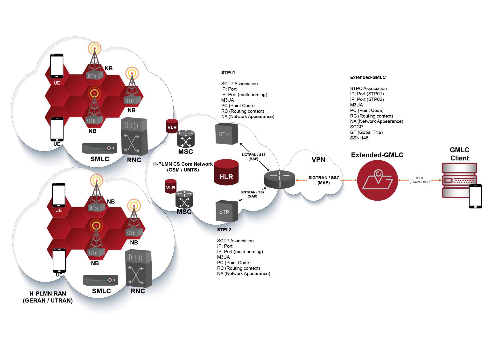
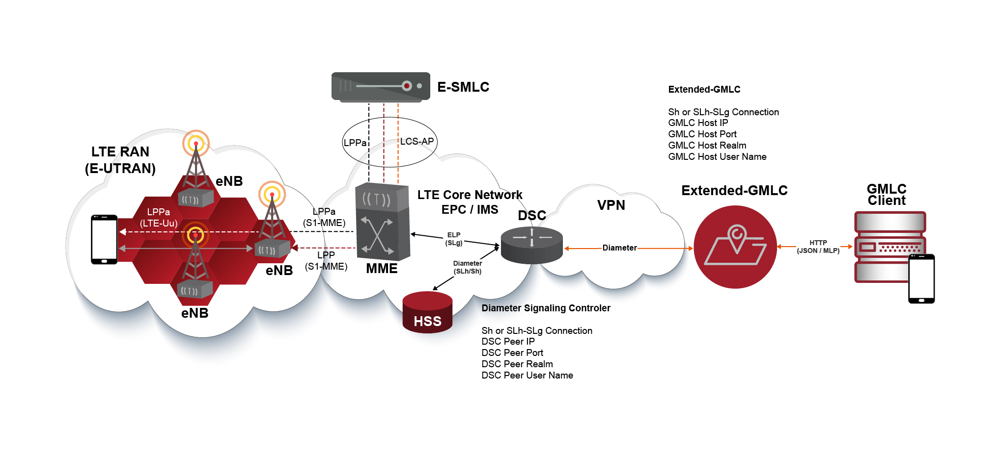

[[_setup_configuration]]
= Post Installation Configuration

You must perform post-installation configuration of the Gateway according to instructions in the {this-platform} {this-application} Admin Guide.
Before using in Production, you must remember to fine-tune Memory and Database settings for better performance.

Once you have installed {this-platform} {this-application} to suit your needs, you can go ahead and configure the SS7 and Diameter stacks and the Gateway to meet your requirements.
Only when you have completely configured the SS7 and Diameter stacks, as well as MongoDB setup, you can go ahead with further configurations for running {this-platform} {this-application}.

The {this-platform} {this-application} Admin Guide in the [path]_{this-folder}-gmlc-<version>/docs/_ folder will assist you in configuring and managing {this-platform} {this-application}.
To configure and manage both stacks and the Gateway, you can make use of the Command Line Interface (CLI) tool or the GUI that comes with the platform.

WARNING: Failure to configure memory, database, logging and other settings as per the instructions in the Admin Guide may result in poor performance of the {this-platform} {this-application}.

[[_gmlc_configuring]]
== Configuring {this-platform} {this-application}

You must fine-tune Memory and Database settings for better performance before using {this-platform} {this-application} in production.

Once you complete setting up the Gateway you must configure the SS7 Stack and GMLC parameters. {this-platform} {this-application} comes with a convenient user-friendly Graphical User Interface (GUI) and a Command Line Interface (CLI) that will allow you to configure, monitor and manage the Gateway.
While the CLI tool allows complete configuration and control of {this-platform} {this-application}, the GUI-based management enhances the usability of the Gateway and gives you the ability to configure and manage {this-platform} {this-application} dynamically.

This chapter will explain how to manage {this-platform} {this-application} effectively using both the GUI and the CLI.

[[_gmlc_configuring_memory]]
=== Memory Settings

You should fine tune the JVM memory settings based on your needs, but we recommend you allocate a minimum of 4 GB and an ideal 8GB for initial and maximum heap size.
These settings are specified in the file[path]_{this-folder}-gmlc-/wildfly-10.1.0.Final/bin/standalone.conf for Wildfly 10.

-Xms8192m::
  Initial heap size, set in megabytes

-Xmx8192m::
  Maximum heap size, set in megabytes

[[_gmlc_configuring_java]]
=== Supported Java Version

{this-platform} {this-application} can run only with Java 8 JRE or JDK.

[[_gmlc_configuring_jslee_http]]
=== Configuring JSLEE http-servlet RA

{this-platform} {this-application} acts as a HTTP Server to achieve location reports by accepting HTTP POST/GET request from third party applications (GMLC Clients).
You must configure the HTTP Servlet JSLEE Resource Adaptor's properties and the HTTP Tomcat server properties to suit your requirements.
Please refer to the SLEE RA HTTP Servlet User Guide available in {this-folder}-gmlc/docs/resources/http-server and HTTP Tomcat server configuring in https://docs.jboss.org/jbossas/guides/webguide/r2/en/html/ch02.html.

[[_gmlc_configuring_jslee_http]]
=== Configuring JSLEE http-client RA

{this-platform} {this-application} acts as a HTTP Client to achieve location reporting by sending a HTTP POST/GET requests to third party applications (GMLC Clients).
You must configure the HTTP Client JSLEE Resource Adaptor's properties to suit your requirements.
Please refer to the SLEE RA HTTP Client User Guide available in [path]_{this-folder}-gmlc-/docs/slee/RestComm_SLEE_RA_HTTP_Client_User_Guide.pdf_.

[[_gmlc_configuring_log4j]]
=== Configuring log4j Logging Service (Wildfly)

{this-platform} {this-application} uses `Apache log4j` for logging.
If you are not familiar with the `log4j` package, you can read more about it at the Jakarta http://jakarta.apache.org/log4j/[website].

Logging is controlled from a central configuration file located at [path]_{this-folder}-gmlc/wildfly-10.1.0.Final/standalone/configuration/standalone.xml_.
This file defines a set of appenders specifying the log files, what categories of messages should go there, the message format and the level of filtering.
For more details, please refer to _Logging Configuration_ section in the Wildfly 10 documentation available  https://docs.jboss.org/author/display/WFLY10/Logging+Configuration[here].

You must make sure `log4j` is fine tuned for optimal performance in production.
We recommend that you set logging threshold to `WARN` or `INFO` in a first phase, while letting the CDR appender be `DEBUG`.

[[_gmlc_configuring_ss7]]
=== Configuring the SS7 Stack

You must configure the SS7 Stack prior to running {this-platform} {this-application}.
For details on configuring the SS7 Stack please refer to the RestComm SS7 Stack User Guide.
The RestComm SS7 Stack User Guide lists all available Shell commands and GUI operations to configure SS7.
In addition, help files are also available for every Shell command providing all details relevant to the command.
Furthermore, you can find an SS7 configuration example in {this-platform} {this-application} installation guide.

[[_gmlc_configuring_jdiameter]]
=== Configuring the Diameter Stack
You must configure the Diameter Stack prior to running {this-platform} {this-application}.
For details on configuring the Diameter Stack please refer to the RestComm Diameter Stack User Guide.
Furthermore, you can find a Diameter configuration example in {this-platform} {this-application} installation guide.

[[_gmlc_configuring_mongodb]]
=== Configuring MongoDB
You must configure MongoDB prior to running {this-platform} {this-application}.
You should install latest MongoDB and set it up as a system service.
Refer to the following link for a guide on how to proceed with MongoDB installation and service setup: https://docs.mongodb.com/manual/administration/install-on-linux/.

Then, run *mongo* in a system terminal to entering the MongoDB shell:
....
fernando@ubuntu:~$ mongo
MongoDB shell version v3.6.3
connecting to: mongodb://127.0.0.1:27017
MongoDB server version: 3.6.3
Server has startup warnings:
2019-05-06T00:12:17.730-0300 I STORAGE  [initandlisten]
2019-05-06T00:12:17.730-0300 I STORAGE  [initandlisten] ** WARNING: Using the XFS filesystem is strongly recommended with the WiredTiger storage engine
2019-05-06T00:12:17.730-0300 I STORAGE  [initandlisten] **          See http://dochub.mongodb.org/core/prodnotes-filesystem
2019-05-06T00:12:18.506-0300 I CONTROL  [initandlisten]
2019-05-06T00:12:18.506-0300 I CONTROL  [initandlisten] ** WARNING: Access control is not enabled for the database.
2019-05-06T00:12:18.506-0300 I CONTROL  [initandlisten] **          Read and write access to data and configuration is unrestricted.
2019-05-06T00:12:18.506-0300 I CONTROL  [initandlisten]
....

Once inside the MongoDB shell, proceed like the following to create the collections needed for HTTP reports for Radio Access Networks reports with location services reference numbers linking to a previous location request, as well as creating token for identifying users for each HTTP request:

....
> show dbs
admin  0.000GB
local  0.000GB
> use gmlc
switched to db gmlc
> db.createCollection("supl-session");
{ "ok" : 1 }
> db.createCollection("http-report");
{ "ok" : 1 }
> db.createCollection("http-report-counter");
{ "ok" : 1 }
> db.getCollection("http-report-counter").insert({name: "serialNumber", counter: 0 })
WriteResult({ "nInserted" : 1 })
> db.createCollection("curl-account");
{ "ok" : 1 }
> db.getCollection("curl-account").insert({token: "RmVybmFuZG9NZW5kaW9yb3o", username: "paicbd" })
WriteResult({ "nInserted" : 1 })
>
....

The configuration in `GmlcManagement_gmlcproperties.xml` file should be consistent with MongoDB running host IP:port and database, for example:
....
<mongohost value="localhost"/>
<mongoport value="27017"/>
<mongodatabase value="gmlc"/>
....

It is also important to follow the recommendations here: https://docs.mongodb.com/manual/reference/ulimit/ for process and file handling.

For instance, you could proceed like this. First setup the Unix limit for open files by executing *ulimit -n 64000* in a Linux console terminal, for example:
....
[gmlcuser@localhost ~]# sudo ulimit -n 64000
....

You can then check the Unix limits by issuing the following: *ulimit -a*. for example:
....
[gmlcuser@localhost ~]# ulimit -a
core file size          (blocks, -c) 0
data seg size           (kbytes, -d) unlimited
scheduling priority             (-e) 0
file size               (blocks, -f) unlimited
pending signals                 (-i) 31192
max locked memory       (kbytes, -l) unlimited
max memory size         (kbytes, -m) unlimited
open files                      (-n) 65536
pipe size            (512 bytes, -p) 8
POSIX message queues     (bytes, -q) 819200
real-time priority              (-r) 0
stack size              (kbytes, -s) 8192
cpu time               (seconds, -t) unlimited
max user processes              (-u) 64000
virtual memory          (kbytes, -v) unlimited
file locks                      (-x) unlimited
....

Configure the security limits by adding the soft and hard values to the GMLC user in the systems's *limits.conf* file. For example
....
[fernando@localhost ~] sudo vim /etc/security/limits.conf

#<domain>      	<type>  <item>  <value>
gmlcuser		hard 	nofile  64000
gmlcuser 		soft 	nofile	64000
*   		    hard 	nproc	64000
*				soft    nproc   64000
....

Finally, as Red Hat Enterprise Linux and CentOS 6 place a max process limitation of 1024 which overrides ulimit settings, create a file named /etc/security/limits.d/*99-mongodb-nproc.conf* with new soft nproc and hard nproc values to increase the process limit. For example:

....
[gmlcuser@localhost ~] sudo vim /etc/security/limits.d/99-mongodb-nproc.conf
#<domain>      	<type>  <item>	<value>
gmlcuser		hard 	nproc	64000
gmlcuser 		soft 	nproc	64000
*   		    hard 	nproc	64000
*				soft    nproc   64000
....

== SS7 Configuration

Following table depicts the parameters to be provided by the MNO in order to establish SS7/SIGTRAN connections according to the network topology diagram shown next. This network topology contemplates a single instance of {this-platform} {this-application} establishing SIGTRAN (M3UA) connections with a couple of STPs within a GSM/UMTS core network.

[width="100%",cols="50%,50%"]
|=======================================================================

|PARAMETER | DESCRIPTION
| OPC | The Point Code assigned to {this-platform} {this-application}.
| DPC | The Destination Point Code/s (STP PC) used by {this-platform} {this-application}.
| GT  | SCCP Global Title assigned to Host side.
| SSN | The Subsystem Number to be assigned to {this-platform} {this-application} (should be 145 according to ITU-T/3GPP standards).
| NI  | International (0 or 1) or National Network (2 or 3) determination for Signaling Point Codes (OPC/DPC).
| STP IP(s):port(s) | IP Address(es) and Port number(s) of peer side (STP side) for the SCTP associations.
| GMLC IP(s):port(s) | DESCRIPTION
| SCTP mode | Side that will initiate SCTP connection (should always be {this-platform} {this-application})
| M3UA type | M3UA role (AS o SGW o IPSP). AS if unknown.
| RC | Routing Context to be configured (might be null).
| NA | The Network Appearance to be configured (might be null)
| M3UA ASP Id | This is optional but needed if it has been setup at the MNO side.
|=======================================================================

The following displays a network topology diagram example for the establishment of redundant SIGTRAN/SS7 associations between the MNO circuit-switched core network and {this-platform} {this-application}.

An STP comprises a signaling hub which only routes incoming messages towards the appropriate destination based on the embedded information. It does not offer service termination, as it typically does not deploy a user part. The STP is the only network entity providing GTT (Global Title Translation), which allows originating network entities being unaware of target nodes? SSN/DPC (Subsystem Numbers/Destination Point Codes) for the ongoing service. Only the STPs need to keep SPC/SSN databases associated to specific services and recipient destinations.

Once the SS7 configuration is set up according to the data provided by the MNO, SS7 configuration files reside at $GMLC_HOME/wildfly-10.1.0.Final/standalone/data. Let's assume the configuration provided is as follows:

[width="100%",cols="50%,50%"]
|=======================================================================

|PARAMETER | DESCRIPTION
| OPC | 12201
| DPC | 12227
| GT  | 60132499947
| SSN | 145
| NI  | 2
| STP IP(s):port(s) | 10.221.45.197:4278, 10.223.49.205:4278
| GMLC IP(s):port(s) | 10.221.32.19:2905, 10.221.32.19:2906
| SCTP mode | CLIENT
| M3UA type | AS
| RC | 1
| NA | 12
| M3UA ASP Id | (not provided)
|=======================================================================

The following would be the resulting configuration files for these values:

*GmlcManagement_gmlcproperties.xml*

....
<?xml version="1.0" encoding="UTF-8" ?>
<gmlcgt value="60132499947"/>
<gmlcssn value="145"/>
<hlrssn value="6"/>
<mscssn value="8"/>
<vlrssn value="7"/>
<maxmapv value="3"/>
<maxactivitycount value="5000"/>
<dialogtimeout value="60000"/>
<eventcntxtsusdeltimeout value="60000"/>
<diameteroriginrealm value="gmlc.net"/>
<diameteroriginhost value="fer.gmlc.net"/>
<diameterdestrealm value="epc.mnc019.mcc732.3gppnetwork"/>
<diameterdesthost value="dra01.epc.mnc019.mcc732.3gppnetwork"/>
<diametergmlcnumber value="775599"/>
<lcsnontriggeredreportoption value="MLP"/>
<lcsurlcallback value="http://localhost:8081/api/report"/>
<mongohost value="localhost"/>
<mongoport value="27017"/>
<mongodatabase value="gmlc"/>
<curluser value="fer"/>
<curlpswd value="nando"/>
<suplsslenabled value="true" />
<suplsslport value="7275" />
<suplnosslport value="7276" />
<supltlscertpath value="serverkeystore.jks" />
<supltlscertpwd value="password" />
....

*SCTPManagement_sctp.xml*

....
<?xml version="1.0" encoding="UTF-8" ?>
<connectdelay value="5000"/>
<congControl_DelayThreshold_1 value="2.5"/>
<congControl_DelayThreshold_2 value="8.0"/>
<congControl_DelayThreshold_3 value="14.0"/>
<congControl_BackToNormalDelayThreshold_1 value="1.5"/>
<congControl_BackToNormalDelayThreshold_2 value="5.5"/>
<congControl_BackToNormalDelayThreshold_3 value="10.0"/>
<servers/>
<associations>
	<name value="SCTPASSOC1"/>
	<association name="SCTPASSOC1" associationType="CLIENT" hostAddress="10.221.32.19" hostPort="2905" peerAddress="10.221.45.197" peerPort="4278" ipChannelType="0" extraHostAddressesSize="0"/>
	<name value="SCTPASSOC2"/>
	<association name="SCTPASSOC2" associationType="CLIENT" hostAddress="10.221.32.19" hostPort="2906" peerAddress="10.223.49.205" peerPort="4278" ipChannelType="0" extraHostAddressesSize="0"/>
</associations>
....

*Mtp3UserPart_m3ua1.xml*
....
<?xml version="1.0" encoding="UTF-8" ?>
<statisticsenabled value="false"/>
<statisticsdelay value="5000"/>
<statisticsperiod value="5000"/>
<routingkeymanagementenabled value="false"/>
<useLsbForLinksetSelection value="false"/>
<aspFactoryList>
	<aspFactory name="ASP1" assocName="SCTPASSOC1" started="true" maxseqnumber="256" aspid="2" heartbeat="true"/>
	<aspFactory name="ASP2" assocName="SCTPASSOC2" started="true" maxseqnumber="256" aspid="3" heartbeat="true"/>
</aspFactoryList>
<asList>
	<as name="AS1" minAspActiveForLb="1" functionality="AS" exchangeType="SE">
		<routingContext size="1">
			<rc value="1"/>
		</routingContext>
		<networkAppearance value="12"/>
		<defTrafficMode mode="2"/>
		<asps>
			<asp name="ASP1"/>
		</asps>
	</as>
	<as name="AS2" minAspActiveForLb="1" functionality="AS" exchangeType="SE">
		<routingContext size="1">
			<rc value="0"/>
		</routingContext>
		<defTrafficMode mode="2"/>
		<asps>
			<asp name="ASP2"/>
		</asps>
	</as>
</asList>
<route>
	<key value="12201:12227:3"/>
	<routeAs trafficModeType="2" as="AS1,AS2"/>
</route>
....

*SccpStack_sccprouter3.xml*
....
<?xml version="1.0" encoding="UTF-8" ?>
<longMessageRule>
    <id value="1"/>
    <value firstSpc="1" lastSpc="16384" ruleType="XUDT_ENABLED"/>
</longMessageRule>
<sap>
	<id value="1"/>
	<value mtp3Id="1" opc="12227" ni="2" networkId="0">
		<mtp3DestinationMap>
			<id value="1"/>
			<value firstDpc="1" lastDpc="16384" firstSls="0" lastSls="255" slsMask="255"/>
		</mtp3DestinationMap>
	</value>
</sap>
....

*SccpStack_sccprouter3_ext.xml*
....
<rule>
	<id value="1"/>
	<value ruleType="Solitary" loadSharingAlgo="Undefined" originatingType="RemoteOriginated" mask="K" paddress="1" saddress="-1" networkId="0">
		<patternSccpAddress pc="0" ssn="0">
			<ai value="16"/>
			<gt type="GT0100" tt="0" es="1" np="1" nai="4" digits="60132499947"/>
		</patternSccpAddress>
	</value>
	<id value="2"/>
	<value ruleType="Solitary" loadSharingAlgo="Undefined" originatingType="LocalOriginated" mask="K" paddress="2" saddress="-1" networkId="0">
		<patternSccpAddress pc="0" ssn="0">
			<ai value="16"/>
			<gt type="GT0100" tt="0" es="1" np="1" nai="4" digits="*"/>
		</patternSccpAddress>
	</value>
</rule>
<routingAddress>
	<id value="1"/>
	<sccpAddress pc="12227" ssn="145">
		<ai value="19"/>
		<gt type="GT0100" tt="0" es="1" np="1" nai="4" digits="60132499947"/>
	</sccpAddress>
	<id value="2"/>
	<sccpAddress pc="12201" ssn="0">
		<ai value="17"/>
		<gt type="GT0100" tt="0" es="1" np="1" nai="4" digits="-"/>
	</sccpAddress>
</routingAddress>
....

*SccpStack_sccpresource2.xml*
....
<?xml version="1.0" encoding="UTF-8" ?>
<remoteSsns>
	<id value="1"/>
	<value remoteSpc="12201" remoteSsn="6" remoteSsnFlag="0" markProhibitedWhenSpcResuming="false"/>
	<id value="2"/>
	<value remoteSpc="12201" remoteSsn="7" remoteSsnFlag="0" markProhibitedWhenSpcResuming="false"/>
	<id value="3"/>
	<value remoteSpc="12201" remoteSsn="8" remoteSsnFlag="0" markProhibitedWhenSpcResuming="false"/>
</remoteSsns>
<remoteSpcs>
	<id value="1"/>
	<value remoteSpc="12201" remoteSpcFlag="0" mask="0"/>
</remoteSpcs>
<concernedSpcs/>
....

*SccpStack_management2.xml*
....
<?xml version="1.0" encoding="UTF-8" ?>
<zmarginxudtmessage value="240"/>
<connesttimerdelay value="15000"/>
<iastimerdelay value="450000"/>
<iartimerdelay value="960000"/>
<reltimerdelay value="15000"/>
<repeatreltimerdelay value="15000"/>
<inttimerdelay value="30000"/>
<guardtimerdelay value="1440000"/>
<resettimerdelay value="15000"/>
<reassemblytimerdelay value="15000"/>
<maxdatamessage value="2560"/>
<periodoflogging value="60000"/>
<removespc value="true"/>
<respectpc value="false"/>
<canrelay value="false"/>
<timerexecutors_threadcount value="10"/>
<previewMode value="false"/>
<sccpProtocolVersion value="ITU"/>
<congControl_TIMER_A value="400"/>
<congControl_TIMER_D value="2000"/>
<congControl_Algo value="international"/>
<congControl_blockingOutgoingSccpMessages value="false"/>
<ssttimerduration_min value="10000"/>
<ssttimerduration_max value="600000"/>
<ssttimerduration_increasefactor value="1.5"/>
....

*TcapStack_management.xml*
....
<?xml version="1.0" encoding="UTF-8" ?>
<dialogidletimeout value="45000"/>
<invoketimeout value="45000"/>
<maxdialogs value="5000"/>
<dialogidrangestart value="1"/>
<dialogidrangeend value="2147483647"/>
<donotsendprotocolversion value="false"/>
<congControl_blockingIncomingTcapMessages value="false"/>
<congControl_ExecutorDelayThreshold_1 value="1.0"/>
<congControl_ExecutorDelayThreshold_2 value="6.0"/>
<congControl_ExecutorDelayThreshold_3 value="12.0"/>
<congControl_ExecutorBackToNormalDelayThreshold_1 value="0.5"/>
<congControl_ExecutorBackToNormalDelayThreshold_2 value="3.0"/>
<congControl_ExecutorBackToNormalDelayThreshold_3 value="8.0"/>
<congControl_MemoryThreshold_1 value="77.0"/>
<congControl_MemoryThreshold_2 value="87.0"/>
<congControl_MemoryThreshold_3 value="97.0"/>
<congControl_BackToNormalMemoryThreshold_1 value="72.0"/>
<congControl_BackToNormalMemoryThreshold_2 value="82.0"/>
<congControl_BackToNormalMemoryThreshold_3 value="92.0"/>
<statisticsenabled value="false"/>
<slsrange value="All"/>
<statisticsenabled value="false"/>
<swaptcapidbytes value="true"/>
....

*MapStack_management.xml*
....
<?xml version="1.0" encoding="UTF-8" ?>
<shorttimervalue value="10000"/>
<mediumtimervalue value="30000"/>
<longtimervalue value="600000"/>
....

== Diameter Configuration

Next table depicts the parameters to be provided by the MNO in order to establish Diameter based connections according to the topology diagram shown in the following network topology diagram example.

[width="100%",cols="50%,50%"]
|=======================================================================
|PARAMETER | DESCRIPTION
| Host IP | Diameter IP address(es) to be assigned to {this-platform} {this-application}.
| Host Port | Diameter port number(s) to be assigned to {this-platform} {this-application}.
| Host Realm | The string(s) in the Network Access Identifier (NAI) that immediately follows the "@" character to be assigned to {this-platform} {this-application}.
| Host User Name | The string(s) which contains the User-Name in a format consistent with the NAI specification to be assigned to {this-platform} {this-application}.
| Host Number | Diameter number to be assigned to {this-platform} {this-application}.
| Peer IP(s) | Diameter IP address(es) of {this-platform} {this-application} peer (DSC or DRA or DEA or IWF).
| Peer Port(s) | Diameter port number(s) of {this-platform} {this-application} peer (DSC or DRA or DEA or IWF).
| Peer Port Range | Port range to use for establishing SCTP associations.
| Peer Realm(s) | The string(s) in the DSC/DRA/DEA/IWF Network Access Identifier (NAI) that immediately follows the "@" character.
| Peer User Name(s) | The string(s) which contains the DSC/DRA/DEA/IWF User-Name in a format consistent with the NAI specification.
|=======================================================================

DSC (Diameter Signaling Controller) is an industry term which assembles multiple roles of the signaling or control plane in LTE networks.  These roles include the ones of the DRA (Diameter Routing Agent), DEA (Diameter Edge Agent) and IWF (Diameter Interworking Function), defined by 3GPP and GSMA. DSC is used for providing the same carrier-grade infrastructure in the EPC as the STP in SS7 networks. DRA provides traffic management, load balancing and session binding while reducing the ?mesh? of signaling connections across multiple network elements. Some operators prefer the stand-alone DRA, typically Tier 1 ones with multiple instances of network elements like the HSS, PCRF, PCEF and OCS. The Diameter Interworking Function (IWF) allows 4G networks to interoperate with 3G network elements. The DEA provides an interworking capability for Diameter and SS7 and acts as an edge device for LTE roaming. The functions of the DSC, as a pure software system, lend themselves well to the SDN and NFV (Software Defined Network and Network Functions Virtualization), which provide better ways to monetize infrastructure by having their control plane managed in the cloud and thus better CAPEX ROI, lowering OPEX.

Once the Diameter configuration is setup according to the data provided by the MNO, Diameter configuration files reside at $GMLC_HOME/wildfly-10.1.0.Final/standalone/data/*GmlcManagement_gmlcproperties.xml* and at $GMLC_HOME/wildfly-10.1.0.Final/modules/system/layers/base/org/restcomm/diameter/lib/main/config/*jdiameter-config.xml*.

{this-platform} {this-application} comes with a simulation mode configuration in both files, for which the following values are assumed:

[width="100%",cols="50%,50%"]
|=======================================================================
|PARAMETER | DESCRIPTION
| Host IP(s) | 10.1.30.19
| Host Port(s) | 3868
| Host Realm | gmlc.net
| Host User Name | fer.gmlc.net
| Host Number | 775599
| Peer IP(s) | 10.1.30.2
| Peer Port(s) | 6501
| Peer Port Range | 25000 - 30000
| Peer Realm(s) | dra01.epc.mnc019.mcc732.3gppnetwork
| Peer User Name(s) | hss.epc.mnc019.mcc732.3gppnetwork, mme.epc.mnc019.mcc732.3gppnetwork
|=======================================================================

Then, these are the resulting configuration files:

*jdiameter-config.xml*
....
<?xml version="1.0"?>
<Configuration xmlns="http://www.jdiameter.org/jdiameter-server">

  <LocalPeer>
    <URI value="aaa://fer.gmlc.net:3868" />
    <IPAddresses>
      <IPAddress value="10.1.30.19" />
    </IPAddresses>
    <Realm value="restcomm.org" />
    <VendorID value="193" />
    <ProductName value="jDiameter Location Simulator" />
    <FirmwareRevision value="1" />
    <OverloadMonitor>
      <Entry index="1" lowThreshold="0.5" highThreshold="0.6">
        <ApplicationID>
          <VendorId value="193" />
          <AuthApplId value="0" />
          <AcctApplId value="19302" />
        </ApplicationID>
      </Entry>
    </OverloadMonitor>
  </LocalPeer>

  <Parameters>
    <AcceptUndefinedPeer value="true" />
    <DuplicateProtection value="false" />
    <DuplicateTimer value="240000" />
    <DuplicateSize value="5000" />
    <UseUriAsFqdn value="false" /> <!-- Needed for Ericsson Emulator (set to true) -->
    <QueueSize value="10000" />
    <MessageTimeOut value="60000" />
    <StopTimeOut value="10000" />
    <CeaTimeOut value="10000" />
    <IacTimeOut value="30000" />
    <DwaTimeOut value="10000" />
    <DpaTimeOut value="5000" />
    <RecTimeOut value="10000" />

    <!-- Peer FSM Thread Count Configuration -->
    <PeerFSMThreadCount value="3" />

    <!-- Statistics Configuration -->
    <Statistics pause="30000" delay="30000" enabled="false" active_records="Concurrent,ScheduledExecService,Network,ScheduledExecService,AppGenRequestPerSecond,NetGenRequestPerSecond,Peer,Peer.local,PeerFSM"/>

    <Concurrent>
      <Entity name="ThreadGroup" size="64"/> <!-- Common Thread Pool -->
      <Entity name="ProcessingMessageTimer" size="1"/>
      <Entity name="DuplicationMessageTimer" size="1"/>
      <Entity name="RedirectMessageTimer" size="1"/>
      <Entity name="PeerOverloadTimer" size="1"/>
      <Entity name="ConnectionTimer" size="1"/>
      <Entity name="StatisticTimer" size="1"/>
    </Concurrent>

    <Dictionary enabled="false" sendLevel="MESSAGE" receiveLevel="OFF" />

    <!-- Router Request Table Cache Size and ClearSize -->
    <RequestTable size="10240" clear_size="2048" />

  </Parameters>

  <Network>
    <Peers>
      <Peer name="aaa://dra01.epc.mnc019.mcc732.3gppnetwork:6501" portRange="25000-30000" attempt_connect="true" rating="1" />
    </Peers>

    <Realms>
     <Realm name="mme.epc.mnc019.mcc732.3gppnetwork" peers="dra01.epc.mnc019.mcc732.3gppnetwork" local_action="LOCAL" dynamic="true" exp_time="1">
        <ApplicationID>
          <VendorId value="10415" />
          <AuthApplId value="16777255" />
          <AcctApplId value="0" />
        </ApplicationID>
      </Realm>

      <Realm name="hss.epc.mnc019.mcc732.3gppnetwork" peers="dra01.epc.mnc019.mcc732.3gppnetwork" local_action="LOCAL" dynamic="true" exp_time="1">
        <ApplicationID>
          <VendorId value="10415" />
          <AuthApplId value="16777291" />
          <AcctApplId value="0" />
        </ApplicationID>
      </Realm>

      <Realm name="hss.epc.mnc019.mcc732.3gppnetwork" peers="dra01.epc.mnc019.mcc732.3gppnetwork" local_action="LOCAL" dynamic="true" exp_time="1">
        <ApplicationID>
          <VendorId value="10415" />
          <AuthApplId value="16777217" />
          <AcctApplId value="0" />
        </ApplicationID>
      </Realm>
    </Realms>
  </Network>

  <Extensions>
      <!-- Set SCTP classes as extension points for Connection and Network Guard -->
      <Connection value="org.jdiameter.client.impl.transport.sctp.SCTPClientConnection" />
      <NetworkGuard value="org.jdiameter.server.impl.io.sctp.NetworkGuard" />
    <!-- To enable clustering uncomment the following lines
    <SessionDatasource value="org.mobicents.diameter.impl.ha.data.ReplicatedSessionDatasource"/>
    <TimerFacility value="org.mobicents.diameter.impl.ha.timer.ReplicatedTimerFacilityImpl"/>
    -->
  </Extensions>

</Configuration>
....

Host and Peer IP addresses/users names must be configured at the *hosts* local file, i.e.:

....
[fernando@localhost ~] sudo vim /etc/hosts
127.0.0.1   localhost

10.1.30.19  fer.gmlc.net
10.1.30.19  dra01.epc.mnc019.mcc732.3gppnetwork
....

*GmlcManagement_gmlcproperties.xml* is as shown in the previous section.
